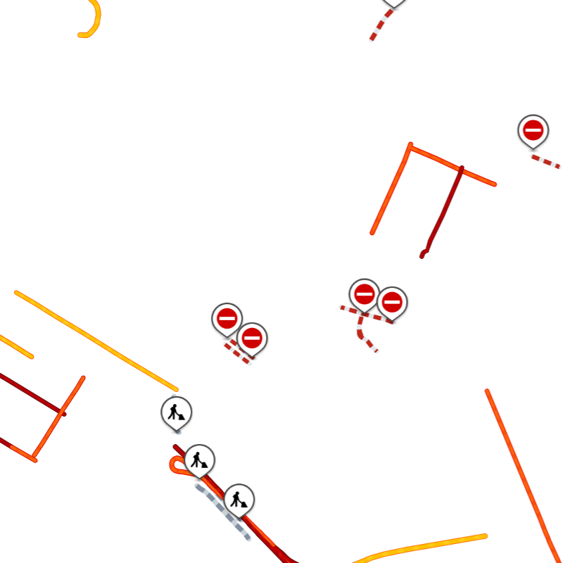

## Public Preview Notice

<Blockquote type="announcement" hasIcon>

    <p>
        This API is in Public Preview. Go to the
        [Public Preview - what is it?](https://developer.Example.com/public-preview)
        page to see what this means.
    </p>

</Blockquote>

## Purpose

The Maps API Resource service delivers resources required to display **vector maps**. The service consists of the:

- **Metadata method:** This retrieves _a list of resources of a selected type_.
- **Resource method:** This retrieves _a selected resource_.
- **Merged style method:** This retrieves _a merged style_ depending on the passed params.
- **Merged sprite method:** This retrieves _a merged sprite_ depending on the passed params.

<Blockquote>

You can find the structure of the map style in the [MapLibre Style Specification](https://maplibre.org/maplibre-style-spec) documentation.

</Blockquote>


## Request data

## Metadata method

### HTTPS method: `GET`

Please see the following [Request parameters](#request-parameters-metadata-method) section with the required and optional parameters tables for these values. The generic URL format is as follows.

<h4 style={{ fontSize: '1em' }}>URL format</h4>

```shell [type=get] [title=Request URL]
https://{baseURL}/map/{versionNumber}/{resourceType}/{resourceVersion}/{resourceVariant}/metadata.{format}?key={Your_API_Key}
```

<h4 style={{ fontSize: '1em' }}>Examples</h4>

```shell [type=get] [title=Example request URLs]
https://api.Example.com/map/1/style/metadata.json?key={Your_API_Key}

https://api.Example.com/map/1/style/22.2.1-9/2/metadata.json?key={Your_API_Key}

https://api.Example.com/map/1/style/22.*/2/metadata.json?key={Your_API_Key}

https://api.Example.com/map/1/sprite/22.2.1-9/2/metadata.json?key={Your_API_Key}

https://api.Example.com/map/1/glyph/22.2.1-9/metadata.json?key={Your_API_Key}
```

<h4 style={{ fontSize: '1em' }}>curl command format</h4>

```shell [type=get] [title=Request curl command]
curl 'https://api.Example.com/map/1/style/22.2.1-9/2/metadata.json?key={Your_API_Key}'
```

### Request parameters (Metadata method)

The following table describes the parameters that can be used in a request.

- Required parameters **must be used** or the call will fail.
- Parameters and values are case-sensitive.
- Optional parameters may be used.

<table>
  <thead>
    <tr>
      <th scope="col" style={{ fontSize: '1em' }} width="250px">
        Required&nbsp;parameters
      </th>
      <th scope="col" style={{ fontSize: '1em' }}>
        Description
      </th>
    </tr>
  </thead>
  <tbody>
    <tr>
      <th scope="row">
         `baseURL` 
        <br />
         *string* 
      </th>
      <td>
        Base URL for calling Example services.
        <br />
         **Value:**   `api.Example.com` 
      </td>
    </tr>
    <tr>
      <th scope="row">
         `versionNumber` 
        <br />
         *string* 
      </th>
      <td>
        The version of the service to call.
        <br />
         **Value:**  The current version is  `1`.
      </td>
    </tr>
    <tr>
      <th scope="row">
         `resourceType` 
        <br />
         *string* 
      </th>
      <td>
        The type of the requested resource.
        <br />
         **Values:** 
        <ul>
          <li>
             `style` 
          </li>
          <li>
             `sprite` 
          </li>
          <li>
             `glyph` 
          </li>
        </ul>
      </td>
    </tr>
    <tr>
      <th scope="row">
         `format` 
        <br />
         *string* 
      </th>
      <td>
        The requested response format.
        <br />
         **Values:** 
        <ul>
          <li>
             `xml` 
          </li>
          <li>
             `json` 
          </li>
          <li>
             `jsonp` 
          </li>
        </ul>
      </td>
    </tr>
    <tr>
      <th scope="row">
         `key` 
        <br />
         *string* 
      </th>
      <td>
        The authorization key for access to the API.
        <br />
         **Value:**  Your valid  `API Key`.
      </td>
    </tr>
  </tbody>
</table>

<table>
  <thead>
    <tr>
      <th scope="col" style={{ fontSize: '1em' }} width="250px;">
        Optional&nbsp;parameters
      </th>
      <th scope="col" style={{ fontSize: '1em' }}>
        Description
      </th>
    </tr>
  </thead>
  <tbody>
    <tr>
      <th scope="row">
         `resourceVersion` 
        <br />
         *string* 
      </th>
      <td>
        Version of the requested resource. If the version string contains a
        wildcard, the latest matching version of the resource will be provided.
        <br />
         **Values:** 
        <ul>
          <li>A version.</li>
          <li>
            A partial version ending with a wildcard character, e.g.,
            `*`, `22.*`, `22.2.1-*`.
          </li>
        </ul>
      </td>
    </tr>
    <tr>
      <th scope="row">
         `resourceVariant` 
        <br />
         *string* 
      </th>
      <td>
        Variant of the requested resource. Can only be used when
         `resourceVersion`
        is provided.
        <br />
         **Value:**  The variant name, e.g.,  `2` 
      </td>
    </tr>
  </tbody>
</table>

## Resource method

### HTTPS method: `GET`

Please see the following [Request parameters](#request-parameters-resource-method) section with the required and optional parameters tables for these values. The generic URL format is as follows.

<h4 style={{ fontSize: '1em' }}>URL format</h4>

```shell [type=get] [title=Request URL]
https://{baseURL}/map/{versionNumber}/{resourceType}/{resourceVersion}/{resourceVariant}/{resourceName}?key={Your_API_Key}
```

<h4 style={{ fontSize: '1em' }}>Examples</h4>

```shell [type=get] [title=Example request URL]
https://api.Example.com/map/1/style/22.*/2/basic_street-light.json?key={Your_API_Key}

https://api.Example.com/map/1/style/22.2.1-9/2/basic_street-light.json?key={Your_API_Key}

https://api.Example.com/map/1/sprite/22.2.1-9/2/basic_street-light/sprite.png?key={Your_API_Key}
```

<h4 style={{ fontSize: '1em' }}>curl command format</h4>

```shell [type=get] [title=Request curl command]
curl 'https://api.Example.com/map/1/style/22.2.1-9/2/basic_street-light.json?key={Your_API_Key}'
```

### Request parameters (Resource method)

The following table describes the parameters that can be used in a request.

- Required parameters **must be used** or the call will fail.
- Parameters and values are case-sensitive.
- Optional parameters may be used.

<table>
  <thead>
    <tr>
      <th scope="col" style={{ fontSize: '1em' }} width="250px;">
        Required&nbsp;parameters
      </th>
      <th scope="col" style={{ fontSize: '1em' }}>
        Description
      </th>
    </tr>
  </thead>
  <tbody>
    <tr>
      <th scope="row">
         `baseURL` 
        <br />
         *string* 
      </th>
      <td>
        Base URL for calling Example services
        <br />
         **Value:**   `api.Example.com` 
      </td>
    </tr>
    <tr>
      <th scope="row">
         `versionNumber` 
        <br />
         *string* 
      </th>
      <td>
        The version of the service to call.
        <br />
         **Value:**  The current version is  `1`.
      </td>
    </tr>
    <tr>
      <th scope="row">
         `resourceType` 
        <br />
         *string* 
      </th>
      <td>
        The type of the requested resource.
        <br />
         **Values:** 
        <ul>
          <li>
             `style` 
          </li>
          <li>
             `sprite` 
          </li>
          <li>
             `glyph` 
          </li>
        </ul>
      </td>
    </tr>
    <tr>
      <th scope="row">
         `resourceVersion` 
        <br />
         *string* 
      </th>
      <td>
        The version of the requested resource. If the version string contains a
        wildcard, the latest matching version of the resource will be provided.
        Available versions can be listed using the Metadata method.
        <br />
         **Values:** 
        <ul>
          <li>A version.</li>
          <li>
            A partial version ending with a wildcard character, e.g.,
            `*`, `22.*`, `22.2.1-*`.
          </li>
        </ul>
      </td>
    </tr>
    <tr>
      <th scope="row">
         `resourceName` 
        <br />
         *string* 
      </th>
      <td>
        The requested resource name (with an extension if applicable). Available
        resources can be listed using the Metadata method.
        <br />
         **Value:**  A resource name.
      </td>
    </tr>
    <tr>
      <th scope="row">
         `key` 
        <br />
         *string* 
      </th>
      <td>
        Authorization key for access to the API.
        <br />
         **Value:**  Your valid  `API Key`.
      </td>
    </tr>
  </tbody>
</table>


<table>
  <thead>
    <tr>
      <th scope="col" style={{ fontSize: '1em' }} width="250px;">
        Optional&nbsp;parameters
      </th>
      <th scope="col" style={{ fontSize: '1em' }}>
        Description
      </th>
    </tr>
  </thead>
  <tbody>
    <tr>
      <th scope="row">
         `resourceVariant` 
        <br />
         *string* 
      </th>
      <td>
        The variant of the requested resource. Available variants can be listed
        using the Metadata method.
        <br />
         **Value:**  For example,  `2` 
      </td>
    </tr>
  </tbody>
</table>

## Merged style method

### HTTPS method: `GET`

- Constants and parameters enclosed in curly brackets &#123; &#125; **must be replaced** with their values.
- Please see the following [Request parameters](#request-parameters-merged-style-method) section with the required and optional parameters tables for their values. The generic request format is as follows.

<h4 style={{ fontSize: '1em' }}>URL format</h4>

```shell [type=get] [title=Request URL]
https://{baseURL}/style/{versionNumber}/style/{resourceVersion}?key={Your_API_Key}&map={map_style}&traffic_incidents={traffic_incident_style}&traffic_flow={traffic_flow_style}&poi={poi_style}&restrictions={restrictions_style}&hillshade={hillshade_style}
```

<h4 style={{ fontSize: '1em' }}>Examples</h4>

```shell [type=get] [title=Example request URLs]
https://api.Example.com/style/1/style/22.2.1-9?key={Your_API_Key}&map=2/basic_street-light&traffic_incidents=2/incidents_light&traffic_flow=2/flow_relative-light&poi=2/poi_light

https://api.Example.com/style/1/style/22.2.1-9?key={Your_API_Key}&map=2/basic_street-light&traffic_incidents=2/incidents_light

https://api.Example.com/style/1/style/22.2.1-9?key={Your_API_Key}&traffic_incidents=2/incidents_light&traffic_flow=2/flow_relative-light

https://api.Example.com/style/1/style/24.2.0-3?key={Your_API_Key}&map=2/basic_street-light&hillshade=2/hillshade_light
```

<h4 style={{ fontSize: '1em' }}>curl command format</h4>

```shell [type=get] [title=Request curl command]
curl 'https://api.Example.com/style/1/style/22.2.1-9?key={Your_API_Key}&traffic_incidents=2/incidents_light&traffic_flow=2/flow_relative-light'
```

### Request parameters (Merged style method)

The following table describes the parameters that can be used in a request.

- Required parameters **must be used** or the call will fail.
- Parameters and values are case-sensitive.
- At least one optional parameter;  `map` ,  `traffic_incidents` ,  `traffic_flow`,  `poi`,  `restrictions`, or  `hillshade`  **must be used** or the call will fail.

<table>
  <thead>
    <tr>
      <th scope="col" style={{ fontSize: '1em' }} width="250px;">
        Required&nbsp;parameters
      </th>
      <th scope="col" style={{ fontSize: '1em' }}>
        Description
      </th>
    </tr>
  </thead>
  <tbody>
    <tr>
      <th scope="row">
         `baseURL` 
        <br />
         *string* 
      </th>
      <td>
        Base URL for calling Example services.
        <br />
         **Value:**   `api.Example.com` 
      </td>
    </tr>
    <tr>
      <th scope="row">
         `versionNumber` 
        <br />
         *string* 
      </th>
      <td>
        The version of the service to call.
        <br />
         **Value:**  The current version is  `1`.
      </td>
    </tr>
    <tr>
      <th scope="row">
         `resourceVersion` 
        <br />
         *string* 
      </th>
      <td>
        Version of the requested resource. Must be newer than or equal to
         **22.2.1-9**. If the version string contains a wildcard, the latest
        matching version of the resource will be provided.
        <br />
         **Values:** 
        <ul>
          <li>A version.</li>
          <li>
            A partial version ending with a wildcard character, e.g.,
            `*`, `22.*`, `22.2.1-*`.
          </li>
        </ul>
      </td>
    </tr>
    <tr>
      <th scope="row">
         `key` 
        <br />
         *string* 
      </th>
      <td>
        The authorization key for access to the API.
        <br />
         **Value:**  Your valid  `API Key`.
      </td>
    </tr>
  </tbody>
</table>

<table>
  <thead>
    <tr>
      <th scope="col" style={{ fontSize: '1em' }} width="250px;">
        Optional&nbsp;parameters
      </th>
      <th scope="col" style={{ fontSize: '1em' }}>
        Description
      </th>
    </tr>
  </thead>
  <tbody>
    <tr>
      <th scope="row">
         `map` 
        <br />
         *string* 
      </th>
      <td>
        Map style name (including variant if applicable) to be used for the
        merged style.
        <br />
         **Values:**  See
         [Available map styles](#available-map-styles).
      </td>
    </tr>
    <tr>
      <th scope="row">
         `traffic_incidents` 
        <br />
         *string* 
      </th>
      <td>
        Traffic incidents style name (including variant if applicable) to be
        used for the merged style.
        <br />
         **Values:**  See
         [Available incidents styles](#available-incidents-styles).
      </td>
    </tr>
    <tr>
      <th scope="row">
         `traffic_flow` 
        <br />
         *string* 
      </th>
      <td>
        Traffic flow style name (including variant if applicable) to be used for
        the merged style.
        <br />
         **Values:**  See
         [Available flow styles](#available-flow-styles).
      </td>
    </tr>
    <tr>
      <th scope="row">
         `poi` 
        <br />
         *string* 
      </th>
      <td>
        POI style name (including variant if applicable) to be used for the
        merged style.
        <br />
         **Values:**  See
         [Available POI styles](#available-poi-styles).
      </td>
    </tr>
    <tr>
      <th scope="row">
        `restrictions`
        <br />
        *string*
      </th>
      <td>
        Restrictions style name (including a variant if applicable) to be used for the merged style.
        <br />
        **Values:**  See
        [Available restrictions styles](#available-restrictions-styles).
      </td>
    </tr>
    <tr>
      <th scope="row">
        `hillshade`
        <br />
        *string*
      </th>
      <td>
        Hillshade style name (including variant if applicable) to be used for the merged style.
        <br />
        **Values:**  See
         [Available Hillshade styles](#available-hillshade-styles).
      </td>
    </tr>
  </tbody>
</table>

### Available Map styles

<table>
  <thead>
    <tr>
      <th scope="col" style={{ fontSize: '1em' }} width="300px;">
        Name (and variant if applicable)
      </th>
      <th scope="col" style={{ fontSize: '1em', width: '450px' }}>
        Preview
      </th>
      <th scope="col" style={{ fontSize: '1em' }}>
        Available since
      </th>
      <th scope="col" style={{ fontSize: '1em' }}>
        Available until
      </th>
    </tr>
  </thead>
  <tbody>
    <tr>
      <td scope="row">2/basic_street-light</td>
      <td>
        
      </td>
      <td>22.2.1-9</td>
      <td> - </td>
    </tr>
    <tr>
      <td scope="row">2/basic_street-dark</td>
      <td>
        
      </td>
      <td>22.2.1-9</td>
      <td> - </td>
    </tr>
    <tr>
      <td scope="row">2/basic_street-light-driving</td>
      <td>
        
      </td>
      <td>22.2.1-9</td>
      <td> - </td>
    </tr>
    <tr>
      <td scope="row">2/basic_street-dark-driving</td>
      <td>
        
      </td>
      <td>22.2.1-9</td>
      <td> - </td>
    </tr>
    <tr>
      <td scope="row">2/basic_mono-light</td>
      <td>
        
      </td>
      <td>22.2.1-16</td>
      <td> - </td>
    </tr>
    <tr>
      <td scope="row">2/basic_mono-dark</td>
      <td>
        
      </td>
      <td>24.1.0-15</td>
      <td> - </td>
    </tr>
    <tr>
      <td scope="row">2/basic_street-satellite</td>
      <td>
        
      </td>
      <td>22.2.1-9</td>
      <td> - </td>
    </tr>
    <tr>
      <td scope="row">2/hybrid_street-light</td>
      <td>
        
      </td>
      <td>22.2.1-9</td>
      <td> - </td>
    </tr>
    <tr>
      <td scope="row">2/hybrid_street-dark</td>
      <td>
        
      </td>
      <td>22.2.1-9</td>
      <td> - </td>
    </tr>
    <tr>
      <td scope="row">2/hybrid_street-light-driving</td>
      <td>
        
      </td>
      <td>22.2.1-9</td>
      <td> - </td>
    </tr>
    <tr>
      <td scope="row">2/hybrid_street-dark-driving</td>
      <td>
        
      </td>
      <td>22.2.1-9</td>
      <td> - </td>
    </tr>
    <tr>
      <td scope="row">2/hybrid_street-satellite</td>
      <td>
        
      </td>
      <td>22.2.1-9</td>
      <td> - </td>
    </tr>
    <tr>
      <td scope="row">2/labels_street-light</td>
      <td>
        
      </td>
      <td>22.2.1-9</td>
      <td> - </td>
    </tr>
    <tr>
      <td scope="row">2/labels_street-dark</td>
      <td>
        
      </td>
      <td>22.2.1-9</td>
      <td> - </td>
    </tr>
    <tr>
      <td scope="row">2/labels_street-light-driving</td>
      <td>
        
      </td>
      <td>22.2.1-9</td>
      <td> - </td>
    </tr>
    <tr>
      <td scope="row">2/labels_street-dark-driving</td>
      <td>
        
      </td>
      <td>22.2.1-9</td>
      <td> - </td>
    </tr>
    <tr>
      <td scope="row">2/labels_street-satellite</td>
      <td>
        
      </td>
      <td>22.2.1-9</td>
      <td> - </td>
    </tr>
    <tr>
      <td scope="row">basic_main</td>
      <td>
        
      </td>
      <td>20.3.2-3</td>
      <td> - </td>
    </tr>
    <tr>
      <td scope="row">basic_night</td>
      <td>
        
      </td>
      <td>20.3.2-3</td>
      <td> - </td>
    </tr>
    <tr>
      <td scope="row">basic_main-lite</td>
      <td>
        
      </td>
      <td>20.3.2-3</td>
      <td> - </td>
    </tr>
    <tr>
      <td scope="row">basic_night-lite</td>
      <td>
        
      </td>
      <td>20.3.2-3</td>
      <td> - </td>
    </tr>
    <tr>
      <td scope="row">hybrid_main</td>
      <td>
        
      </td>
      <td>20.3.2-3</td>
      <td> - </td>
    </tr>
    <tr>
      <td scope="row">hybrid_night</td>
      <td>
        
      </td>
      <td>20.3.2-3</td>
      <td> - </td>
    </tr>
    <tr>
      <td scope="row">hybrid_main-lite</td>
      <td>
        
      </td>
      <td>20.3.2-3</td>
      <td> - </td>
    </tr>
    <tr>
      <td scope="row">hybrid_night-lite</td>
      <td>
        
      </td>
      <td>20.3.2-3</td>
      <td> - </td>
    </tr>
    <tr>
      <td scope="row">labels_main</td>
      <td>
        
      </td>
      <td>20.3.2-3</td>
      <td> - </td>
    </tr>
    <tr>
      <td scope="row">labels_night</td>
      <td>
        
      </td>
      <td>20.3.2-3</td>
      <td> - </td>
    </tr>
    <tr>
      <td scope="row">labels_main-lite</td>
      <td>
        
      </td>
      <td>20.3.2-3</td>
      <td> - </td>
    </tr>
    <tr>
      <td scope="row">labels_night-lite</td>
      <td>
        
      </td>
      <td>20.3.2-3</td>
      <td> - </td>
    </tr>
  </tbody>
</table>
<br />

### Available Incidents styles

<table>
  <thead>
    <tr>
      <th scope="col" style={{ fontSize: '1em' }} width="300px;">
        Name (and variant if applicable)
      </th>
      <th scope="col" style={{ fontSize: '1em', width: '450px' }}>
        Preview
      </th>
      <th scope="col" style={{ fontSize: '1em' }}>
        Available since
      </th>
      <th scope="col" style={{ fontSize: '1em' }}>
        Available until
      </th>
    </tr>
  </thead>
  <tbody>
    <tr>
      <td scope="row">2/incidents_light</td>
      <td>
        
      </td>
      <td>22.2.1-9</td>
      <td> - </td>
    </tr>
    <tr>
      <td scope="row">2/incidents_dark</td>
      <td>
        
      </td>
      <td>22.2.1-9</td>
      <td> - </td>
    </tr>
    <tr>
      <td scope="row">incidents_day</td>
      <td>
        
      </td>
      <td>20.3.2-3</td>
      <td> - </td>
    </tr>
    <tr>
      <td scope="row">incidents_dark</td>
      <td>
        
      </td>
      <td>20.3.2-3</td>
      <td> - </td>
    </tr>
    <tr>
      <td scope="row">incidents_night</td>
      <td>
        
      </td>
      <td>20.3.2-3</td>
      <td> - </td>
    </tr>
    <tr>
      <td scope="row">incidents_s0</td>
      <td>
        
      </td>
      <td>20.3.2-3</td>
      <td> - </td>
    </tr>
    <tr>
      <td scope="row">incidents_s0-dark</td>
      <td>
        
      </td>
      <td>20.3.2-3</td>
      <td> - </td>
    </tr>
    <tr>
      <td scope="row">incidents_s1</td>
      <td>
        
      </td>
      <td>20.3.2-3</td>
      <td> - </td>
    </tr>
    <tr>
      <td scope="row">incidents_s2</td>
      <td>
        
      </td>
      <td>20.3.2-3</td>
      <td> - </td>
    </tr>
    <tr>
      <td scope="row">incidents_s3</td>
      <td>
        
      </td>
      <td>20.3.2-3</td>
      <td> - </td>
    </tr>
  </tbody>
</table>
<br />

### Available Flow styles

<table>
  <thead>
    <tr>
      <th scope="col" style={{ fontSize: '1em' }} width="300px;">
        Name (and variant if applicable)
      </th>
      <th scope="col" style={{ fontSize: '1em', width: '450px' }}>
        Preview
      </th>
      <th scope="col" style={{ fontSize: '1em' }}>
        Available since
      </th>
      <th scope="col" style={{ fontSize: '1em' }}>
        Available until
      </th>
    </tr>
  </thead>
  <tbody>
    <tr>
      <td scope="row">2/flow_relative-light</td>
      <td>
        
      </td>
      <td>22.2.1-9</td>
      <td> - </td>
    </tr>
    <tr>
      <td scope="row">2/flow_relative-dark</td>
      <td>
        
      </td>
      <td>22.2.1-9</td>
      <td> - </td>
    </tr>
    <tr>
      <td scope="row">flow_absolute</td>
      <td>
        
      </td>
      <td>20.3.2-3</td>
      <td> - </td>
    </tr>
    <tr>
      <td scope="row">flow_reduced-sensitivity</td>
      <td>
        
      </td>
      <td>20.3.2-3</td>
      <td> - </td>
    </tr>
    <tr>
      <td scope="row">flow_relative-delay</td>
      <td>
        
      </td>
      <td>20.3.2-3</td>
      <td> - </td>
    </tr>
    <tr>
      <td scope="row">flow_relative0</td>
      <td>
        
      </td>
      <td>20.3.2-3</td>
      <td> - </td>
    </tr>
    <tr>
      <td scope="row">flow_relative0-dark</td>
      <td>
        
      </td>
      <td>20.3.2-3</td>
      <td> - </td>
    </tr>
  </tbody>
</table>
<br />

### Available POI styles

<table>
  <thead>
    <tr>
      <th scope="col" style={{ fontSize: '1em' }} width="300px;">
        Name (and variant if applicable)
      </th>
      <th scope="col" style={{ fontSize: '1em', width: '450px' }}>
        Preview
      </th>
      <th scope="col" style={{ fontSize: '1em' }}>
        Available since
      </th>
      <th scope="col" style={{ fontSize: '1em' }}>
        Available until
      </th>
    </tr>
  </thead>
  <tbody>
    <tr>
      <td scope="row">2/poi_light</td>
      <td>
        
      </td>
      <td>22.2.1-9</td>
      <td> - </td>
    </tr>
    <tr>
      <td scope="row">2/poi_dark</td>
      <td>
        
      </td>
      <td>22.2.1-9</td>
      <td> - </td>
    </tr>
    <tr>
      <td scope="row">2/poi_satellite</td>
      <td>
        
      </td>
      <td>22.2.1-9</td>
      <td> - </td>
    </tr>
    <tr>
      <td scope="row">2/poi_dynamic-light</td>
      <td>
        
      </td>
      <td>22.2.1-9</td>
      <td> - </td>
    </tr>
    <tr>
      <td scope="row">2/poi_dynamic-dark</td>
      <td>
        
      </td>
      <td>22.2.1-9</td>
      <td> - </td>
    </tr>
    <tr>
      <td scope="row">2/poi_dynamic-light</td>
      <td>
        
      </td>
      <td>22.2.1-9</td>
      <td> - </td>
    </tr>
    <tr>
      <td scope="row">2/poi_dynamic-mono-dark</td>
      <td>
        
      </td>
      <td>24.1.0-15</td>
      <td> - </td>
    </tr>
    <tr>
      <td scope="row">2/poi_dynamic-mono-light</td>
      <td>
        
      </td>
      <td>22.2.1-16</td>
      <td> - </td>
    </tr>
    <tr>
      <td scope="row">2/poi_mono-dark</td>
      <td>
        
      </td>
      <td>24.1.0-15</td>
      <td> - </td>
    </tr>
    <tr>
      <td scope="row">2/poi_mono-light</td>
      <td>
        
      </td>
      <td>22.2.1-16</td>
      <td> - </td>
    </tr>
    <tr>
      <td scope="row">poi_main</td>
      <td>
        
      </td>
      <td>20.3.4-6</td>
      <td> - </td>
    </tr>
    <tr>
      <td scope="row">poi_dynamic</td>
      <td>
        
      </td>
      <td>20.4.5-8</td>
      <td> - </td>
    </tr>
  </tbody>
</table>
<br />

### Available Restrictions styles

<table>
    <thead>
    <tr>
        <th scope="col" style={{ fontSize: '1em' }} width="300px;">
            Name (and variant if applicable)
        </th>
        <th scope="col" style={{ fontSize: '1em', width: '450px' }}>
            Preview
        </th>
        <th scope="col" style={{ fontSize: '1em' }}>
            Available since
        </th>
        <th scope="col" style={{ fontSize: '1em' }}>
            Available until
        </th>
    </tr>
    </thead>
    <tbody>
    <tr>
      <td scope="row">2/restrictions_light</td>
      <td>
        
      </td>
      <td>24.1.0-16</td>
      <td> - </td>
    </tr>
    <tr>
      <td scope="row">2/restrictions_dark</td>
      <td>
        
      </td>
      <td>24.1.0-16</td>
      <td> - </td>
    </tr>
    </tbody>
</table>

### Available Hillshade styles

<table>
  <thead>
    <tr>
        <th scope="col" style={{ fontSize: '1em' }} width="300px;">
            Name (and variant if applicable)
        </th>
        <th scope="col" style={{ fontSize: '1em', width: '450px' }}>
            Preview
        </th>
        <th scope="col" style={{ fontSize: '1em' }}>
            Available since
        </th>
        <th scope="col" style={{ fontSize: '1em' }}>
            Available until
        </th>
    </tr>
  </thead>
  <tbody>
    <tr>
      <td scope="row">2/hillshade_dark</td>
      <td></td>
      <td>24.2.2-8</td>
      <td> - </td>
    </tr>
    <tr>
      <td scope="row">2/hillshade_light</td>
      <td></td>
      <td>24.2.2-8</td>
      <td> - </td>
    </tr>
    <tr>
      <td scope="row">2/hillshade_mono-dark</td>
      <td></td>
      <td>24.2.2-8</td>
      <td> - </td>
    </tr>
    <tr>
      <td scope="row">2/hillshade_mono-light</td>
      <td></td>
      <td>24.2.2-8</td>
      <td> - </td>
    </tr>
    <tr>
      <td scope="row">2/hillshade_satellite</td>
      <td></td>
      <td>24.2.2-8</td>
      <td> - </td>
    </tr>
  </tbody>
</table>

## Merged sprite method

### HTTPS method: `GET`

Please see the following [Request parameters](#request-parameters-merged-sprite-method) section with the required and optional parameters tables for these values. The generic URL format is as follows.

<h4 style={{ fontSize: '1em' }}>URL format</h4>

```shell [type=get] [title=Request URL]
https://{baseURL}/style/{versionNumber}/sprite/{resourceVersion}/{type}?key={Your_API_Key}&map={map_style}&traffic_incidents={traffic_incident_style}&traffic_flow={traffic_flow_style}&poi={poi_style}&restrictions={restrictions_style}&hillshade={hillshade_style}
```

<h4 style={{ fontSize: '1em' }}>Examples</h4>

```shell [type=get] [title=Example request URL]
https://api.Example.com/style/1/sprite/22.2.1-9/sprite.png?key={Your_API_Key}&map=2/basic_street-light&traffic_incidents=2/incidents_light&traffic_flow=2/flow_relative-light&poi=2/poi_light

https://api.Example.com/style/1/sprite/22.2.1-9/sprite@2x.json?key={Your_API_Key}&map=2/basic_street-light&traffic_incidents=2/incidents_light

https://api.Example.com/style/1/sprite/22.2.1-9/sprite@2x.png?key={Your_API_Key}&traffic_incidents=2/incidents_light&traffic_flow=2/flow_relative-light

https://api.Example.com/style/1/sprite/24.2.0-3/sprite@2x.png?key={Your_API_Key}&map=2/basic_street-light&hillshade=2/hillshade_dem
```

<h4 style={{ fontSize: '1em' }}>curl command format</h4>

```shell [type=get] [title=Request curl command]
curl 'https://api.Example.com/style/1/sprite/22.2.1-9/sprite.json?key={Your_API_Key}&traffic_incidents=2/incidents_light&traffic_flow=2/flow_relative-light'
```

### Request parameters (Merged sprite method)

The following table describes the parameters that can be used in a request.

- Required parameters **must be used** or the call will fail.
- Parameters and values are case-sensitive.
- At least one optional parameter;  `map` ,  `traffic_incidents` ,  `traffic_flow`  or  `poi`  **must be used** or the call will fail.

<table>
  <thead>
    <tr>
      <th scope="col" style={{ fontSize: '1em' }} width="250px;">
        Required&nbsp;parameters
      </th>
      <th scope="col" style={{ fontSize: '1em' }}>
        Description
      </th>
    </tr>
  </thead>
  <tbody>
    <tr>
      <th scope="row">
         `baseURL` 
        <br />
         *string* 
      </th>
      <td>
        Base URL for calling Example services.
        <br />
         **Value:**   `api.Example.com` 
      </td>
    </tr>
    <tr>
      <th scope="row">
         `versionNumber` 
        <br />
         *string* 
      </th>
      <td>
        The version of the service to call.
        <br />
         **Value:**  The current version is  `1`.
      </td>
    </tr>
    <tr>
      <th scope="row">
         `resourceVersion` 
        <br />
         *string* 
      </th>
      <td>
        Version of the requested resource. Must be newer than or equal to
         **22.2.1-9**. If the version string contains a wildcard, the latest
        matching version of the resource will be provided.
        <br />
         **Values:** 
        <ul>
          <li>A version.</li>
          <li>
            A partial version ending with a wildcard character, e.g.,
            `*`, `22.*`, `22.2.1-*`.
          </li>
        </ul>
      </td>
    </tr>
    <tr>
      <th scope="row">
         `type` 
        <br />
         *string* 
      </th>
      <td>
        The requested type of data.
        <br />
         **Values:** 
        <ul>
          <li>
             `sprite.png` 
          </li>
          <li>
             `sprite@2x.png` 
          </li>
          <li>
             `sprite.json` 
          </li>
          <li>
             `sprite@2x.json` 
          </li>
        </ul>
      </td>
    </tr>
    <tr>
      <th scope="row">
         `key` 
        <br />
         *string* 
      </th>
      <td>
        The authorization key for access to the API.
        <br />
         **Value:**  Your valid  `API Key`.
      </td>
    </tr>
  </tbody>
</table>

<table>
  <thead>
    <tr>
      <th scope="col" style={{ fontSize: '1em' }} width="250px;">
        Optional&nbsp;parameters
      </th>
      <th scope="col" style={{ fontSize: '1em' }}>
        Description
      </th>
    </tr>
  </thead>
  <tbody>
    <tr>
      <th scope="row">
         `map` 
        <br />
         *string* 
      </th>
      <td>
        Map style name to be used for the merged sprite.
        <br />
         **Values:**  See
         [available map styles](#available-map-styles).
      </td>
    </tr>
    <tr>
      <th scope="row">
         `traffic_incidents` 
        <br />
         *string* 
      </th>
      <td>
        Traffic incidents style name to be used for the merged sprite.
        <br />
         **Values:**  See
         [available incidents styles](#available-incidents-styles).
      </td>
    </tr>
    <tr>
      <th scope="row">
         `traffic_flow` 
        <br />
         *string* 
      </th>
      <td>
        Traffic flow style name to be used for the merged sprite.
        <br />
         **Values:**  See
         [available flow styles](#available-flow-styles).
      </td>
    </tr>
    <tr>
      <th scope="row">
         `poi` 
        <br />
         *string* 
      </th>
      <td>
        POI style name to be used for the merged sprite.
        <br />
         **Values:**  See
         [available poi styles](#available-poi-styles).
      </td>
    </tr>
    <tr>
        <th scope="row">
            `restrictions`
            <br />
            *string*
        </th>
        <td>
            Restrictions style name to be used for the merged sprite.
            <br />
            **Values:**  See
            [available restrictions styles](#available-restrictions-styles).
        </td>
    </tr>
    <tr>
      <th scope="row">
        `hillshade`
        <br />
        *string*
      </th>
      <td>
        Hillshade style name (including variant if applicable) to be used for the merged style.
        <br />
        **Values:**  See
         [Available Hillshade styles](#available-hillshade-styles).
      </td>
    </tr>
  </tbody>
</table>
