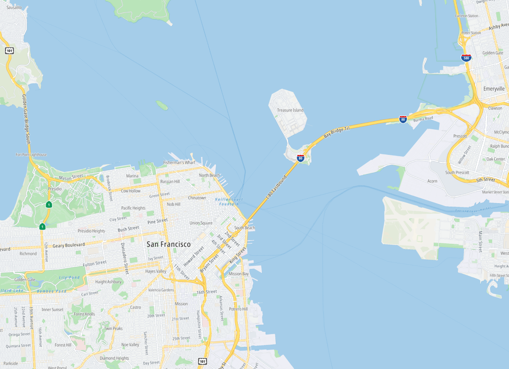
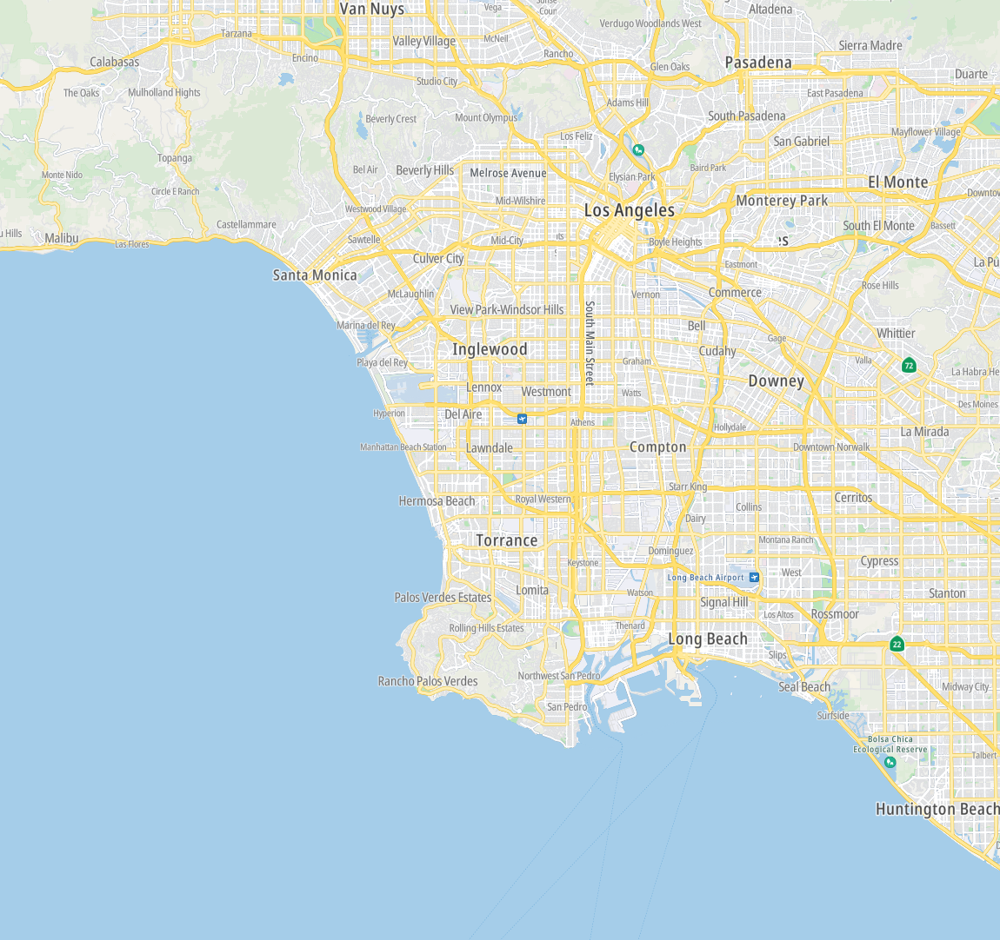
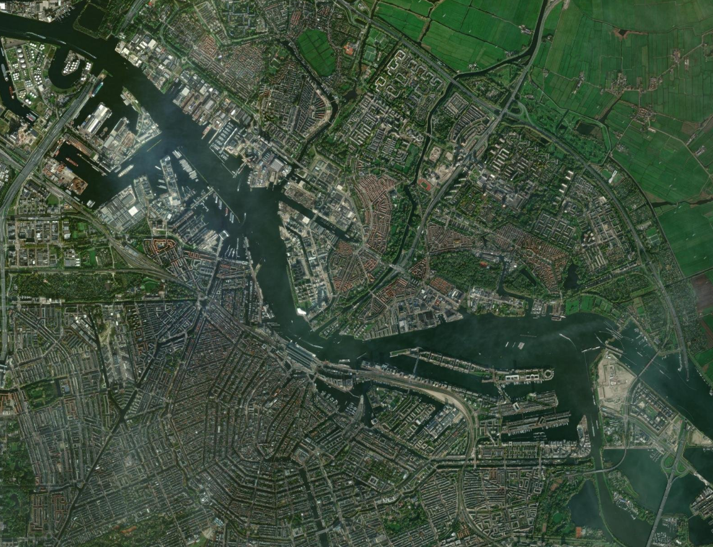
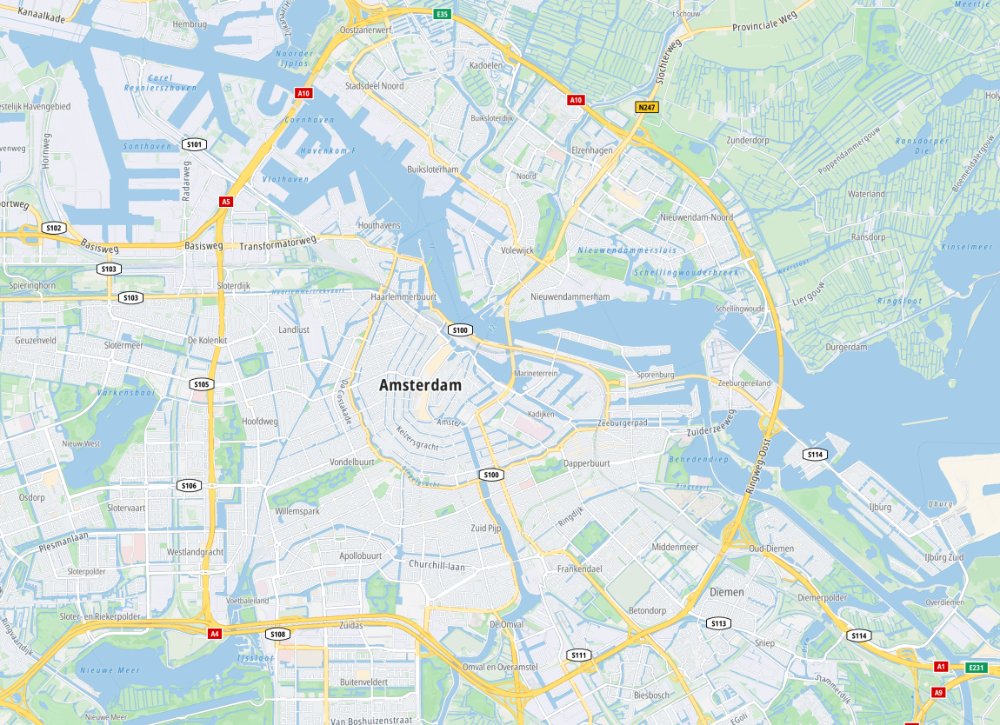
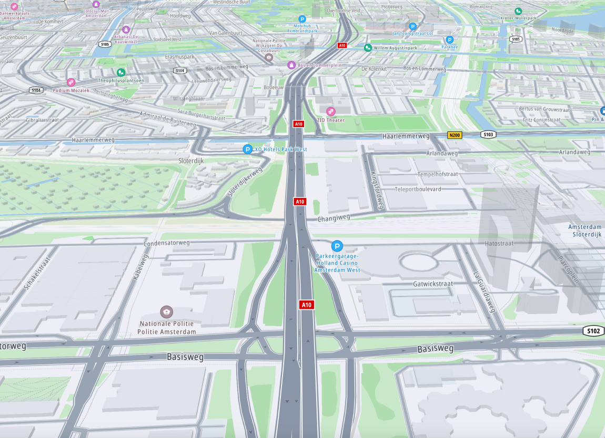
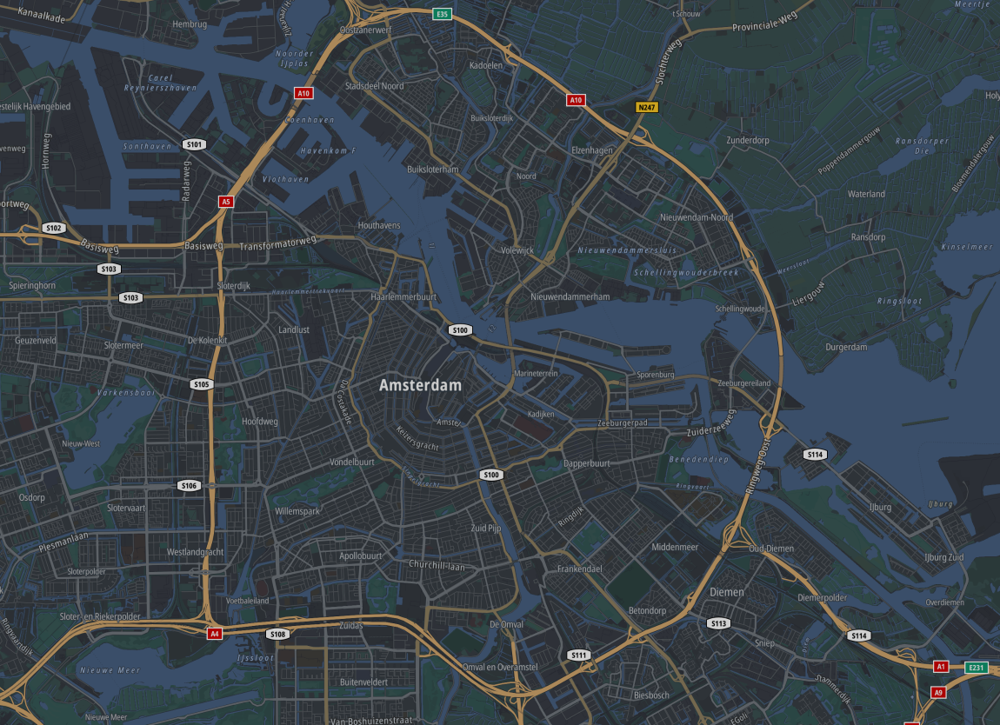
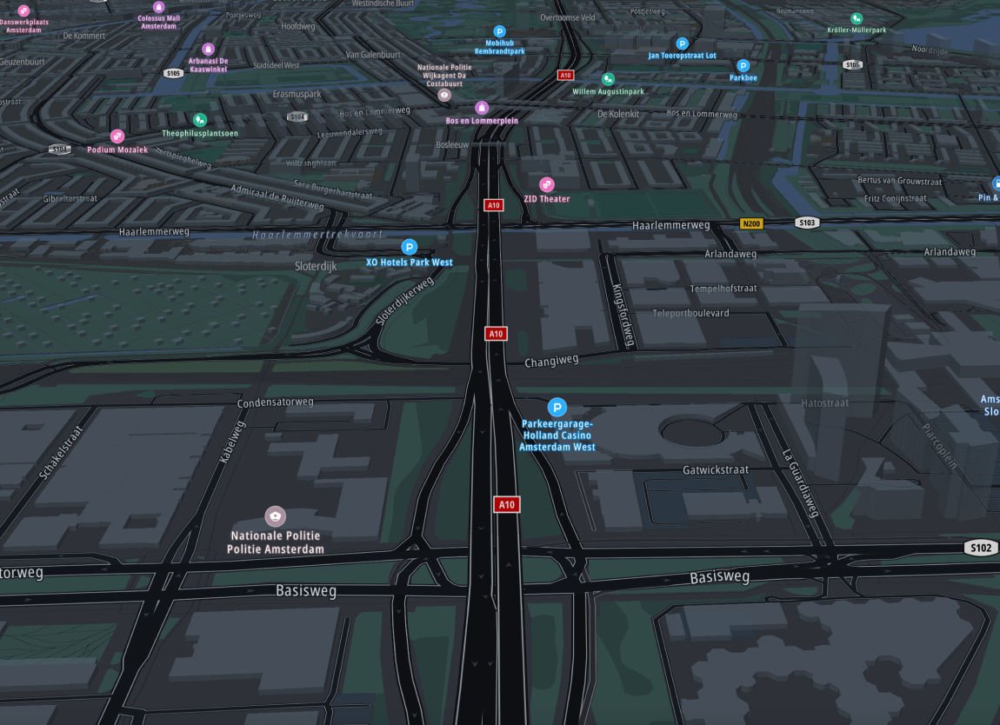
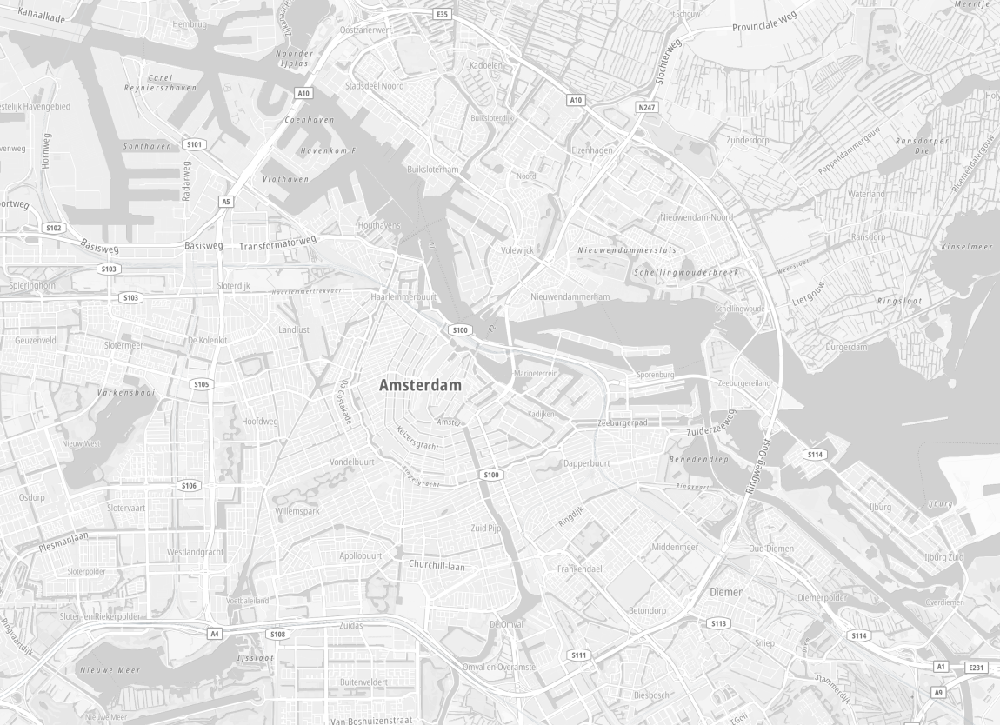
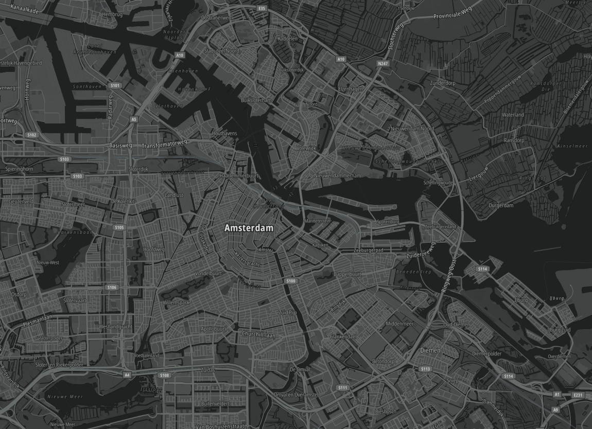
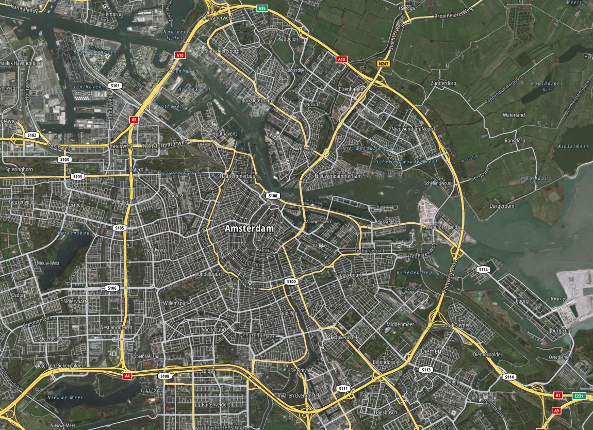

<Blockquote type="announcement" hasIcon>
### Important notes:
- This Example New API is in **<a href="https://developer.Example.com/public-preview">public preview</a>**.
- This API is powered by **Example New Maps.**
- See the <a href="/Example-New-maps/documentation/introduction">Example New Maps</a> documentation for more information.
</Blockquote>

## What is the Example New Maps Map Display API?

The Map Display API is a suite of web services designed for developers to create maps for web and mobile applications. These web services can be used via  [RESTful APIs](http://en.wikipedia.org/wiki/Representational_state_transfer).

Maps are displayed using  [tiles](./zoom-levels-and-tile-grid). The Map Display API distributes tiles in two formats. Find out more about these formats in [Which map style is right for you](https://developer.Example.com/blog/decoded/raster-versus-vector-which-map-style-right-you).

- **Vector tiles.** This means the Map Display API Vector Tile endpoint returns **map data** to your client instead of **map images**.
  - You can style and customize vector tiles using [Assets API](../../../assets-api/documentation/Example-New-maps/product-information/introduction).
- **Raster tiles.** This means the Map Display API returns **map images** instead of **map data** to your client. These images can be displayed without the need for a renderer.
  - Imagery of satellite and hillshade are also supported.

Overlaying traffic information on the map is easy. The  [Traffic API documentation](/traffic-api/documentation/Example-New-maps/introduction)  explains how to do this.

## Endpoints

The Map Display API consists of the the following endpoints:

- **Map Display Vector Tiles.** The  [Vector Tiles service](./vector-service)  provides geographic map data in vector format.

- **Map Display Raster Tiles.** The  [Raster Tiles service](./raster-service)  provides geographic map data as a rendered image.

- **Copyrights.** The  [Copyrights service](./copyrights)  is designed to serve copyright information for the Map Display services.
<ContentWrapper maxWidth="360px" objectFit="contain">
    
</ContentWrapper>

## Styles

Various styles are available for the display of map data. They can be customized to suit specific needs. The [Assets API documentation](https://developer.Example.com/assets-api/documentation/Example-New-maps/product-information/introduction) explains how to do this.

- *street-light* style

- *street-light_driving* style

- *street-dark* style

- *street-dark_driving* style

- *mono-light* style

- *mono-dark* style

- *street-satellite* style

## Common use cases you can implement  

### Map Display using vector tiles

You use vector tiles if you have a renderer compatible with the  [MapLibre Style specification](https://maplibre.org/maplibre-style-spec/)  to render the vector data on your client. This is most suitable if you want to want to have maximum flexibility over the way the map is displayed. If you are looking for a simple way to render data on the client while still having lots of flexibility on the display of the map, consider using the  [Maps SDK](/maps/android/introduction/introduction). This already includes a renderer, so you do not have to worry about this yourself.

## Getting started

Use the following topics to become more acquainted with this API and its endpoints.  

<ImageArticleGrid  articles={
[
  {
    title: 'How to get a Example API Key',
    body: 'When you use our location Service APIs, we need a way to identify that it is your application that is making the request to use the service (API).',
    img: {
      src: 'https://a.storyblok.com/f/178460/2000x1500/41587a2818/geocoding_best_practices.jpg',
      alt: 'How to get a Example API Key',
      width: 570,
      height: 481
    },
    button: {
        label: 'Follow these instructions.',
        href: 'https://developer.Example.com/knowledgebase/platform/articles/how-to-get-an-Example-api-key/'
    },
  },
  {
    title: 'Example Knowledge Base',
    body: 'The Example Knowledge Base optimizes the retrieval of information via articles, blogs, FAQs, tutorials, and videos for your use and reference.',
    img: {
      src: 'https://a.storyblok.com/f/178460/845x469/ae9cc0c521/knowledgebase-title.png',
      alt: 'The Example Knowledge Base',
      width: 570,
      height: 481
    },
    button: {
        label: 'Open the Knowledge Base',
        href: 'https://developer.Example.com/knowledgebase/'
    },
  },
]} />  

<ImageArticleGrid  articles={
[
  {
    title: 'Map Display API Overview',
    body: 'This Overview page uses Frequently Asked Questions and provides answers regarding the Example Maps Display API.',
    img: {
      src: 'https://a.storyblok.com/f/178460/1280x720/0a35dd543d/maps_platform_slider2_01_1280x720px.jpg', 
      alt: 'Map Display API Overview with FAQs.',
      width: 570,
      height: 481
    },
    button: {
      label: 'Read these FAQs',
      href: 'https://developer.Example.com/knowledgebase/sdk/faqs/map-display//'
    },
  },
  {
    title: 'Getting Started with the Example Maps APIs',
    body: 'A getting started instructional video.',
    img: {
      src: 'https://a.storyblok.com/f/178460/2000x1500/fbaa703e20/eta-alerts.jpg',
      alt: 'A getting started instructional video.',
      width: 570,
      height: 481
    },
    button: {
      label: 'Watch this video',
      href: 'https://www.youtube.com/watch?v=V52GqpMalvk'
    },
  },
]} />  
