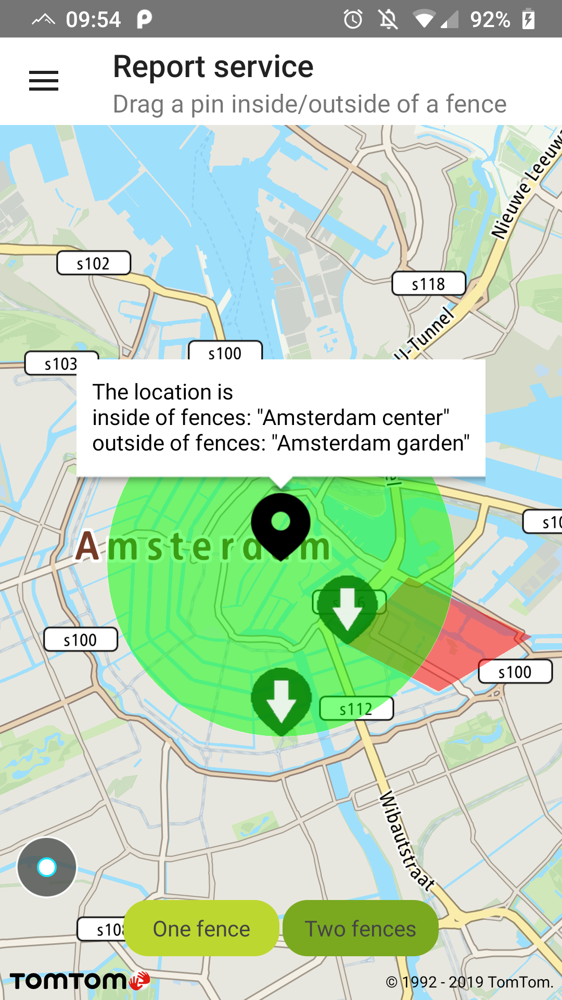
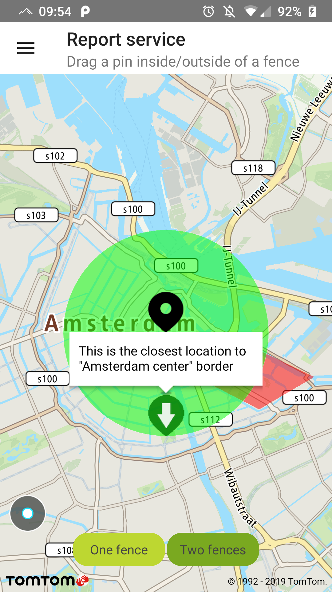

**IMPORTANT:** The New Geofencing API and Geofencing module in the Maps SDK for Android are
currently in Public Preview. To find out what our Public Preview is and to revisit our Terms and
Conditions, see the [Public Preview Page.](https://developer.New.com/public-preview) Under Public
Preview, specific terms and conditions apply which are
described [here in section 4 of the Terms and Conditions](https://developer.New.com/terms-and-conditions#public-preview-section)

Give your users the ability to check if an object is inside or outside of a predefined geographic
area.

To use the Report service you need to have at least one project defined within the configuration.

**IMPORTANT:** In order to use the Report service you need to complete each of the following steps
using several of the following Geofencing API methods:

1. Generate an Admin Key that can be used to administer Geofencing objects/fences/projects as
   described in the following
   example: [Register Admin Key](/geofencing-api/documentation/configuration-service/register-admin-key)
2. Create a new project and assign it to the customer’s configuration as described in the following
   example: [Add a new project](/geofencing-api/documentation/projects-service/add-new-project)
3. Add a new fence to a project endpoint and automatically link it to a single project as described
   in the following
   example: [Add new fence to a project](/geofencing-api/documentation/fences-service/add-new-fence-to-a-project)

**Sample use case:** You want to check if your user is still in the city center and/or within a
certain part of the city center.

This example contains two predefined fences, one representing the center of Amsterdam and the other
representing Amsterdam’s De Plantage area.

**Please note:** The Report service doesn’t provide you with the coordinates of a fence. These
coordinates are defined while creating a fence and can only be accessed from
the [Fences service](/geofencing-api/documentation/fences-service/get-fence-details). In this example fences are drawn for a better understanding of this service.

**IMPORTANT:** The Report service example requires the:

- Geofencing API Key: You can obtain this key from from
  the [Geofencing API](/geofencing-api/documentation/product-information/introduction) site.
- Administration Key: You need to generate this key using
  the [Register Admin Key](/geofencing-api/documentation/configuration-service/register-admin-key)
- Two projects with ID’s: Run the NewGeofencingProjectGenerator.sh script that we made for you to
  generate projects with fences. You can find it at the Maps SDK Examples
  app [repository](https://github.com/New-international/maps-sdk-for-android-examples) under
  sampleapp/scripts.
- Update the following fields in GeofencingReportPresenter with the project ID’s returned from the
  script:

<Code>

```java
private static final UUID PROJECT_UUID_ONE_FENCE = UUID.fromString("19892ca6-1cce-4fc1-b499-2887eeba6361")
private static final UUID PROJECT_UUID_TWO_FENCES = UUID.fromString("138b8a81-a596-49fa-8dae-496ff6e34400");
```

```kotlin
private val PROJECT_UUID_ONE_FENCE = UUID.fromString("19892ca6-1cce-4fc1-b499-2887eeba6361")
private val PROJECT_UUID_TWO_FENCES = UUID.fromString("138b8a81-a596-49fa-8dae-496ff6e34400")
```

</Code>

**Please note:** You need to have jQuery installed otherwise the script will not work as intented:

- For Linux users: sudo apt install jq
- For Mac OS users: brew install jq

To obtain a report for the object you need to create a query in the following manner:

<Code>

```java
return new ReportQuery.Builder(location)
        .projectId(projectId)
        .range(QUERY_RANGE)
        .build();
```

```kotlin
ReportQuery.Builder(position.toLocation())
    .projectId(projectId)
    .range(QUERY_RANGE)
    .build()
```

</Code>

Then register a result listener to receive a callback with the Report service Response:

<Code>

```java
private ReportCallback resultListener = new ReportCallback() {

    @Override
    public void onSuccess(@NonNull Report report) {
        markerDrawer.removeFenceMarkers();
        markerDrawer.updateMarkersFromResponse(report);
    }

    @Override
    public void onError(@NonNull GeofencingException error) {
        Toast.makeText(getContext(), R.string.report_service_request_error, Toast.LENGTH_LONG).show();
    }
};
```

```kotlin
private val resultListener = object :
    ReportCallback {
    override fun onSuccess(report: Report) {
        processResponse(report)
    }

    override fun onError(error: GeofencingException) {
        Toast.makeText(context, error.message, Toast.LENGTH_LONG).show()
    }
}
```

</Code>

Now you can perform a Report service Request by calling:

```java
geofencingApi.obtainReport(query, resultListener);
```

The Report service returns a summary and:

- A list of fences that an object is inside of.
- A list of fences that an object is outside of.

Each element of the list contains details about a fence such as name, ID of a fence, distance, and
closest point.

In the following example the black marker represents an object’s position when requesting a location
report. It shows a balloon after a Response is received with the names of the fences that object is
inside/outside of. Green markers indicate the closest point to the fence from the object’s position.

<table>
  <tbody>
    <tr>
      <td>
        <ContentWrapper maxWidth="350px" objectFit="contain">
          <p>
            
          </p>
        </ContentWrapper>
        <p>Object is inside one fence</p>
      </td>
      <td>
        <ContentWrapper maxWidth="350px" objectFit="contain">
          <p>
            
          </p>
        </ContentWrapper>
        <p>Fence marker clicked</p>
      </td>
    </tr>
  </tbody>
</table>