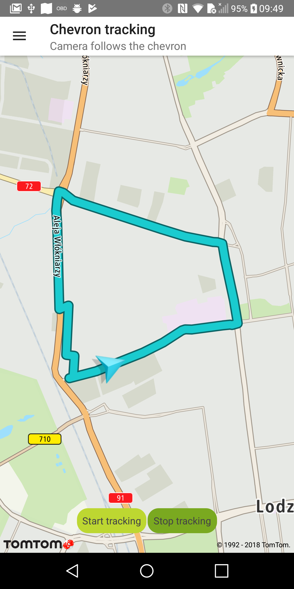
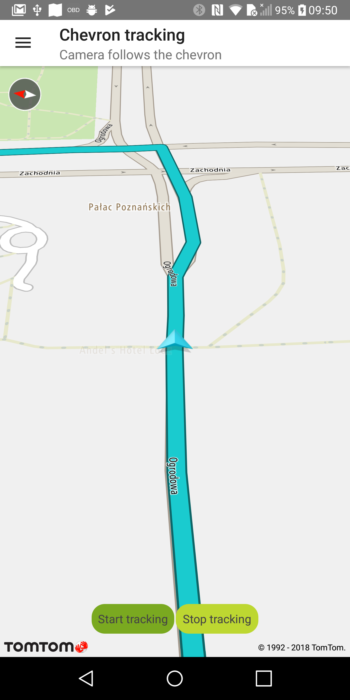

<a
  href="#"
  style={{ display: 'block', margin: '0', padding: '0' }}
  name="follow-chevron"
></a>

Allow your users to follow their changing positions on the map e.g., when driving. When a new
location is set, the animation moves the chevron to the new position.

**Sample use case 1:** You want to show your user position when driving.

<a
  href="#"
  style={{ display: 'block', margin: '0', padding: '0' }}
  name="_custom_chevron_indicator"
></a>

# Custom chevron indicator

You can set a custom icon for the chevron indicator.

To create a custom chevron:

<Code>

```java
ChevronBuilder chevronBuilder = ChevronBuilder.create(activeIcon, inactiveIcon)
chevron = NewMap.getDrivingSettings().addChevron(chevronBuilder);
```

```kotlin
val chevronBuilder = ChevronBuilder.create(activeIcon, inactiveIcon)
chevron = NewMap.drivingSettings.addChevron(chevronBuilder)
```

</Code>

<a
  href="#"
  style={{ display: 'block', margin: '0', padding: '0' }}
  name="_chevron_tracking_mode"
></a>

# Chevron tracking mode

Additionally, it is possible to track the chevron. This means that the camera/map and the chevron
move when a new location is received so that the map is always centered on the chevron with the
bearing of the drive. In the tracking mode, rotate and pan gestures are blocked. The user can only
change the zoom level, while the map camera is automatically adjusted to follow the chevron.

To start tracking a selected chevron:

<Code>

```java
NewMap.getDrivingSettings().startTracking(getChevron());
```

```kotlin
NewMap.drivingSettings.startTracking(chevron)
```

</Code>

To stop tracking a selected chevron:

<Code>

```java
NewMap.getDrivingSettings().stopTracking();
```

```kotlin
NewMap.drivingSettings.stopTracking()
```

</Code>

You can set the chevron position on the map when in tracking mode.

To change the position:

```java
NewMap.drivingSettings.setChevronScreenPosition(ChevronScreenPosition(0.5, 0.75))
```

To reset/center the position of a chevron:

```java
NewMap.drivingSettings.centerChevronScreenPosition()
```

<a
  href="#"
  style={{ display: 'block', margin: '0', padding: '0' }}
  name="_update_chevron_location"
></a>

# Update chevron location

To update the chevron base on a GPS position, you need to register to location updates. You can
register `LocationUpdateListener` on the `NewMap` instance. After receiving the new location, you
can update the position of the chevron. Use this code snippet:

```kotlin
val listener = LocationUpdateListener { location ->
    chevron.position = ChevronPosition.Builder(location).build()
    chevron.show()
}
NewMap.addLocationUpdateListener(listener)
```

Remember to unregister the listener:

```kotlin
NewMap.removeLocationUpdateListener(listener)
```

<table>
  <tbody>
    <tr>
      <td>
        <ContentWrapper maxWidth="350px" objectFit="contain">
          <p>
            
          </p>
        </ContentWrapper>
        <p>Chevron overview</p>
      </td>
      <td>
        <ContentWrapper maxWidth="350px" objectFit="contain">
          <p>
            
          </p>
        </ContentWrapper>
        <p>Chevron tracking</p>
      </td>
    </tr>
  </tbody>
</table>