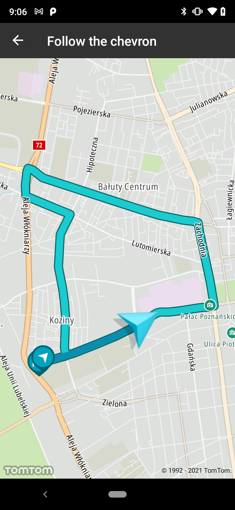
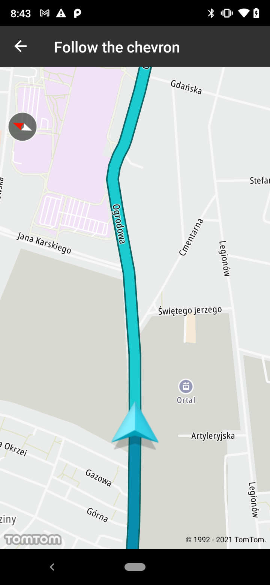

<a
  href="#"
  style={{ display: 'block', margin: '0', padding: '0' }}
  name="Progress-along-the-route"
></a>

Allow your users to visually distinguish the part of the route that has already been traveled. When
a new location is set, the specified route style layer is drawn up to the desired location.

**Sample use case:** You want to show your user the part of the route that has already been
traveled.

Use the following code snippet to create your route progress style:

```kotlin
val style = RouteLayerStyle.Builder()
    .color(DARK_BLUE)
    .build()
```

Use the following code snippet to activate showing the route progress layer on top of a route:

```kotlin
routeSettings.activateProgressAlongRoute(routeId, style)
```

Use the following code snippet to update the already traveled part of the route:

```kotlin
routeSettings.updateProgressAlongRoute(routeId, location)
```

Screen shots presenting how progress along the route works:

<table>
  <tbody>
    <tr>
      <td>
        <ContentWrapper maxWidth="350px" objectFit="contain">
          <p>
            
          </p>
        </ContentWrapper>
      </td>
      <td>
        <ContentWrapper maxWidth="350px" objectFit="contain">
          <p>
            
          </p>
        </ContentWrapper>
      </td>
    </tr>
  </tbody>
</table>