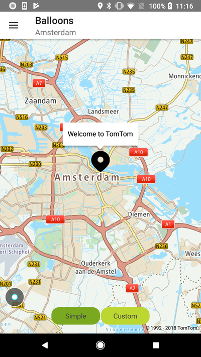
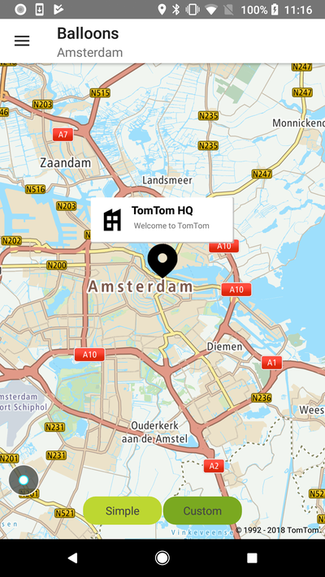

Allow your users to display and customize balloons in a few lines of code.

**Sample use case:** You would like to learn more about a place on the map. Depending on the
selected location, the app displays a balloon containing either text or additional information such
as icons or pictures.

Every **Marker** can be linked with a corresponding balloon to display detailed information.
Balloons can be triggered in two ways:

- Automatically, if the annotation is tapped on the map.
- Calling the `Marker#select()` method.

A balloon can be closed in the following ways:

- Automatically, if a user taps on the map.
- Automatically, if a user taps on another Marker.

You can use one of the built-in balloon views that provide an easy way to display it,
like `SimpleMarkerBalloon` that is used to display a default balloon. A balloon object is an
instance of MarkerBalloon that has to implement the ViewAdapter interface.

# Default Balloons

By default every marker when selected will display a default balloon which is an instance
of `BaseMarkerBalloon` filled with the coordinates of the marker. `BaseMarkerBalloon` is a view
model of the marker balloon view. To add a property to the model, you need to use this function:

<Code>

```java
BaseMarkerBalloon markerBalloon = new BaseMarkerBalloon()
markerBalloon.addProperty("key", "value");
```

```kotlin
val markerBalloon = BaseMarkerBalloon()
markerBalloon.addProperty("key", "value")
```

</Code>

Model can be used to inflate balloon view.

Property `Marker#canShowBalloon` by default is set to `true`. By changing it to `false` the marker
can still be selected but no balloon will appear. Property `Marker#selected` determines if the
marker is selected at all. By default is `false`.

There is only one defined common model property key, which can be used in `BaseBalloonViewAdapter`
to inflate the balloon, however more property keys can be added.

```java
/**
 * text property key, one of the most used properties for balloon.
 */
public static final String KEY_TEXT = "text";
```

To display a balloon model we need to create and set a balloon view adapter:

```java
/**
 * The adapter of balloon view. An implement interface to inflate a balloon adapter.
 */
public interface BalloonViewAdapter<T extends MarkerBalloon, E extends MapPoint> {

    /**
     * A callback which is called when inflating the model.
     *
     * @param container - A container where a marker or balloon item will be inflated.
     * @param marker - A marker which has a balloon.
     * @param markerBalloon - A view model of a marker balloon.
     */
    <M extends T> View onCreateView(ViewGroup container, E marker, M markerBalloon);

    /**
     * @param view  The root view of inflating a layout.
     * @param marker The value which is used to fill a layout.
     * @param markerBalloon The view model of the marker balloon.
     */
    <M extends T> void onBindView(View view, E marker, M markerBalloon);

    /**
     * A view of the marker balloon.
     * @return It can be null when the balloon is not inflated.
     */
    @NonNull
    View getBalloonView();

    /**
     * Gets the balloon offset from the marker.
     */
    @NonNull
    Point getBalloonOffset(E marker);
}
```

There are a few implementations provided of the balloon view adapter. These implementations cover
the commons cases for balloons.

<a
  href="#"
  style={{ display: 'block', margin: '0', padding: '0' }}
  name="_simple_balloons"
></a>

## Simple balloons

<ContentWrapper maxWidth="350px" objectFit="contain">



</ContentWrapper>

To create a simple balloon (a simple balloon is a balloon with one text line):

1. Create a model for the marker balloon with the text
   properties: `new SimpleMarkerBalloon("Welcome to New")`.
2. Create a balloon view adapter: `TextBalloonViewAdapter` that supports a one text line balloon
   view model.
3. Set an adapter.
4. Use all of the following steps:

<Code>

```java
NewMap.getMarkerSettings().setMarkerBalloonViewAdapter(new TextBalloonViewAdapter());
SimpleMarkerBalloon balloon = new SimpleMarkerBalloon("Welcome to New");
MarkerBuilder markerBuilder = new MarkerBuilder(position)
        .markerBalloon(balloon);

Marker m = NewMap.addMarker(markerBuilder);
```

```kotlin
NewMap.markerSettings.markerBalloonViewAdapter = TextBalloonViewAdapter()
val balloon = SimpleMarkerBalloon(SIMPLE_BALLOON_TEXT)
val markerBuilder = MarkerBuilder(position)
    .markerBalloon(balloon)

val marker = NewMap.addMarker(markerBuilder)
```

</Code>

If any adapter is not set by the user, `TextBalloonViewAdapter` is set by default. Because of that,
points 2-4 are optional.

<a
  href="#"
  style={{ display: 'block', margin: '0', padding: '0' }}
  name="_custom_balloons"
></a>

## Custom balloons

Despite that you can use the default balloon, as the SDK allows you to create fully customizable
ones. Balloon is nothing more than an Android `layout` implementation. A custom layout can be built
in the way that you like either from the Android Studio Builder or programmatically.

<ContentWrapper maxWidth="350px" objectFit="contain">



</ContentWrapper>

To create a custom layout balloon:

- Create a model for the marker balloon. `BaseMarkerBalloon` doesn’t have properties by default.
  Properties can be added by the `addProperties(key, value)` method.
- Use `SingleLayoutBalloonViewAdapter` and provide the layout in the constructor.
- Set an adapter.
- Use all of the following steps:

<Code>

```java
NewMap.getMarkerSettings().setMarkerBalloonViewAdapter(new SingleLayoutBalloonViewAdapter(R.layout.custom_balloon_layout));
MarkerBuilder markerBuilder = new MarkerBuilder(position)
        .markerBalloon(new BaseMarkerBalloon());
Marker m = NewMap.addMarker(markerBuilder);
```

```kotlin
NewMap.markerSettings.markerBalloonViewAdapter = SingleLayoutBalloonViewAdapter(layoutRes)
val markerBuilder = MarkerBuilder(position)
    .markerBalloon(BaseMarkerBalloon())

val marker = NewMap.addMarker(markerBuilder)
```

</Code>

To manage the custom ballon view model override method of `SingleLayoutBalloonViewAdapter`:

```java
/**
 * @param view  The root view of inflating a layout.
 * @param marker The value which is used to fill a layout.
 * @param markerBalloon The view model of the marker balloon.
 */
<M extends T> void onBindView(View view, E marker, M markerBalloon);
```

or create your own class which extends `BalloonViewAdapter` and overrides all abstract methods.