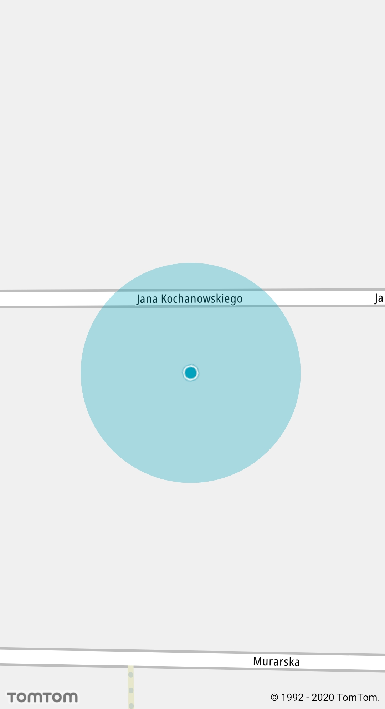
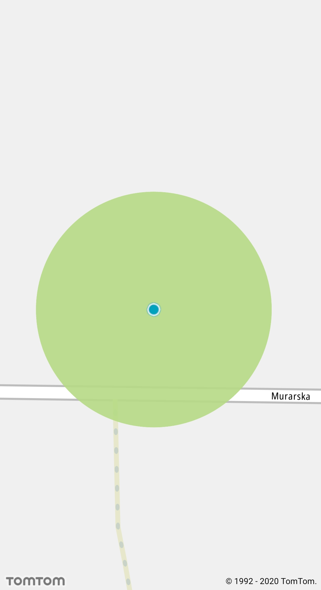
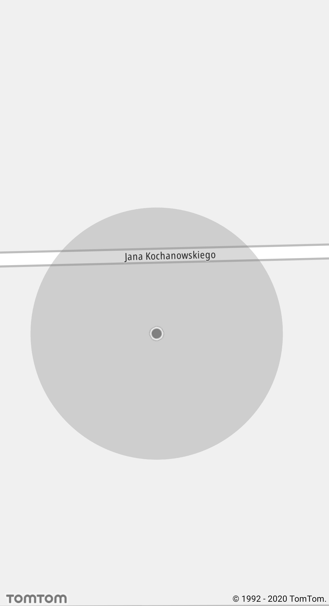
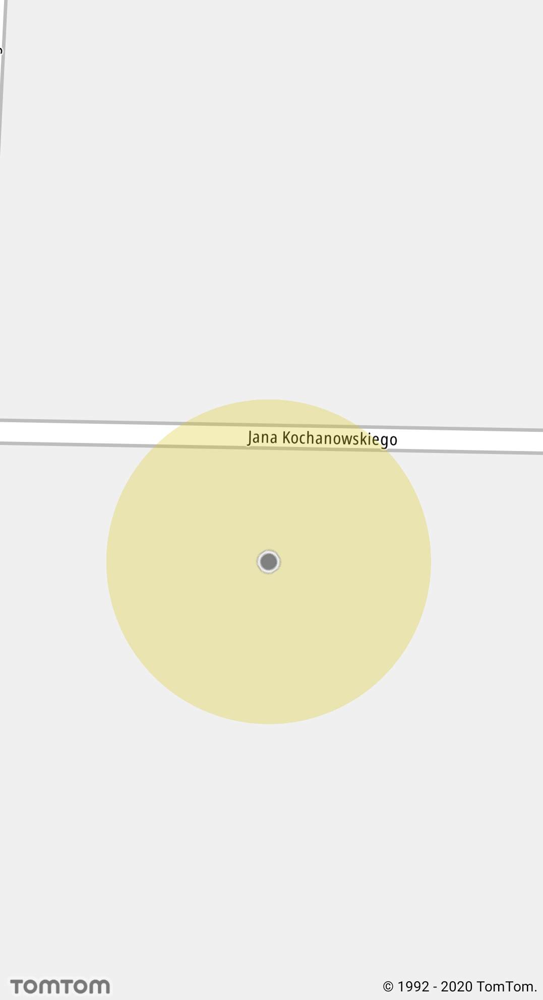

<a
  href="#"
  style={{ display: 'block', margin: '0', padding: '0' }}
  name="_custom_gps_radius_color"
></a>

## Custom GPS radius color

The Maps SDK provides the ability to change the `GPS Indicator` inaccuracy radius color at runtime.
Default behavior of the indicator consists of two states: active when GPS signal is accurate and
dimmed. To change both radius colors, first you need to obtain the current `GPS Indicator` by using
the following method:

<Code>

```java
Optional<GpsIndicator> indicatorOptional = NewMap.getGpsPositionIndicator()
if (indicatorOptional.isPresent()) {
    gpsIndicator = indicatorOptional.get();
}
```

```kotlin
val gpsIndicator = NewMap.gpsPositionIndicator.orNull()
```

</Code>

After obtaining the indicator, you can change the active state radius color by invoking the
following method:

<Code>

```java
gpsIndicator.setInaccuracyAreaColor(COLOR_RGBA);
```

```kotlin
gpsIndicator?.setInaccuracyAreaColor(COLOR_RGBA)
```

</Code>

<table>
  <tbody>
    <tr>
      <td>
        <ContentWrapper maxWidth="350px" objectFit="contain">
          <p>
            
          </p>
        </ContentWrapper>
        <p>Default GPS indicator active radius</p>
      </td>
      <td>
        <ContentWrapper maxWidth="350px" objectFit="contain">
          <p>
            
          </p>
        </ContentWrapper>
        <p>Custom GPS indicator active radius</p>
      </td>
    </tr>
  </tbody>
</table>

Changing the dimmed radius color can be done by using a similar piece of code:

<Code>

```java
gpsIndicator.setDimmedInaccuracyAreaColor(COLOR_RGBA);
```

```kotlin
gpsIndicator?.setDimmedInaccuracyAreaColor(COLOR_RGBA)
```

</Code>

<table>
  <tbody>
    <tr>
      <td>
        <ContentWrapper maxWidth="350px" objectFit="contain">
          <p>
            
          </p>
        </ContentWrapper>
        <p>Default GPS indicator dimmed radius</p>
      </td>
      <td>
        <ContentWrapper maxWidth="350px" objectFit="contain">
          <p>
            
          </p>
        </ContentWrapper>
        <p>Custom GPS indicator dimmed radius</p>
      </td>
    </tr>
  </tbody>
</table>