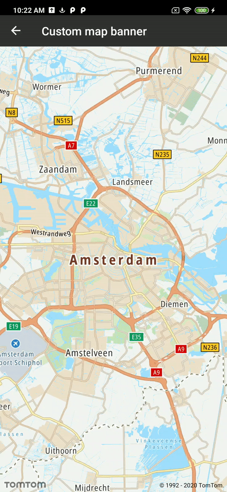

<a
  href="#"
  style={{ display: 'block', margin: '0', padding: '0' }}
  name="custom-view-tracking"
></a>

The Maps for Android SDK provides support for custom marker balloons. However, you are limited to
only display one balloon at any given time. Therefore displaying multiple views on the map is not
possible when using markers. To display multiple views on the map and tie them to a certain position
on the map you need to fulfill some basic steps.

In this example we will be adding a new custom view after every `Long Click` event and tie it to
the `Long Click` location.

The first step is to define how our custom view will look. In this example we are going to use the
following XML layout:

```xml
<androidx.constraintlayout.widget.ConstraintLayout xmlns:android="http://schemas.android.com/apk/res/android"
    xmlns:app="http://schemas.android.com/apk/res-auto"
    xmlns:tools="http://schemas.android.com/tools"
    android:layout_width="wrap_content"
    android:layout_height="wrap_content"
    android:background="@color/transparent">

    <androidx.constraintlayout.widget.ConstraintLayout
        android:layout_width="wrap_content"
        android:layout_height="wrap_content"
        android:layout_marginTop="@dimen/custom_banner_internal_layout_margin"
        android:layout_marginEnd="@dimen/custom_banner_internal_layout_margin"
        android:layout_marginRight="@dimen/custom_banner_internal_layout_margin"
        android:background="@drawable/center_balloon_bg"
        app:layout_constraintEnd_toEndOf="parent"
        app:layout_constraintStart_toStartOf="parent"
        app:layout_constraintTop_toTopOf="parent">

        <ImageView
            android:id="@+id/banner_icon"
            android:layout_width="@dimen/custom_banner_icon_size"
            android:layout_height="@dimen/custom_banner_icon_size"
            android:layout_marginStart="@dimen/custom_banner_icon_margin"
            android:layout_marginLeft="@dimen/custom_banner_icon_margin"
            android:src="@drawable/ic_markedlocation"
            app:layout_constraintBottom_toBottomOf="@+id/banner_title"
            app:layout_constraintStart_toStartOf="parent"
            app:layout_constraintTop_toTopOf="@+id/banner_title" />

        <TextView
            android:id="@+id/banner_title"
            android:layout_width="wrap_content"
            android:layout_height="wrap_content"
            android:layout_gravity="center"
            android:layout_margin="@dimen/custom_banner_title_margin"
            android:textColor="@android:color/black"
            app:layout_constraintBottom_toBottomOf="parent"
            app:layout_constraintEnd_toEndOf="parent"
            app:layout_constraintStart_toEndOf="@+id/banner_icon"
            app:layout_constraintTop_toTopOf="parent"
            tools:text="Your position is" />
    </androidx.constraintlayout.widget.ConstraintLayout>

    <ImageButton
        android:id="@+id/banner_remove_button"
        android:layout_width="@dimen/custom_banner_remove_icon_size"
        android:layout_height="@dimen/custom_banner_remove_icon_size"
        android:background="@drawable/round_button_background"
        android:src="@drawable/ic_remove"
        app:layout_constraintEnd_toEndOf="parent"
        app:layout_constraintTop_toTopOf="parent" />
</androidx.constraintlayout.widget.ConstraintLayout>
```

Now since our layout is properly defined we can define
our `NewMapCallback.OnMapLongClickListener`

```java
private val onMapLongClickListener = NewMapCallback.OnMapLongClickListener { latLng ->
    processLongClickEvent(latLng)
}
```

And register it using the following method in `onResume()` of your `Fragment`/`Activity`:

```java
NewMap.addOnMapLongClickListener(onMapLongClickListener)
```

Whenever a `Long Click` occurs, its position is translated to screen pixels and the custom view
creation starts:

```java
val screenPosition = NewMap.pixelForLatLng(latLng)
createAndAddViewToLayout(latLng, screenPosition)
```

The custom view creation consists of three steps: layout inflation, setup of the initial position,
and adding to the `ViewGroup` which in this case is the `Fragment` root layout:

```java
private fun createAndAddViewToLayout(position: LatLng, rawScreenPosition: PointF) {
    val view = inflateCustomView(position)
    view.viewTreeObserver.addOnGlobalLayoutListener(object : ViewTreeObserver.OnGlobalLayoutListener {
        override fun onGlobalLayout() {
            view.viewTreeObserver.removeOnGlobalLayoutListener(this)
            setViewPosition(view, rawScreenPosition)
            lockViewToPosition(position)
        }
    })
    container.addView(view)
}
```

When layout inflation occurs, the main thing to remember is that you either should add tags to the
view or to the store view ID, so whenever the camera move occurs we will be able to easily update
the view position. In this example we are using passed position as a tag. Additionally we hook up
the `OnClickListener` to the `ImageButton` from the layout that will remove this view from
the `ViewGroup`.

```java
private fun inflateCustomView(position: LatLng): View {
    val annotationBalloon =
        LayoutInflater.from(requireContext()).inflate(R.layout.custom_banner_view, container, false)
    annotationBalloon.tag = position

    val textView = annotationBalloon.findViewById<TextView>(R.id.banner_title)
    textView.text = getString(R.string.custom_banner_title, position.latitude, position.longitude)

    val removeButton = annotationBalloon.findViewById<ImageButton>(R.id.banner_remove_button)
    removeButton.setOnClickListener { removeView(annotationBalloon) }

    return annotationBalloon
}
```

After inflation is done, we need to add `onGlobalLayoutListener` to get a callback when the view
size is determined. Now we can calculate the initial position of the view using the previously
obtained screen pixels and adding the proper offset.

Then we do a view translation to the new position:

```java
private fun setViewPosition(view: View, rawScreenPosition: PointF) {
    view.x = rawScreenPosition.x - (view.width / 2)
    view.y = rawScreenPosition.y - view.height
}
```

After the screen position is set, we tie the view using its tag to the position of the `Long Click`
for future screen position updates. In this example we store positions which are used as tags inside
of `ViewModel` in a `List`:

```java
viewModel.mapBannerPositions.add(position)
```

At this point every `Long Click` will add a view like this:

<ContentWrapper maxWidth="250px" objectFit="contain">



</ContentWrapper>

Unfortunately, right now the custom view is not updating its position on the screen when the camera
is moving. To achieve that effect we need to register for camera changed events or rendering events.

In this example we are going to use
the `NewMapCallback.OnMapChangedListener#onDidFinishRenderingFrame()` listener for a smoother
transition effect. If you are going to have multiple views we recommend using
the `NewMapCallback.OnCameraChangedListener` instead. Both callbacks are called multiple times
per second. Therefore you should not run any heavy operations inside callbacks.

Register the listener in `onResume` of your `Fragment`/`Activity`:

```kotlin
NewMap.addOnMapChangedListener(onRenderFrameListener)
```

When the `onDidFinishRenderingFrame()` method is called, you need to recalculate and apply the new
view position on the screen using:

```kotlin
viewModel.mapBannerPositions.forEach { latLng ->
    val screenPosition = NewMap.pixelForLatLng(latLng)
    setViewPosition(container.findViewWithTag(latLng), screenPosition)
}
```

At this point, the view should react on a map movement:

<ContentWrapper maxWidth="250px" objectFit="contain">


</ContentWrapper>

Unregister both listeners on your `Fragment`/`Activity` `onPause()` method:

```kotlin
NewMap.removeOnMapChangedListener(onRenderFrameListener)
NewMap.removeOnMapLongClickListener(onMapLongClickListener)
```

To handle screen orientation changes, use data stored inside of `ViewModel` and recreate the views
before you register camera changed events or rendering an events listener.