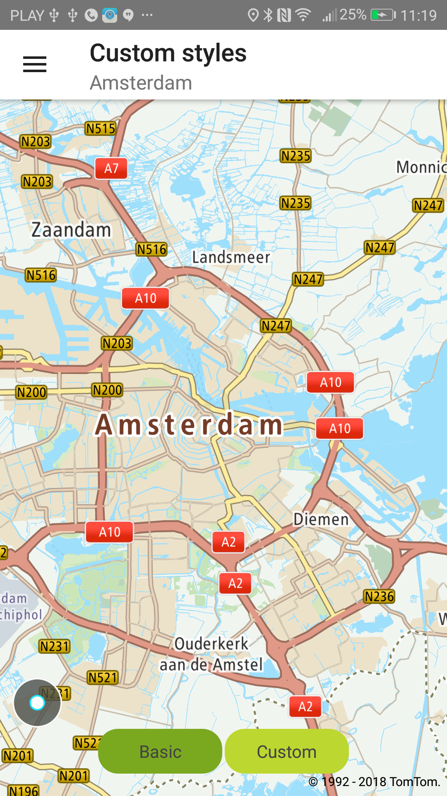
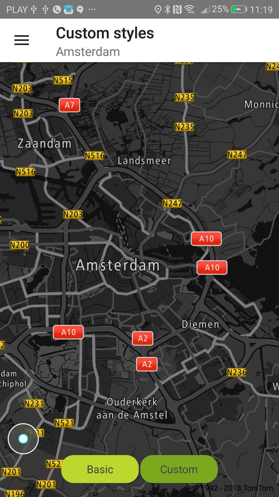

<a
  href="#"
  style={{ display: 'block', margin: '0', padding: '0' }}
  name="Map-Custom-styles"
></a>

<a
  href="#"
  style={{ display: 'block', margin: '0', padding: '0' }}
  name="_default_custom_style"
></a>

## Default & Custom Style

The default style for Maps SDK is retrieved from
the [Map Style endpoint](/map-display-api/documentation/mapstyles/map-styles).
This is a merged style constructed from layers of vector map, traffic flow and traffic incidents
overlay. The details on generating such a style is described in the following sections "Merged style
method" and "Merged sprite method" of
the [Map Style documentation](/map-display-api/documentation/mapstyles/map-styles)

If you wish to create your own map style, we recommend the following:

- download the default style from the Map Style endpoint
- modify the style in the Map Styler
- use the modified style in the SDK

**Modify the default New style**

The best way to create a custom style is to modify the default New style for vector maps using
the Maputnik editor. You can find the JSON map style in the resources directory. The tutorial on how
to modify the style is available for all Maps SDKs (for Android, iOS, and Web)
at [Creating custom vector map style](https://developer.New.com/maps-sdk-web/tutorials-advanced/creating-custom-vector-map-style). Note that after step 9 of the linked tutorial, you need to save the JSON file and place it in the
resources directory of your app project.

**Provide your style** You can provide an external map style file on the server and provide the URL.
Sprites and fonts should be stored locally in the application. Currently, we don’t support loading
resources and fonts from a server.

**Sample use case 1:** You want to display a night-themed map with inverted logo colors at night or
while in a tunnel.

<Code>

```java
NewMap.getUiSettings().setStyleUrl("asset://styles/night.json")
NewMap.getUiSettings().getLogoView().applyInvertedLogo();
```

```kotlin
NewMap.uiSettings.setStyleUrl("asset://styles/night.json")
NewMap.uiSettings.logoView.applyInvertedLogo()
NewMap.uiSettings.copyrightsView.applyInvertedColor()
```

</Code>

Optionally, there is a possibility to load the style directly from JSON text:

<Code>

```java
String styleJson = [...];
NewMap.getUiSettings().setStyleJson(styleJson);
```

```kotlin
val styleJson: String = [...]
NewMap.uiSettings.setStyleJson(styleJson)
```

</Code>

**Sample use case 2:** You want to switch back to the basic style for map and logo.

<Code>

```java
NewMap.getUiSettings().loadDefaultStyle();
NewMap.getUiSettings().getLogoView().applyDefaultLogo();
```

```kotlin
NewMap.uiSettings.loadDefaultStyle()
NewMap.uiSettings.logoView.applyDefaultLogo()
NewMap.uiSettings.copyrightsView.applyDefaultColor()
```

</Code>

**Sample use case 3:** You want to use your own custom style not compliant with New source names
convention.

<Code>

```java
NewMap.getUiSettings().setStyleUrl(
        "asset://styles/custom-traffic.json",
        new LayerSetConfiguration.Builder()
                .mapTilesConfiguration(MAP_TILES_SOURCE_ID)
                .trafficFlowTilesConfiguration(TRAFFIC_FLOW_SOURCE_ID)
                .trafficIncidentsTilesConfiguration(TRAFFIC_INCIDENTS_SOURCE_ID)
                .build()
);
```

```kotlin
NewMap.uiSettings.setStyleUrl(
    "asset://styles/custom-traffic.json",
    LayerSetConfiguration.Builder()
        .mapTilesConfiguration(MAP_TILES_SOURCE_ID)
        .trafficFlowTilesConfiguration(TRAFFIC_FLOW_SOURCE_ID)
        .trafficIncidentsTilesConfiguration(TRAFFIC_INCIDENTS_SOURCE_ID)
        .build()
)
```

</Code>

**IMPORTANT:** Reloading the style is an asynchronous operation. You need to ensure that no method
modifies the style before this operation is
done. `NewMapCallback.OnMapChangedListener.onDidFinishLoadingStyle` is called when reloading the
style is finished. An `OnMapChangedListener` can be registered
using `NewMap.addOnMapChangedListener`.

<table>
  <tbody>
    <tr>
      <td>
        <ContentWrapper maxWidth="350px" objectFit="contain">
          <p>
            
          </p>
        </ContentWrapper>
        <p>Basic style</p>
      </td>
      <td>
        <ContentWrapper maxWidth="350px" objectFit="contain">
          <p>
            
          </p>
        </ContentWrapper>
        <p>Night custom style</p>
      </td>
    </tr>
  </tbody>
</table>