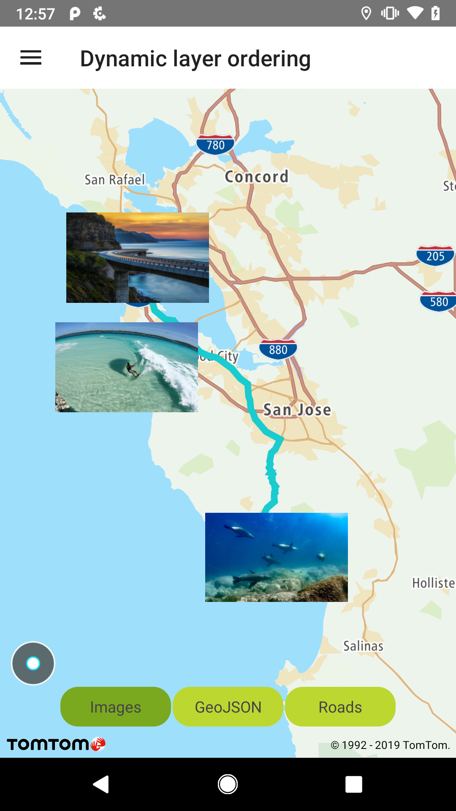
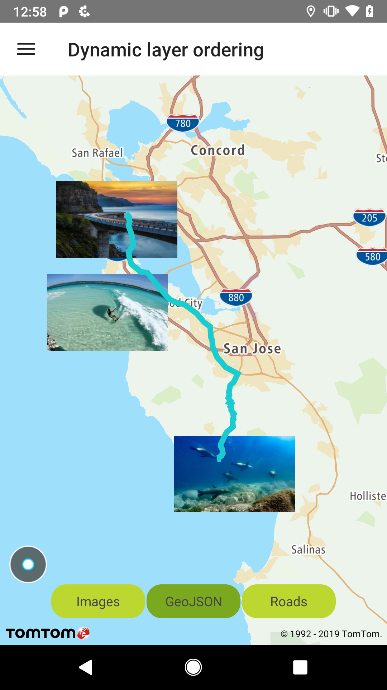
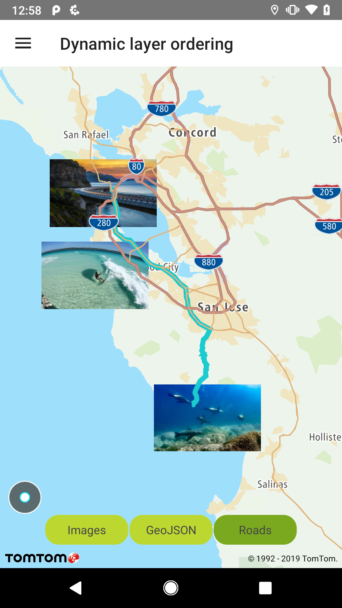

You can dynamically change the z-order of the layers on the map to make the layers important to your
use case visible on top of other layers.

**Sample use case :** You placed images on the map in your app but your users can bring the route
and the road network on top of the images to see what the route looks like in detail.

<table>
  <tbody>
    <tr>
      <td>
        <ContentWrapper maxWidth="350px" objectFit="contain">
          <p>
            
          </p>
        </ContentWrapper>
        <p>Images layer moved to the front</p>
      </td>
      <td></td>
    </tr>
  </tbody>
</table>

<Code>

```java
// layersImages = NewMap.getStyleSettings().findLayersById(IMAGE_LAYER_ID + "[0-9]")
// Layer imgLayer = layersImages.get(...)
NewMap.getStyleSettings().moveLayerBehind(imgLayer.getId(), "");
```

```kotlin
//REFERENCE_LAYER = ""
NewMap.styleSettings.moveLayerBehind(layer.id, REFERENCE_LAYER)
```

</Code>

<table>
  <tbody>
    <tr>
      <td>
        <ContentWrapper maxWidth="350px" objectFit="contain">
          <p>
            
          </p>
        </ContentWrapper>
        <p>GeoJson layer with line moved to the front</p>
      </td>
      <td></td>
    </tr>
  </tbody>
</table>

<Code>

```java
// layerGeoJson = NewMap.getStyleSettings().findLayerById("layer-line-id").orNull();
NewMap.getStyleSettings().moveLayerBehind(layerGeoJson.getId(), "");
```

```kotlin
//REFERENCE_LAYER = ""
NewMap.styleSettings.moveLayerBehind(layer.id, REFERENCE_LAYER)
```

</Code>

<table>
  <tbody>
    <tr>
      <td>
        <ContentWrapper maxWidth="350px" objectFit="contain">
          <p>
            
          </p>
        </ContentWrapper>
        <p>Roads layer moved to the front</p>
      </td>
      <td></td>
    </tr>
  </tbody>
</table>

<Code>

```java
// layersRoads = NewMap.getStyleSettings().findLayersById(".*[rR]oad.*|.*[mM]otorway.*");
// Layer roadLayer = layersRoads.get(...)
NewMap.getStyleSettings().moveLayerBehind(roadLayer.getId(), "");
```

```kotlin
//REFERENCE_LAYER = ""
NewMap.styleSettings.moveLayerBehind(layer.id, REFERENCE_LAYER)
```

</Code>