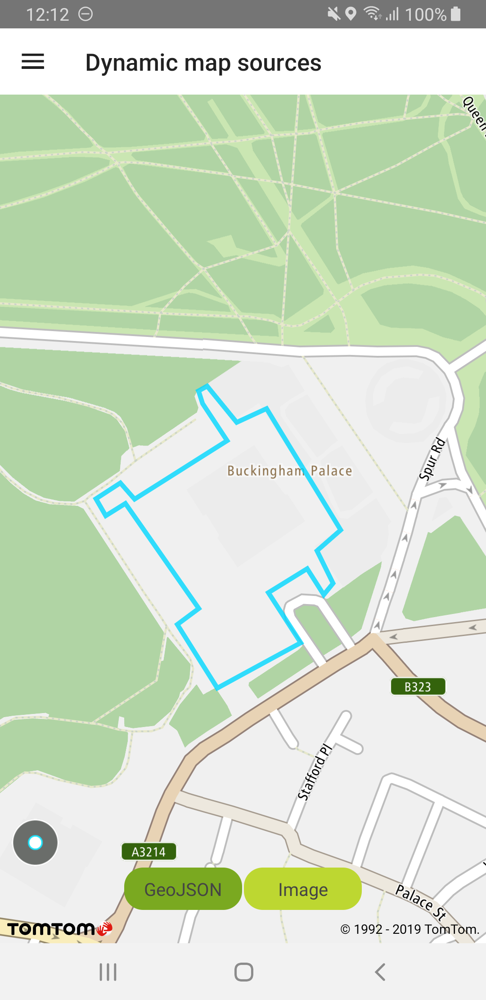
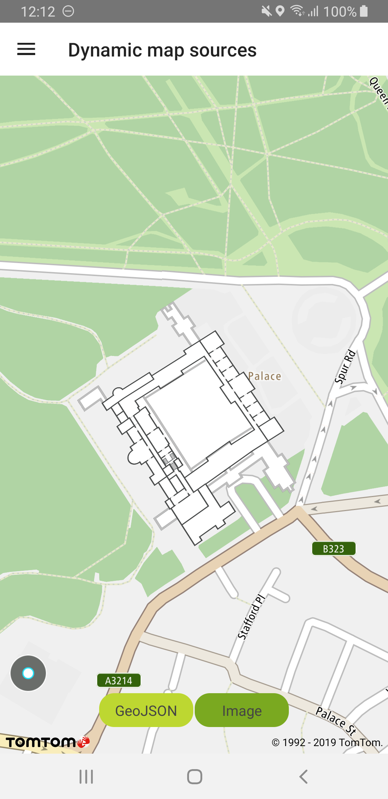

Add layers and sources (e.g., GeoJSON, images) to the map in real time. This will allow you to
dynamically change a map’s style in response to user interaction and context.

**Sample use case 1:** You want to add extra layers with building plans from your custom source.

**Sample use case 2:** You want to dynamically modify source parameters (e.g., a URL).

To create a layer and dynamically add it to the style:

<Code>

```java
Layer layer = LayerFactory.createLayer(layerJson)
NewMap.getStyleSettings().addLayer(layer);
```

```kotlin
val layer = LayerFactory.createLayer(layerJson)
NewMap.styleSettings.addLayer(layer)
```

</Code>

To create a GeoJSON source and dynamically add it to the style:

<Code>

```java
//GEOJSON_SOURCE_ID = unique_source_id
//GeoJsonData = JSON representing source data
GeoJsonSource source = SourceFactory.createGeoJsonSource(GEOJSON_SOURCE_ID);
source.setGeoJson(geoJsonData);
NewMap.getStyleSettings().addSource(source);
```

```kotlin
//GEOJSON_SOURCE_ID = unique_source_id
//GeoJsonData = JSON representing source data
val source = SourceFactory.createGeoJsonSource(GEOJSON_SOURCE_ID)
source.setGeoJson(geoJsonData)
NewMap.styleSettings.addSource(source)
```

</Code>

To create an Image source:

<Code>

```java
//IMAGE_SOURCE_ID = unique_source_id
//IMAGE_CORNERS = Four corners of the image (top left, top right, bottom right, bottom left)
ImageSource source = SourceFactory.createImageSource(IMAGE_SOURCE_ID, IMAGE_CORNERS);
source.setImage(getContext().getResources().getDrawable(R.drawable.buckingham_palace_plan));
NewMap.getStyleSettings().addSource(source);
```

```kotlin
//IMAGE_SOURCE_ID = unique_source_id
//IMAGE_CORNERS = Four corners of the image (top left, top right, bottom right, bottom left)
val source = SourceFactory.createImageSource(IMAGE_SOURCE_ID, IMAGE_CORNERS)
ContextCompat.getDrawable(context, R.drawable.buckingham_palace_plan)?.let { source.setImage(it) }
NewMap.styleSettings.addSource(source)
```

</Code>

To remove a source or a layer from the style:

<Code>

```java
NewMap.getStyleSettings().removeLayer(GEOJSON_LAYER_ID);
NewMap.getStyleSettings().removeSource(GEOJSON_SOURCE_ID);
```

```kotlin
NewMap.styleSettings.removeLayer(layerId)
NewMap.styleSettings.removeSource(sourceId)
```

</Code>

<table>
  <tbody>
    <tr>
      <td>
        <ContentWrapper maxWidth="350px" objectFit="contain">
          <p>
            
          </p>
        </ContentWrapper>
        <p>Custom GeoJSON source</p>
      </td>
      <td>
        <ContentWrapper maxWidth="350px" objectFit="contain">
          <p>
            
          </p>
        </ContentWrapper>
        <p>Custom image source</p>
      </td>
    </tr>
  </tbody>
</table>