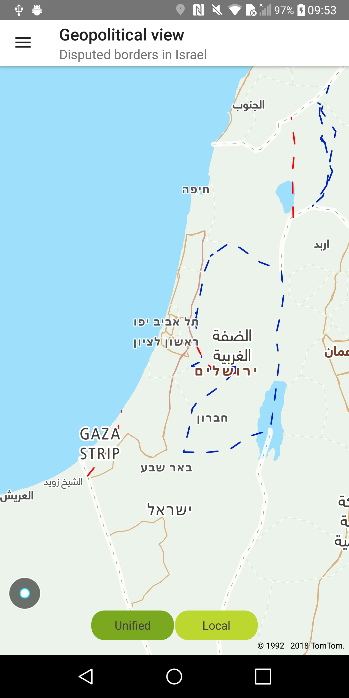
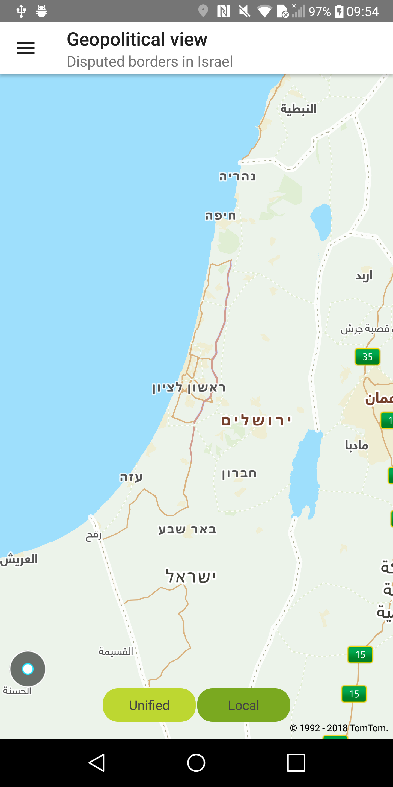

<a
  href="#"
  style={{ display: 'block', margin: '0', padding: '0' }}
  name="Map-GeopoliticalView-Parameter"
></a>

Allow your users to see map boundaries based on unified or local country views. The local view is
available for a particular area of the world that is considered disputed by two or more countries.
You can change the geopolitical view of your map. If you don’t specify a geopolitical view the "
Unified" view will be used. The Israel geopolitical view is currently available only for vector
maps.

A list of the supported views can be found
at [Default View Mapping](/map-display-api/documentation/vector/tile).

Note: Inside India’s territory only the "IN" geopolitical view is available without the possibility
of being overridden.

**Sample use case:** You want to display a local map view for Israel.

To change the geopolitical view for the map:

<Code>

```java
//ISRAEL_LOCAL_VIEW = "IL"
NewMap.setGeopoliticalView(ISRAEL_LOCAL_VIEW)
```

```kotlin
NewMap.setGeopoliticalView("IL")
```

</Code>

<table>
  <tbody>
    <tr>
      <td>
        <ContentWrapper maxWidth="350px" objectFit="contain">
          <p>
            
          </p>
        </ContentWrapper>
        <p>Israel international view</p>
      </td>
      <td>
        <ContentWrapper maxWidth="350px" objectFit="contain">
          <p>
            
          </p>
        </ContentWrapper>
        <p>Israel local view</p>
      </td>
    </tr>
  </tbody>
</table>