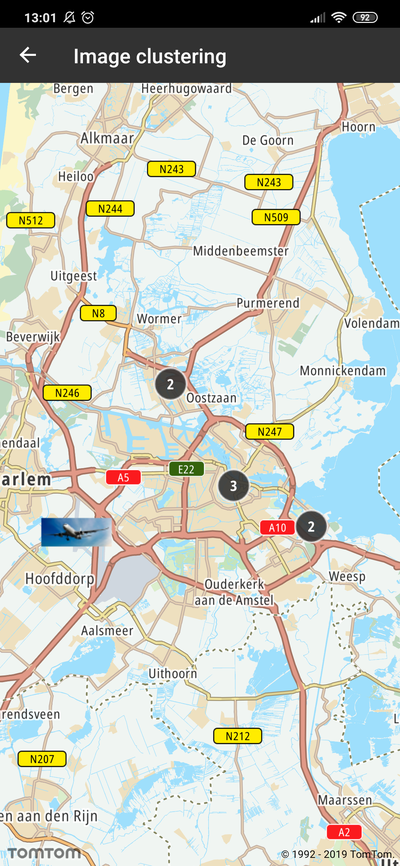

Allow your users to cluster image annotations for better visualization. By default clustering is
disabled.

**Sample use case 1:** You want to cluster images in the `FeatureCollection` type provided in
GeoJSON.

To enable clustering you need to set:

```json
"cluster": true,
```

and set the desired cluster radius:

```json
"clusterRadius": 70,
```

Here you can see what the GeoJSON `Source` style file with enabled clustering looks like:

```json
"IC-app-test-source": {
    "type": "geojson",
    "cluster": true,
    "clusterRadius": 70,
    "data": {
      "type": "FeatureCollection",
      "features": [
        {
          "type": "Feature",
          "geometry": {
            "type": "Point",
            "coordinates": [
              4.710759,
              52.340415
            ]
          },
          "properties": {
            "icon": "jet_airplane_landing"
          }
        }
      ]
    }
  }
```

You also need to add a new `Layer` to the current style that defines behaviour when your features do
not fulfill clustering constraints.

```json
{
  "id": "IC-layer-cluster-image",
  "filter": ["!has", "point_count"],
  "type": "symbol",
  "layout": {
    "icon-image": "{icon}",
    "icon-allow-overlap": true
  },
  "source": "IC-clustering-source"
}
```

Please also remember if the feature `"properties": {"icon": "jet_airplane_landing"}` is set you need
to add an image to `Style` as follows:

```kotlin
val image = ImageFactory.createImage(imageId, drawable)
NewMap.styleSettings.addImage(image)
```

**Sample use case:** You want to add a background overlay under the cluster size.

You need to create `Layer` with given content:

```shell
{
  "id": "IC-layer-clustered",
  "filter": ["has", "point_count"],
  "type": "symbol",
  "layout": {
    "icon-image":  "ic_cluster",
    "icon-allow-overlap": true,
    "icon-ignore-placement": true
  },
  "source": "IC-clustering-source"
}
```

and add it to current map style.

**Sample use case:** You want to customize the cluster symbol text color, text size, and offset.

You need to define `Layer` with given JSON content:

```shell
{
  "filter": ["has", "point_count"],
  "id": "IC-layer-symbol-count",
  "source": "IC-clustering-source",
  "type": "symbol",
  "layout": {
    "text-field": "{point_count}",
    "text-font": [
      "Noto-Bold"
    ],
    "text-size": 14,
    "text-offset": [0.0, 0.0]
  },
  "paint": {
    "text-color": "#FFFFFF"
  }
}
```

and add it to current map style.

<a
  href="#"
  style={{ display: 'block', margin: '0', padding: '0' }}
  name="_code_example"
></a>

## Code Example

Here you can check what an example implementation may look like:

- adding map source

```kotlin
val imageSourceJson = AssetUtils.getAssetFile(context, SOURCE_PATH)
val source = SourceFactory.createSource(imageSourceJson)
NewMap.styleSettings.addSource(source)
```

- adding map layer with a given file name

```kotlin
val imageLayerJson = AssetUtils.getAssetFile(context, LAYER_CLUSTER_IMAGE_PATH)
val imageLayer = LayerFactory.createLayer(imageLayerJson)
NewMap.styleSettings.addLayer(imageLayer)
```

<ContentWrapper maxWidth="350px" objectFit="contain">



</ContentWrapper>

Clusters and images