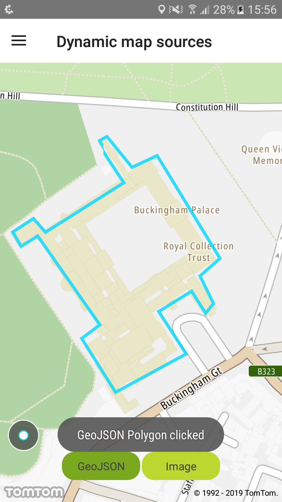
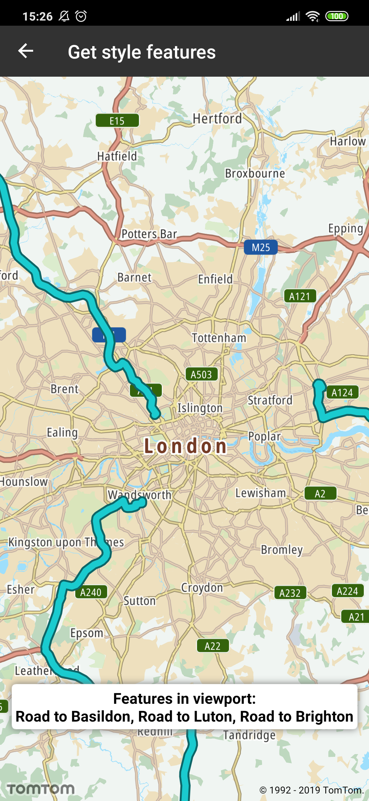

Retrieve data of a feature (e.g., ID, geometry) from layers in the style by querying for rendered
features at a point, coordinates, or a bounding box within a specified layer in the style.

**Sample use case 1:** You want to display information if the user clicks the layer that you added.

**Sample use case 2:** You want to return all visible features in a viewport.

To create a layer and dynamically add it to the style:

<Code>
   ``` java
   Layer layer = LayerFactory.createLayer(layerJson)
   NewMap.getStyleSettings().addLayer(layer);
   ```

```kotlin
val layer = LayerFactory.createLayer(layerJson)
NewMap.styleSettings.addLayer(layer)
```

</Code>

To query the style for specific layer features at a given screen point, call:

<Code>
   ``` java
   List<String> layerIds = ImmutableList.of(GEOJSON_LAYER_ID);
   FeatureCollection featureCollection = NewMap.getDisplaySettings().featuresAtPoint(point, layerIds);
   ```

```kotlin
val layerIds = listOf(GEOJSON_LAYER_ID)
val featureCollection = NewMap.displaySettings.featuresAtPoint(point, layerIds)
```

</Code>

To query the style for specific layer features in a given screen box, call:

<Code>
   ``` java
   FeatureCollection featureCollection = NewMap.getDisplaySettings().featuresInScreenRect(mapViewPort, layerIds);
   ```

```kotlin
val featureCollection = NewMap.displaySettings.featuresInScreenRect(mapViewPort, LAYER_LIST)
```

</Code>

To obtain and process features:

<Code>
   ``` java
   List<Feature> featureList = featureCollection.getFeatures();
   FuncUtils.forEach(featureList, feature -> FuncUtils.apply(feature.getId(), this::displayToast));
   ```

```kotlin
val featureList = featureCollection.features
FuncUtils.forEach(featureList) { feature -> FuncUtils.apply(feature.id) { id -> displayToast(id) } }
```

</Code>

<table>
  <tbody>
    <tr>
      <td>
        <ContentWrapper maxWidth="350px" objectFit="contain">
          <p>
            
          </p>
        </ContentWrapper>
        <p>GeoJSON polygon clicked</p>
      </td>
      <td>
        <ContentWrapper maxWidth="350px" objectFit="contain">
          <p>
            
          </p>
        </ContentWrapper>
        <p>Features in viewport</p>
      </td>
    </tr>
  </tbody>
</table>