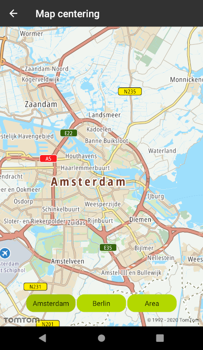
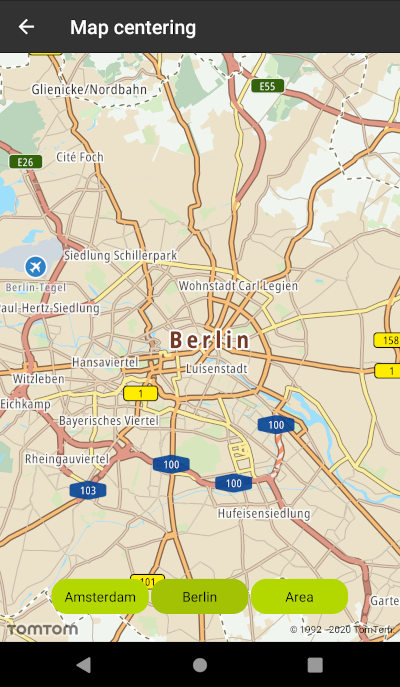
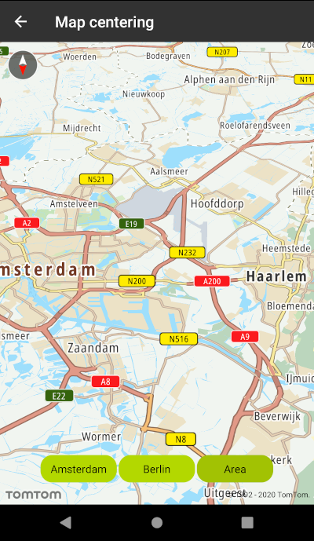

Center the map in your mobile app either at the current coordinates or any other location at the
zoom level of your choice. Alternatively you can define an area of the map which will be displayed
to the user. In the latter case the zoom level will be adjusted automatically.

**Sample use case 1:** You want to display the maps for selected cities in specific zoom levels.
Your users should be able to easily switch between different locations.

**Sample use case 2:** You want to display an area determined by a certain bounding box.

Use the following code snippets in your app to display maps either of different locations (in this
case, the current location and the New offices in Amsterdam and Berlin) or of a certain area.

The example shows how to center the map on Amsterdam with the zoom level set to 10:

<Code>

```java
NewMap.centerOn(CameraPosition.builder()
        .focusPosition(Locations.AMSTERDAM_LOCATION)
        .zoom(DEFAULT_ZOOM_LEVEL)
        .bearing(MapConstants.ORIENTATION_NORTH)
        .build())
```

```kotlin
NewMap.centerOn(
    CameraPosition.builder()
        .focusPosition(location)
        .zoom(zoomLevel)
        .bearing(bearing.toDouble())
        .build()
)
```

</Code>

The following example shows how to center the map on the area containing Amsterdam-Haarlem and
Amsterdam-Center locations. Applied parameters make the map South-up oriented with a camera pitch
set to 45 degrees.

<Code>

```java
BoundingBox areaBox = new BoundingBox(topLeft, bottomRight);
CameraFocusArea cameraFocusArea = new CameraFocusArea.Builder(areaBox)
        .bearing(MapConstants.ORIENTATION_SOUTH)
        .pitch(45.0)
        .build();
NewMap.centerOn(cameraFocusArea, new AnimationDuration(1500, TimeUnit.MILLISECONDS));
```

```kotlin
val areaBox = BoundingBox(topLeft, bottomRight)
val cameraFocusArea = CameraFocusArea.Builder(areaBox)
    .apply {
        bearing(orientation.toDouble())
        pitch(45.0)
    }
    .build()
NewMap.centerOn(cameraFocusArea, AnimationDuration(1500, TimeUnit.MILLISECONDS))
```

</Code>

<table>
  <tbody>
    <tr>
      <td>
        <ContentWrapper maxWidth="350px" objectFit="contain">
          <p>
            
          </p>
        </ContentWrapper>
        <p>Map centered on Amsterdam with 10 zoom level</p>
      </td>
      <td>
        <ContentWrapper maxWidth="350px" objectFit="contain">
          <p>
            
          </p>
        </ContentWrapper>
        <p>Map centered on Berlin with 10 zoom level</p>
      </td>
    </tr>
    <tr>
      <td>
        <ContentWrapper maxWidth="350px" objectFit="contain">
          <p>
            
          </p>
        </ContentWrapper>
        <p>
          South-up oriented map centered on an area including Amsterdam-Haarlem
          and Amsterdam Central. The camera pitch is set to 45 degrees.
        </p>
      </td>
      <td></td>
    </tr>
  </tbody>
</table>