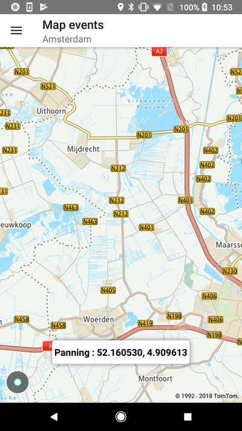

Implement any action you need to be triggered on one of the following map events:

- Panning
- Single click
- Double click
- Long click
- Map rotate
- Camera movement

**Sample use case:** In your app, users invoke one behavior with a single press and another with a
long press.

Use the following code snippets in your app to catch map events. In this example, the action is
simply to display a toast with latitude and longitude on each map event. Of course, you can
implement other cool features instead.

If you want to receive callbacks after a map is clicked, long-clicked, double-clicked or panned,
then you need to define your own NewMapCallback listeners:

<Code>

```java
NewMapCallback.OnMapClickListener onMapClickListener =
        latLng -> displayMessage(R.string.menu_events_on_map_click, latLng)

NewMapCallback.OnMapLongClickListener onMapLongClickListener =
        latLng -> displayMessage(R.string.menu_events_on_map_long_click, latLng);

NewMapCallback.OnMapDoubleClickListener onMapDoubleClickListener =
        latLng -> displayMessage(R.string.menu_events_on_map_double_click, latLng);

NewMapCallback.OnMapPanningListener onMapPanningListener = new NewMapCallback.OnMapPanningListener() {
    @Override
    public void onMapPanningStarted() {
        displayMessage(R.string.menu_events_on_map_panning_started, NewMap.getCenterOfMap());
    }

    @Override
    public void onMapPanningOngoing() {
        displayMessage(R.string.menu_events_on_map_panning_ongoing, NewMap.getCenterOfMap());
    }

    @Override
    public void onMapPanningEnded() {
        displayMessage(R.string.menu_events_on_map_panning_ended, NewMap.getCenterOfMap());
    }
};
```

```kotlin
val showMessageWhenOnMapClick: NewMapCallback.OnMapClickListener =
    NewMapCallback.OnMapClickListener { latLng -> displayMessage(SINGLE_PRESS_TITLE, latLng) }

val showMessageWhenOnMapLongClick: NewMapCallback.OnMapLongClickListener =
    NewMapCallback.OnMapLongClickListener { latLng -> displayMessage(LONG_CLICK_TITLE, latLng) }

val showMessageWhenOnMapDoubleClick: NewMapCallback.OnMapDoubleClickListener =
    NewMapCallback.OnMapDoubleClickListener { latLng -> displayMessage(DOUBLE_CLICK_TITLE, latLng) }

val showMessageWhenMapPanningOccurs: NewMapCallback.OnMapPanningListener =
    object : NewMapCallback.OnMapPanningListener {
        override fun onMapPanningStarted() {
            displayMessage(MAP_PANNING_STARTED_TITLE)
        }

        override fun onMapPanningOngoing() {
            displayMessage(MAP_PANNING_ONGOING_TITLE)
        }

        override fun onMapPanningEnded() {
            displayMessage(MAP_PANNING_ENDED_TITLE)
        }
    }
```

</Code>

Then set them to your NewMap instance:

<Code>

```java
NewMap.addOnMapClickListener(onMapClickListener);
NewMap.addOnMapLongClickListener(onMapLongClickListener);
NewMap.addOnMapDoubleClickListener(onMapDoubleClickListener);
NewMap.addOnMapPanningListener(onMapPanningListener);
```

```kotlin
NewMap.addOnMapClickListener(showMessageWhenOnMapClick)
NewMap.addOnMapLongClickListener(showMessageWhenOnMapLongClick)
NewMap.addOnMapDoubleClickListener(showMessageWhenOnMapDoubleClick)
NewMap.addOnMapPanningListener(showMessageWhenMapPanningOccurs)
```

</Code>

After callbacks are no longer required you can unregister them by calling:

<Code>

```java
NewMap.removeOnMapClickListener(onMapClickListener);
NewMap.removeOnMapLongClickListener(onMapLongClickListener);
NewMap.removeOnMapDoubleClickListener(onMapDoubleClickListener);
NewMap.removeOnMapPanningListener(onMapPanningListener);
```

```kotlin
NewMap.removeOnMapClickListener(showMessageWhenOnMapClick)
NewMap.removeOnMapLongClickListener(showMessageWhenOnMapLongClick)
NewMap.removeOnMapDoubleClickListener(showMessageWhenOnMapDoubleClick)
NewMap.removeOnMapPanningListener(showMessageWhenMapPanningOccurs)
```

</Code>

If you want to receive information about the camera changing its position, then you need to define
your own NewCallback listeners:

<Code>

```java
NewMapCallback.OnCameraChangedListener onCameraChangedListener =
        cameraPosition -> displayMessage(R.string.menu_events_on_camera_changed);

NewMapCallback.OnCameraMoveStartedListener onCameraMoveStartedListener =
        () -> displayMessage(R.string.menu_events_on_camera_move_started);

NewMapCallback.OnCameraMoveListener onCameraMoveListener =
        () -> displayMessage(R.string.menu_events_on_camera_move);

NewMapCallback.OnCameraMoveFinishedListener onCameraMoveFinishedListener =
        () -> displayMessage(R.string.menu_events_on_camera_move_finished);

NewMapCallback.OnCameraMoveCanceledListener onCameraMoveCanceledListener =
        () -> displayMessage(R.string.menu_events_on_camera_move_canceled);
```

```kotlin
val onCameraChangedListener = OnCameraChangedListener {
    displayMessage(ON_CAMERA_CHANGED_MESSAGE)
}
val onCameraMoveStartedListener = OnCameraMoveStartedListener {
    displayMessage(ON_CAMERA_MOVE_STARTED_MESSAGE)
}
val onCameraMoveListener = OnCameraMoveListener {
    displayMessage(ON_CAMERA_MOVE_MESSAGE)
}
val onCameraMoveFinishedListener = OnCameraMoveFinishedListener {
    displayMessage(ON_CAMERA_MOVE_FINISHED_MESSAGE)
}
val onCameraMoveCanceledListener = OnCameraMoveCanceledListener {
    displayMessage(ON_CAMERA_MOVE_CANCELED_MESSAGE)
}
```

</Code>

Then register them using your `NewMap` instance:

<Code>

```java
NewMap.addOnCameraChangedListener(onCameraChangedListener);
NewMap.addOnCameraMoveStartedListener(onCameraMoveStartedListener);
NewMap.addOnCameraMoveListener(onCameraMoveListener);
NewMap.addOnCameraMoveFinishedListener(onCameraMoveFinishedListener);
NewMap.addOnCameraMoveCanceledListener(onCameraMoveCanceledListener);
```

```kotlin
NewMap.addOnCameraChangedListener(onCameraChangedListener)
NewMap.addOnCameraMoveStartedListener(onCameraMoveStartedListener)
NewMap.addOnCameraMoveListener(onCameraMoveListener)
NewMap.addOnCameraMoveFinishedListener(onCameraMoveFinishedListener)
NewMap.addOnCameraMoveCanceledListener(onCameraMoveCanceledListener)
```

</Code>

After callbacks are no longer required you can unregister them by calling:

<Code>

```java
NewMap.removeOnCameraChangedListener(onCameraChangedListener);
NewMap.removeOnCameraMoveStartedListener(onCameraMoveStartedListener);
NewMap.removeOnCameraMoveListener(onCameraMoveListener);
NewMap.removeOnCameraMoveFinishedListener(onCameraMoveFinishedListener);
NewMap.removeOnCameraMoveCanceledListener(onCameraMoveCanceledListener);
```

```kotlin
NewMap.removeOnCameraChangedListener(onCameraChangedListener)
NewMap.removeOnCameraMoveStartedListener(onCameraMoveStartedListener)
NewMap.removeOnCameraMoveListener(onCameraMoveListener)
NewMap.removeOnCameraMoveFinishedListener(onCameraMoveFinishedListener)
NewMap.removeOnCameraMoveCanceledListener(onCameraMoveCanceledListener)
```

</Code>

In this example you will see a Toast with the latitude and longitude of a point that was clicked on
the map, but you can utilize this information in your own manner.

<table>
  <tbody>
    <tr>
      <td>
        <ContentWrapper maxWidth="350px" objectFit="contain">
          <p>
            
          </p>
        </ContentWrapper>
        <p>Receive callbacks after the map is clicked.</p>
      </td>
      <td>
        <ContentWrapper maxWidth="350px" objectFit="contain">
          <p>
            
          </p>
        </ContentWrapper>
        <p>Receive callbacks after the map is long clicked.</p>
      </td>
    </tr>
    <tr>
      <td>
        <ContentWrapper maxWidth="350px" objectFit="contain">
          <p>
            
          </p>
        </ContentWrapper>
        <p>Receive callbacks after the map panning.</p>
      </td>
      <td></td>
    </tr>
  </tbody>
</table>

<a
  href="#"
  style={{ display: 'block', margin: '0', padding: '0' }}
  name="_enable_and_disable_gestures"
></a>

## Enable and disable gestures

You can disable gestures such as zooming, panning, and rotating in your application by passing
the `GesturesConfiguration` object to NewMap: By default all gestures are enabled.

**Disable zooming gesture**

<Code>

```java
NewMap.updateGesturesConfiguration(
        new GesturesConfiguration.Builder()
                .zoomEnabled(false)
                .build()
);
```

```kotlin
NewMap.updateGesturesConfiguration(
    GesturesConfiguration.Builder()
        .zoomEnabled(false)
        .build()
)
```

</Code>

**Disable the rotating gesture**

<Code>

```java
NewMap.updateGesturesConfiguration(
        new GesturesConfiguration.Builder()
                .rotationEnabled(false)
                .build()
);
```

```kotlin
NewMap.updateGesturesConfiguration(
    GesturesConfiguration.Builder()
        .rotationEnabled(false)
        .build()
)
```

</Code>

**Disable the tilting gesture**

<Code>

```java
NewMap.updateGesturesConfiguration(
        new GesturesConfiguration.Builder()
                .tiltEnabled(false)
                .build()
);
```

```kotlin
NewMap.updateGesturesConfiguration(
    GesturesConfiguration.Builder()
        .tiltEnabled(false)
        .build()
)
```

</Code>

**Disable the panning gesture**

<Code>

```java
NewMap.updateGesturesConfiguration(
        new GesturesConfiguration.Builder()
                .panningEnabled(false)
                .build()
);
```

```kotlin
NewMap.updateGesturesConfiguration(
    GesturesConfiguration.Builder()
        .panningEnabled(false)
        .build()
)
```

</Code>

You can turn off more than one gesture by setting up the mask on properties as shown in the
following code snippets:

<Code>

```java
NewMap.updateGesturesConfiguration(
        new GesturesConfiguration.Builder()
                .rotationEnabled(false)
                .panningEnabled(false)
                .build()
);
```

```kotlin
NewMap.updateGesturesConfiguration(
    GesturesConfiguration.Builder()
        .rotationEnabled(false)
        .panningEnabled(false)
        .build()
)
```

</Code>

If you want to enable gestures, pass the `GesturesConfiguration` object to the NewMap object as
shown in the following code snippets:

<Code>

```java
NewMap.updateGesturesConfiguration(
        new GesturesConfiguration.Builder()
                .rotationEnabled(true)
                .panningEnabled(true)
                .zoomEnabled(true)
                .tiltEnabled(true)
                .build()
);
```

```kotlin
NewMap.updateGesturesConfiguration(
    GesturesConfiguration.Builder()
        .rotationEnabled(true)
        .panningEnabled(true)
        .zoomEnabled(true)
        .tiltEnabled(true)
        .build()
)
```

</Code>

or even in a simpler way:

<Code>

```java
NewMap.updateGesturesConfiguration(new GesturesConfiguration.Builder().build());
```

```kotlin
NewMap.updateGesturesConfiguration(
    GesturesConfiguration.Builder().build()
)
```

</Code>