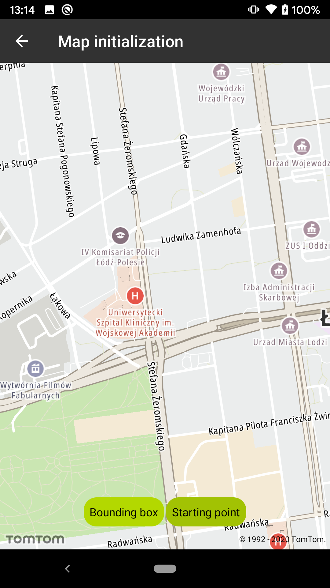
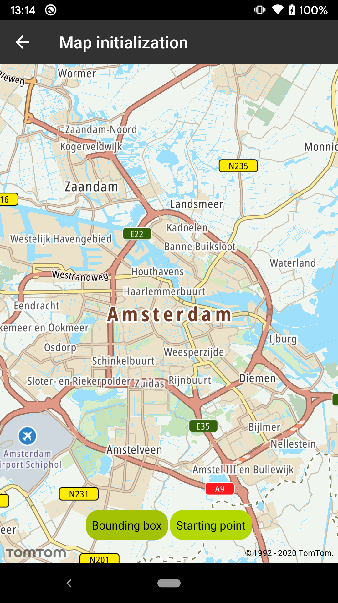

<a
  href="#"
  style={{ display: 'block', margin: '0', padding: '0' }}
  name="map-centering"
></a>

The Maps SDK for Android allows you to initialize the map with a setup configuration. For this
purpose, use the `MapFragment.newInstance()` method or `MapView` constructor with `MapProperties`.
The `MapProperties` object allows you to set initial map values of the map.

<a
  href="#"
  style={{ display: 'block', margin: '0', padding: '0' }}
  name="_initializing_the_map_with_bounding_box"
></a>

## Initializing the map with bounding box

Programmatically:

```java
val amsterdamTopLeft = LatLng(52.499782, 4.749553)
val amsterdamBottomRight = LatLng(52.246161, 5.031764)
val boundingBox = BoundingBox(amsterdamTopLeft, amsterdamBottomRight)
val focusArea: CameraFocusArea = CameraFocusArea.Builder(boundingBox)
    .pitch(5.0)
    .bearing(MapConstants.ORIENTATION_NORTH.toDouble())
    .build()
val apiKeys = mapOf(ApiKeyType.MAPS_API_KEY to BuildConfig.MAPS_API_KEY)
val mapProperties = MapProperties.Builder()
    .cameraFocusArea(focusArea)
    .keys(apiKeys)
    .build()
mapFragment = MapFragment.newInstance(mapProperties)
```

From XML:

```xml
<com.New.online.sdk.map.MapView
    android:id="@+id/map_view"
    android:name="com.New.online.sdk.map.MapFragment"
    android:layout_width="match_parent"
    android:layout_height="match_parent"
    app:cameraFocusAreaTopLeftLatitude="52.499782"
    app:cameraFocusAreaTopLeftLongitude="4.749553"
    app:cameraFocusAreaBottomRightLatitude="52.246161"
    app:cameraFocusAreaBottomRightLongitude="5.031764"
    app:cameraFocusAreaPitch="5.0"
    app:cameraFocusAreaBearing="0.0" />
```

<a
  href="#"
  style={{ display: 'block', margin: '0', padding: '0' }}
  name="_centering_the_map_with_starting_point"
></a>

## Centering the map with starting point

Programmatically:

```java
val NewOfficeLodz = LatLng(51.759434, 19.449011)
val cameraPosition = CameraPosition.builder()
    .focusPosition(NewOfficeLodz)
    .zoom(MapConstants.DEFAULT_ZOOM_LEVEL)
    .pitch(5.0)
    .bearing(MapConstants.ORIENTATION_NORTH.toDouble())
    .build()
val apiKeys = mapOf(ApiKeyType.MAPS_API_KEY to BuildConfig.MAPS_API_KEY)
val mapProperties = MapProperties.Builder()
    .cameraPosition(cameraPosition)
    .keys(apiKeys)
    .build()
mapFragment = MapFragment.newInstance(mapProperties)
```

From XML:

```xml
<fragment
    android:id="@+id/map_fragment"
    android:name="com.New.online.sdk.map.MapFragment"
    android:layout_width="match_parent"
    android:layout_height="match_parent"
    app:cameraPositionLatitude="52.499782"
    app:cameraPositionLongitude="4.749553"
    app:cameraPositionZoom="14.0"
    app:cameraPositionPitch="5.0"
    app:cameraPositionBearing="0.0" />
```

<table>
  <tbody>
    <tr>
      <td>
        <ContentWrapper maxWidth="350px" objectFit="contain">
          <p>
            
          </p>
        </ContentWrapper>
        <p>Map initialized on Lodz Office of New with 15 zoom level</p>
      </td>
      <td>
        <ContentWrapper maxWidth="350px" objectFit="contain">
          <p>
            
          </p>
        </ContentWrapper>
        <p>Map initialized on Amsterdam area</p>
      </td>
    </tr>
  </tbody>
</table>