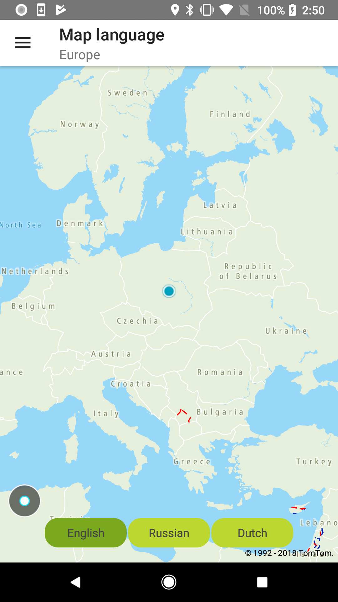

<a
  href="#"
  style={{ display: 'block', margin: '0', padding: '0' }}
  name="Map-Language-Parameter"
></a>

Allow your users to see a map in different languages to make your app international. The language
parameter determines the language of labels on the map. It does not affect any proper nouns like the
names of streets, plazas, etc. The list of the supported languages can be found
at: [Default View Mapping](/map-display-api/documentation/vector/tile).

**Sample use case:** You want to have all labels only in British English

To change the language for a map:

<Code>

```java
//BRITISH_ENGLISH_CODE = "en-GB"
NewMap.setLanguage(BRITISH_ENGLISH_CODE)
```

```kotlin
//language can be equal e.g. to "en-GB"
NewMap.setLanguage(language)
```

</Code>

<table>
  <tbody>
    <tr>
      <td>
        <ContentWrapper maxWidth="350px" objectFit="contain">
          <p>
            
          </p>
        </ContentWrapper>
        <p>Map labels in English</p>
      </td>
      <td>
        <ContentWrapper maxWidth="350px" objectFit="contain">
          <p>
            
          </p>
        </ContentWrapper>
        <p>Map labels in Russian</p>
      </td>
    </tr>
    <tr>
      <td>
        <ContentWrapper maxWidth="350px" objectFit="contain">
          <p>
            
          </p>
        </ContentWrapper>
        <p>Map labels in Dutch</p>
      </td>
      <td></td>
    </tr>
  </tbody>
</table>