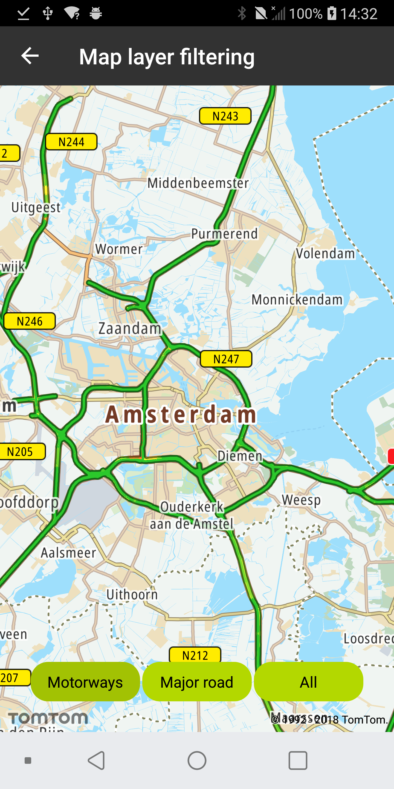
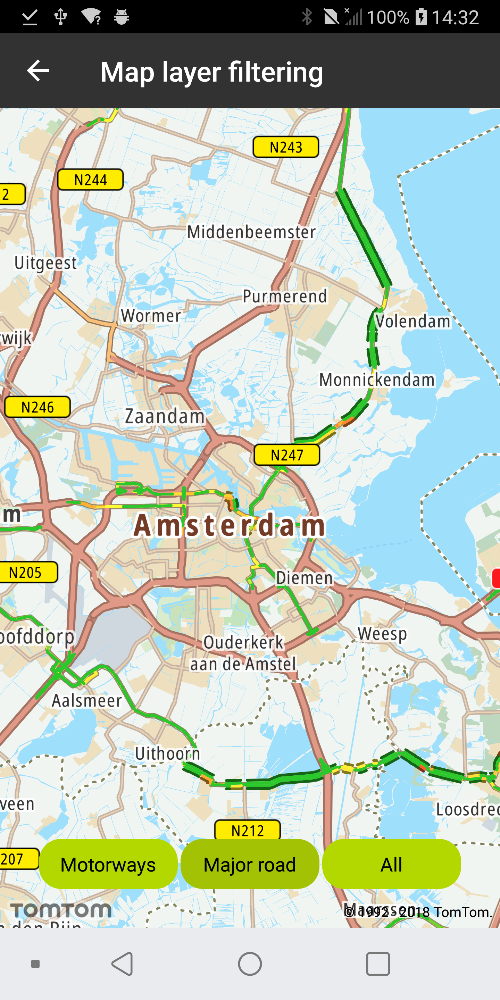
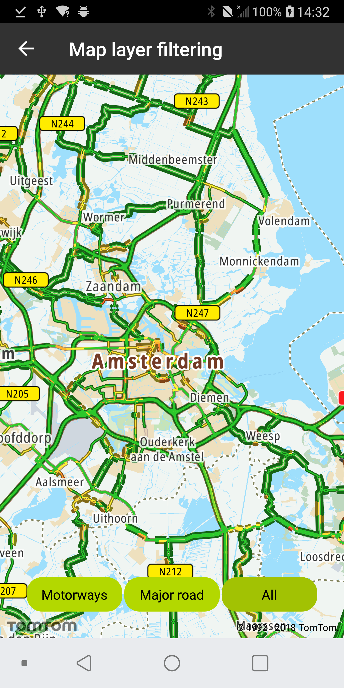

Allow your users to apply a filter based on feature properties to only show selected layers.

**Sample use case:** You are
using [Traffic Module](/maps-android-sdk/documentation/traffic/getting-started) in your
application, and you only want to show the traffic flow on Motorways.

You can achieve that by applying a filter that takes the value of the "road_type" property defined
in
the [Traffic Vector Flow Tiles](/traffic-api/documentation/traffic-flow/vector-flow-tiles)
and compares it with the "Motorway" value. In this case the filter needs to be applied on layers
that have a layer with an id of "Traffic flow" as their source layer.

To retrieve all those layers you can use the findLayersBySourceLayerId method as shown in the
following code snippet:

```java
//LAYERS_REGEX = "Traffic flow"
val layers = NewMap.styleSettings.findLayersBySourceLayerId(LAYERS_REGEX)
```

Once you have a list of layers, you can create the expression defining the filter (it is required to
create a new instance of the expression for every layer):

```java
//ROAD_TYPE = "road_type"
//ROAD_TYPE_MOTORWAY = "Motorway"
val filteringExpression = ComparisonExpression.eq(
    GetExpression.get(ROAD_TYPE),
    LiteralExpression.string(ROAD_TYPE_MOTORWAY)
)
```

To apply the filer you have to provide it to the setFiler method of the Layer object:

```java
layer.setFilter(filteringExpression)
```

Removing the filter is done by calling the resetFilter method of the Layer object.

```java
layer.resetFilter()
```

<table>
  <tbody>
    <tr>
      <td>
        <ContentWrapper maxWidth="350px" objectFit="contain">
          <p>
            
          </p>
        </ContentWrapper>
        <p>Show traffic only on motorways</p>
      </td>
      <td>
        <ContentWrapper maxWidth="350px" objectFit="contain">
          <p>
            
          </p>
        </ContentWrapper>
        <p>Show traffic only on major roads</p>
      </td>
    </tr>
    <tr>
      <td>
        <ContentWrapper maxWidth="350px" objectFit="contain">
          <p>
            
          </p>
        </ContentWrapper>
        <p>Show traffic on all roads</p>
      </td>
      <td></td>
    </tr>
  </tbody>
</table>