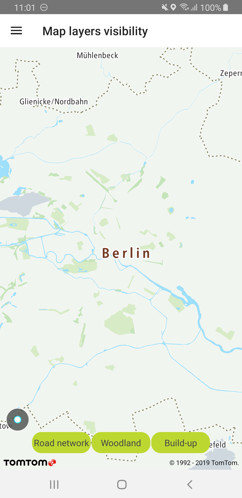
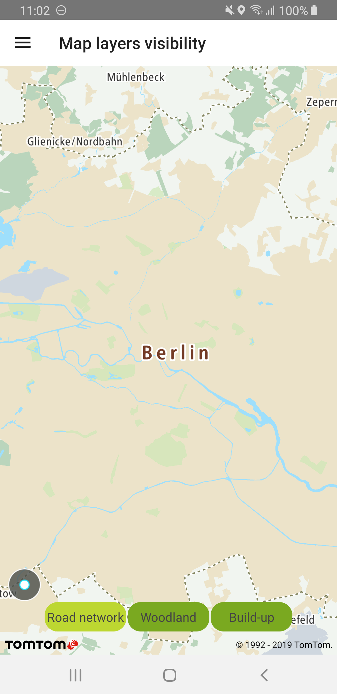

Allow your users to dynamically toggle the visibility of map entities. You can hide map layers to
get the level of detail you need and highlight the layers that are important for your use case.

**Sample use case:** You want to provide a clear map view for driving that focuses on the road
network in your app. You can achieve that by switching off some map layers e.g., woodland, build-up
areas, etc. You can turn these layers back on at run time to bring back the details for a better map
viewing experience.

The following articles provide more information on map layer visibility and map layers available in
the default style: [Map layers](/maps-android-sdk/documentation/map-display/documentation/map-layers).

You can retrieve all layers available in the style or only those that match the provided regex. To
filter, you can use layer ID or source layer ID properties, as shown in the following code snippets:

<Code>

```java
//ROADS_NETWORK_LAYER_REGEX = "[mM]otorway.*|.*[rR]oad.*"
List<Layer> layers = NewMap.getStyleSettings().findLayersBySourceLayerId(ROADS_NETWORK_LAYER_REGEX)
```

```kotlin
//regex = e.g. "[mM]otorway.*|.*[rR]oad.*" or "[wW]oodland" or "Built-up area"
val layers = NewMap.styleSettings.findLayersBySourceLayerId(String.format(regex))
```

</Code>

Once you have a list of layers, you can modify their visibility:

<Code>

```java
for (Layer layer : layers) {
    layer.setVisibility(visibility);
}
```

```kotlin
layers.forEach { layer -> layer.visibility = visibility }
```

</Code>

<table>
  <tbody>
    <tr>
      <td>
        <ContentWrapper maxWidth="350px" objectFit="contain">
          <p>
            
          </p>
        </ContentWrapper>
        <p>Road network hidden</p>
      </td>
      <td>
        <ContentWrapper maxWidth="350px" objectFit="contain">
          <p>
            
          </p>
        </ContentWrapper>
        <p>Woodland and build-up shown</p>
      </td>
    </tr>
  </tbody>
</table>