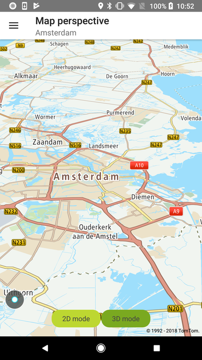
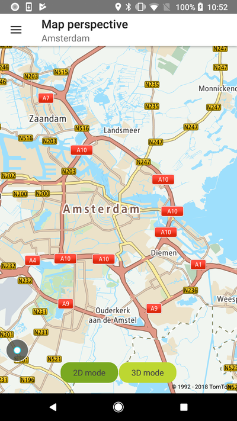

Set either the 2D map perspective for the typical map view mode, or the 2.5D map perspective for
custom scenarios such as moving the map.

**Sample use case:** You want to switch from 2D to 2.5D modes to support following the moving
location in your app.

Use the following code snippets in your app to switch between perspectives.

Note that switching between 2D and 3D modes only changes the perspective. The zoom level and map
orientation are set with the methods described in the "Map centering" example.

In order to change the map mode to 2-dimensional, you need to call the following method:

<Code>

```java
NewMap.set2DMode()
```

```kotlin
NewMap.set2DMode()
```

</Code>

To change it back to 3D simply apply the other option setting:

<Code>

```java
NewMap.set3DMode();
```

```kotlin
NewMap.set3DMode()
```

</Code>

<table>
  <tbody>
    <tr>
      <td>
        <ContentWrapper maxWidth="350px" objectFit="contain">
          <p>
            
          </p>
        </ContentWrapper>
        <p>3D map perspective</p>
      </td>
      <td>
        <ContentWrapper maxWidth="350px" objectFit="contain">
          <p>
            
          </p>
        </ContentWrapper>
        <p>2D map perspective</p>
      </td>
    </tr>
  </tbody>
</table>