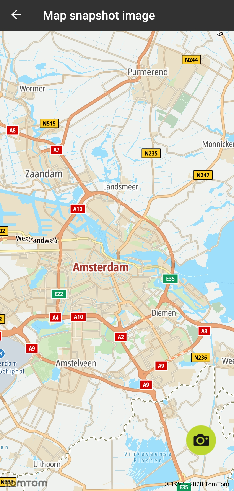
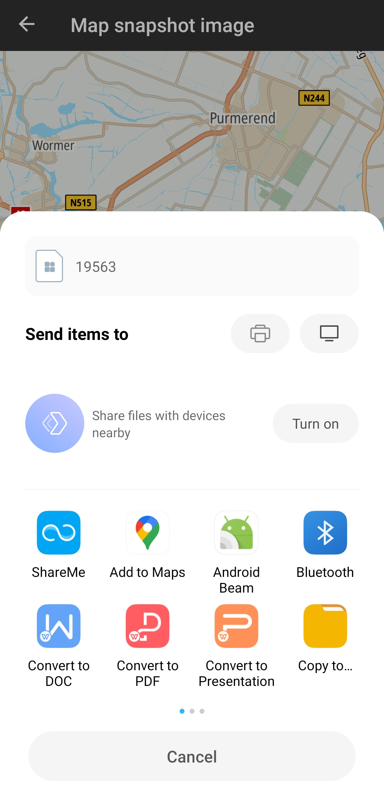
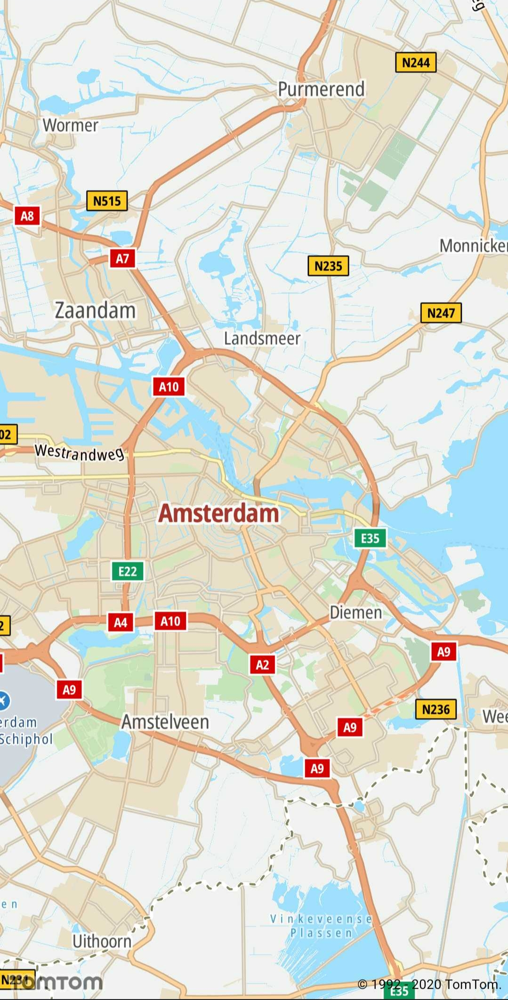

<a
  href="#"
  style={{ display: 'block', margin: '0', padding: '0' }}
  name="map-events"
></a>

The snapshot functionality generates a map image with markers, routes, and shapes that are rendered
on the map which you can use as:

- a screen in another app
- a notification
- a social media or communicator message

**Sample use case:** You would like to take a screenshot of the map with markers, routes, and shapes
that are rendered on the map, so you can share this picture in an email, social media, or
communicator.

**Sample use case:** You would like to store the snapshot of the picked place in the storage, so you
can display the data with the corresponding snapshot.

Use the following code snippets to take a snapshot of a map:

- `MapFragment`

```java
val mapFragment = activity.supportFragmentManager.findFragmentById(R.id.map_fragment) as MapFragment
mapFragment.takeSnapshot(snapshotCallback)
```

- `MapView`

```java
val mapView: MapView = requireActivity().findViewById(R.id.map_view)
mapView.takeSnapshot(snapshotCallback)
```

Where the `snapshotCallback` is defined as:

```java
private val snapshotCallback = object : SnapshotCallback {
    override fun onSuccess(snapshot: Bitmap) {
        // The saveSnapshotToCache(snapshot) creates a file in the context.cacheDir, writes bitmap data
        // into it using snapshot.compress(CompressFormat.JPEG, 100, outputStream) then returns the file.
        // Before you can obtain URI of this file you need to define a FileProvider in the manifest.
        val snapshotFile = saveSnapshotToCache(snapshot)
        snapshotFile?.let {
            val snapshotUri = FileProvider.getUriForFile(requireContext(), FILE_PROVIDER_AUTHORITY, it)

            val shareIntent = Intent(Intent.ACTION_SEND)
            shareIntent.addFlags(Intent.FLAG_GRANT_READ_URI_PERMISSION)
            shareIntent.type = "image/jpeg"
            shareIntent.putExtra(Intent.EXTRA_STREAM, snapshotUri)
            startActivity(Intent.createChooser(shareIntent, "Send map snapshot"))
        } ?: run { Toast.makeText(requireContext(), FILE_NOT_FOUND, Toast.LENGTH_SHORT).show() }
    }

    override fun onError(error: Throwable) {
        Toast.makeText(requireContext(), error.message, Toast.LENGTH_SHORT).show()
    }
}
```

<table>
  <tbody>
    <tr>
      <td>
        <ContentWrapper maxWidth="350px" objectFit="contain">
          <p>
            
          </p>
        </ContentWrapper>
      </td>
      <td>
        <ContentWrapper maxWidth="350px" objectFit="contain">
          <p>
            
          </p>
        </ContentWrapper>
      </td>
    </tr>
    <tr>
      <td>
        <ContentWrapper maxWidth="350px" objectFit="contain">
          <p>
            
          </p>
        </ContentWrapper>
      </td>
      <td></td>
    </tr>
  </tbody>
</table>