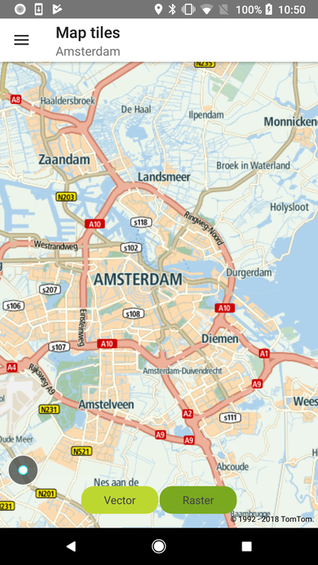
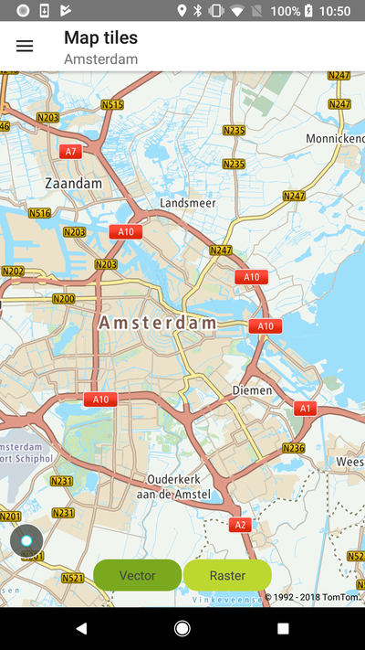

<a
  href="#"
  style={{ display: 'block', margin: '0', padding: '0' }}
  name="map-tile-modes"
></a>

**IMPORTANT:** In May 2020, the methods used to switch between vector and raster tiles were
deprecated and will be removed after one year. From that point, to display raster tiles it will be
required to reload the style to one which contains raster layers. Before the deprecation period is
over, a map is still going to be initialized with the style that contains raster and vector tiles.
However, if your style is obtained from the Style Merger you need to set `MapStyleSource`
to `STYLE_MERGER` in `MapProperties`
described [here](/maps-android-sdk/documentation/map-display/documentation/map-initialization). This approach
will only load vector tiles.

In order to display a map, you need to provide a map style file which includes information required
to render a map. Sources include information about the types of tiles (e.g., raster or vector) and
the URL(s) for the tile service(s). For more information take a look at
the [Map Style Specification](/map-display-api/documentation/mapstyles/map-style-specification). The default map display in the Maps SDK is based on vector tiles. It utilizes a map style file
which sets the URL to the Vector Tile endpoint. The default style file for the map and traffic
display is fetched from the Style Merger. It is also possible to display a map with raster tiles in
the Maps SDK. In order to do that, you need to provide a map style defining the raster type and the
raster tiles endpoint URL. This style must be loaded into the Maps SDK. This example provides a
simple map JSON-style file that can be used to display New raster tiles and shows how to use such
a style in the Maps SDK.

- Raster tiles are served as images. They require less processing power and memory to render, but
  have a larger file size than vector tiles.
- Vector tiles take the form of data that describes map entries such as geographic points, forests,
  lakes, built-up areas (as polygons), and roads (as lines). They are styled by means of a style
  sheet. Vector tiles can be scaled to different sizes without losing quality. The file size of
  vector tiles is smaller than that of raster tiles.

**Sample use case 1:** Your app is designed to use raster tiles for map display. You want to update
the app with New Map Display API raster tiles.

**Sample use case 2:** You want to take advantage of vector tiles features such as map 2.5 D
perspective, custom map styles, etc.

**Sample use case 3:** Your app runs on devices with different capabilities. You want to use vector
tiles for map display on powerful devices and raster tiles on devices with less processing power.

Use the following code snippets in your app to display the map with raster or vector tiles.

Depending on how the map was initialized there are two ways to switch between raster and vector
tiles.

If the map was initialized with `MapStyleSource` set to `STYLE_MERGER`, then to switch to raster
tiles you will need to reload the style with proper Raster layers having appropriately set source
names. The raster style can be loaded from the URL or be stored in assets. The styles used in the
following examples can be found at
the [MapsSDK for Android Examples](https://github.com/New-international/maps-sdk-for-android-examples).

To load raster tiles use:

<Code>

```java
NewMap.getUiSettings().setStyleUrl("asset://styles/mapssdk-raster_style.json")
```

```kotlin
NewMap.uiSettings.setStyleUrl("asset://styles/mapssdk-raster_style.json")
```

</Code>

To load vector tiles use:

<Code>

```java
NewMap.getUiSettings().loadDefaultStyle();
```

```kotlin
NewMap.uiSettings.loadDefaultStyle()
```

</Code>

If a map was initialized in the legacy mode i.e., `MapStyleSource` is not set to `STYLE_MERGER` then
the tile mode can be changed using the following code:

To select raster tiles use:

<Code>

```java
NewMap.getUiSettings().setMapTilesType(MapTilesType.RASTER);
```

```kotlin
NewMap.uiSettings.mapTilesType = MapTilesType.RASTER
```

</Code>

To select vector tiles use:

<Code>

```java
NewMap.getUiSettings().setMapTilesType(MapTilesType.VECTOR);
```

```kotlin
NewMap.uiSettings.mapTilesType = MapTilesType.VECTOR
```

</Code>

To turn off all tiles use:

<Code>

```java
NewMap.getUiSettings().setMapTilesType(MapTilesType.NONE);
```

```kotlin
NewMap.uiSettings.mapTilesType = MapTilesType.NONE
```

</Code>

In this example you will see buttons that allow switching between raster and vector tiles at
runtime:

<table>
  <tbody>
    <tr>
      <td>
        <ContentWrapper maxWidth="350px" objectFit="contain">
          <p>
            
          </p>
        </ContentWrapper>
        <p>Raster tiles</p>
      </td>
      <td>
        <ContentWrapper maxWidth="350px" objectFit="contain">
          <p>
            
          </p>
        </ContentWrapper>
        <p>Vector tiles</p>
      </td>
    </tr>
  </tbody>
</table>