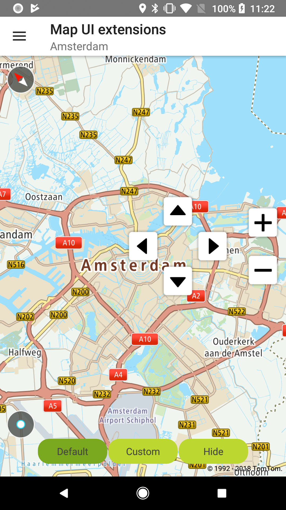
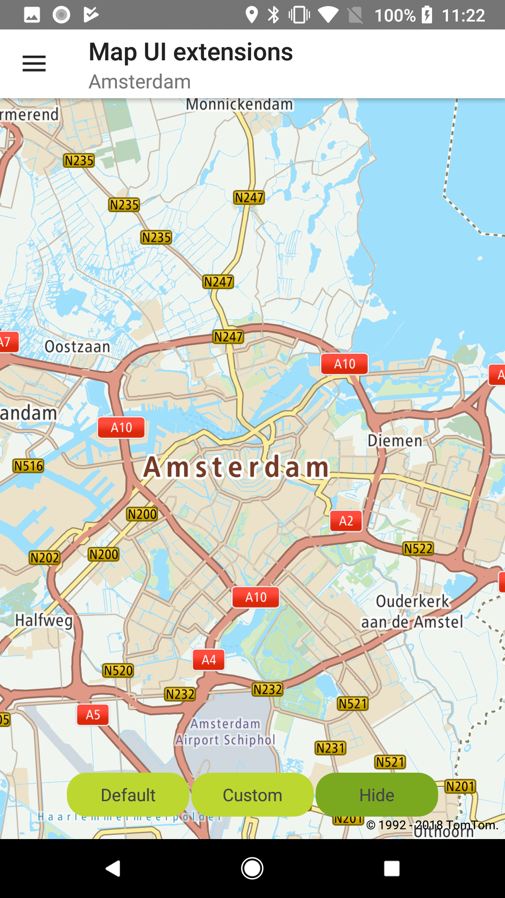
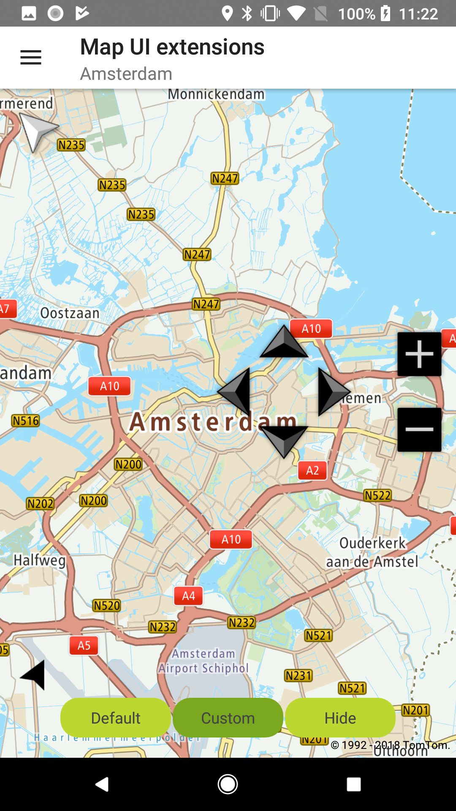

<a
  href="#"
  style={{ display: 'block', margin: '0', padding: '0' }}
  name="map-ui-extensions-examples"
></a>

Use default compass, current location buttons, zooming, and panning controls built into the Maps
SDK. You can read more on
the [Map UI extensions](/maps-android-sdk/documentation/map-display/map-examples/map-ui-extensions) page.

**Sample use case 1:** You want to provide your users with the compass, current location, and
panning and zooming controls so they can quickly center the map on their current location, set it to
display north at the top of the screen after rotating the map, and pan or zoom the map. You can use
the default controls provided with the Maps SDK.

**Sample use case 2:** You want to provide your users with the compass, current location, panning
and zooming controls and you want to use custom icons that are designed for your app style.

**Sample use case 3:** In some of the screens in your app, you want to remove the compass, current
location, and panning and zooming controls.

Since all ui elements are fully customizable because the Android view’s properties are exposed,
changing the default icons for them is straight forward:

<Code>

```java
ArrowButtonsGroup arrowButtons = NewMap.getUiSettings().getPanningControlsView().getView()
arrowButtons.getArrowDownButton().setImageResource(R.drawable.btn_down_custom);
arrowButtons.getArrowUpButton().setImageResource(R.drawable.btn_up_custom);
arrowButtons.getArrowLeftButton().setImageResource(R.drawable.btn_left_custom);
arrowButtons.getArrowRightButton().setImageResource(R.drawable.btn_right_custom);
```

```kotlin
val arrowButtonGroup: ArrowButtonsGroup =
    NewMap.uiSettings.panningControlsView.view as ArrowButtonsGroup
arrowButtonGroup.arrowDownButton.setImageResource(R.drawable.arrow_button_down_custom)
arrowButtonGroup.arrowUpButton.setImageResource(R.drawable.arrow_button_up_custom)
arrowButtonGroup.arrowLeftButton.setImageResource(R.drawable.arrow_button_left_custom)
arrowButtonGroup.arrowRightButton.setImageResource(R.drawable.arrow_button_right_custom)
```

</Code>
<Code>

```java
ZoomButtonsGroup zoomButtons = NewMap.getUiSettings().getZoomingControlsView().getView();
zoomButtons.getZoomInButton().setImageResource(R.drawable.btn_zoom_in_custom);
zoomButtons.getZoomOutButton().setImageResource(R.drawable.btn_zoom_out_custom);
```

```kotlin
val zoomButtonsGroup: ZoomButtonsGroup =
    NewMap.uiSettings.zoomingControlsView.view as ZoomButtonsGroup
zoomButtonsGroup.zoomInButton.setImageResource(R.drawable.zoom_in_button_custom)
zoomButtonsGroup.zoomOutButton.setImageResource(R.drawable.zoom_out_button_custom)
```

</Code>

<table>
  <tbody>
    <tr>
      <td>
        <ContentWrapper maxWidth="350px" objectFit="contain">
          <p>
            
          </p>
        </ContentWrapper>
        <p>Default ui extensions controls</p>
      </td>
      <td>
        <ContentWrapper maxWidth="350px" objectFit="contain">
          <p>
            
          </p>
        </ContentWrapper>
        <p>Default ui extensions controls - Hidden</p>
      </td>
    </tr>
    <tr>
      <td>
        <ContentWrapper maxWidth="350px" objectFit="contain">
          <p>
            
          </p>
        </ContentWrapper>
        <p>Custom ui extensions controls</p>
      </td>
      <td></td>
    </tr>
  </tbody>
</table>