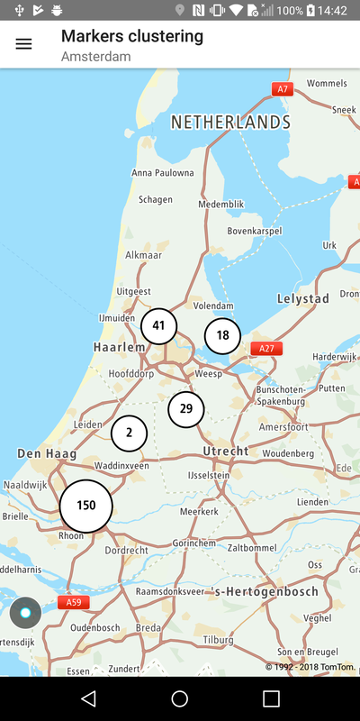
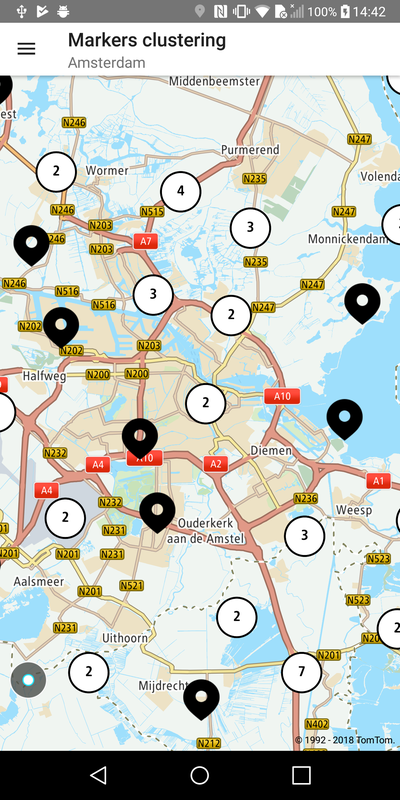

Allow your users to cluster markers for better visualization. By default, marker clustering is
disabled. You can decide for each marker if it should be included in the clustering process or not (
e.g., you want to have a few markers that are never clustered). To manipulate marker clustering, use
MarkerSettings obtained from NewMap.

**Sample use case:** You want to display the distribution of parking spots across the city.
Individual parking spots are shown only at higher zoom levels, otherwise data is clustered for
better visualization.

To enable markers clustering:

<Code>

```java
NewMap.getMarkerSettings().setMarkersClustering(true)
```

```kotlin
NewMap.markerSettings.setMarkersClustering(true)
```

</Code>

To flag a marker that it should be clustered:

<Code>

```java
MarkerBuilder markerBuilder = new MarkerBuilder(position)
        .shouldCluster(true)
        .markerBalloon(new SimpleMarkerBalloon(positionToText(position)));
```

```kotlin
val markerBuilder = MarkerBuilder(position)
    .shouldCluster(true)
    .markerBalloon(SimpleMarkerBalloon(positionToText(position)))
```

</Code>

Examples are shown below:

<table>
  <tbody>
    <tr>
      <td>
        <ContentWrapper maxWidth="350px" objectFit="contain">
          <p>
            
          </p>
        </ContentWrapper>
        <p>Lower zoom level</p>
      </td>
      <td>
        <ContentWrapper maxWidth="350px" objectFit="contain">
          <p>
            
          </p>
        </ContentWrapper>
        <p>Higher zoom level</p>
      </td>
    </tr>
  </tbody>
</table>