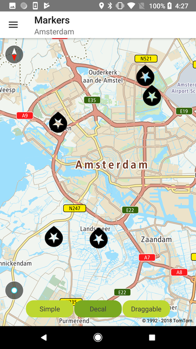

<a
  href="#"
  style={{ display: 'block', margin: '0', padding: '0' }}
  name="custom-markers"
></a>

Utilize different Maps SDK marker features to provide engaging functionality in your mobile app.

The main marker features are:

- Customizable marker icons: Use the default New marker, or favorite icons, or use your own.
- Simple and decal marker mode: Choose how the marker is rendered on the map.
- Draggable markers: Allow your users to drag and drop a marker around the map.
- Animated markers: Use GIFs as marker icons.

You can find details of each of the marker features following the examples on this page.

**Sample use case:** In your app, you want to display a number of markers to mark places on the map.
Use the code snippet below to display a single marker at specific coordinates on the map.

<Code>

```java
MarkerBuilder markerBuilder = new MarkerBuilder(position)
        .icon(Icon.Factory.fromResources(context, R.drawable.ic_favourites))
        .markerBalloon(new SimpleMarkerBalloon(positionToText(position)))
        .tag("more information in tag").iconAnchor(MarkerAnchor.Bottom)
        .decal(true) //By default is false
NewMap.addMarker(markerBuilder);
```

```kotlin
val markerBuilder = MarkerBuilder(position)
    .icon(icon)
    .markerBalloon(SimpleMarkerBalloon(positionToText(position)))
    .tag(SERIALIZABLE_MARKER_TAG)
    .iconAnchor(MarkerAnchor.Bottom)
    .decal(true) //By default is false
NewMap.addMarker(markerBuilder)
```

</Code>

Examples are shown in the following code snippet:

<table>
  <tbody>
    <tr>
      <td>
        <ContentWrapper maxWidth="350px" objectFit="contain">
          <p>
            
          </p>
        </ContentWrapper>
        <p>Icon Marker</p>
      </td>
      <td>
        <ContentWrapper maxWidth="350px" objectFit="contain">
          <p>
            
          </p>
        </ContentWrapper>
        <p>Decal Marker</p>
      </td>
    </tr>
  </tbody>
</table>

Create a simple marker with a default icon and add it to the map; only the location needs to be
specified:

<Code>

```java
MarkerBuilder markerBuilder = new MarkerBuilder(position)
        .markerBalloon(new SimpleMarkerBalloon(positionToText(position)));
NewMap.addMarker(markerBuilder);
```

```kotlin
val markerBuilder = MarkerBuilder(position)
    .markerBalloon(SimpleMarkerBalloon(positionToText(position)))
NewMap.addMarker(markerBuilder)
```

</Code>

<a
  href="#"
  style={{ display: 'block', margin: '0', padding: '0' }}
  name="_marker_selected"
></a>

# Marker selected

You can implement an observable marker selected event. You can do that with the global listener
OnMarkerClickedListener for all markers that have to be registered on MarkerSettings as shown in the
following code snippets:

<Code>

```java
NewMap.addOnMarkerClickListener(this);
```

```kotlin
NewMap.addOnMarkerClickListener(markerListener)
```

</Code>

For that purpose, the passed object has to implement the following interface:

```java
interface OnMarkerClickListener {
    /**
     * Called when the user clicks on the marker.
     *
     * @param marker Selected marker.
     */
    void onMarkerClick(@NonNull Marker marker);
}
```

You can remove all markers from the map in this way:

<Code>

```java
NewMap.removeMarkers();
```

```kotlin
NewMap.removeMarkers()
```

</Code>

You can remove all the markers one-by-one in this way:

- Remove all markers with the tag "tag".

<Code>

```java
NewMap.removeMarkerByTag("tag");
```

```kotlin
NewMap.removeMarkerByTag("tag")
```

</Code>

- Remove marker by id.

<Code>

```java
NewMap.removeMarkerByID(1);
```

```kotlin
NewMap.removeMarkerByID(1)
```

</Code>

<a
  href="#"
  style={{ display: 'block', margin: '0', padding: '0' }}
  name="_simple_and_decal_marker_modes"
></a>

# Simple and decal marker modes

- Focal (default): Where the icon always stands vertically even when the map is rotated. All nine
  callout anchor points are supported with this annotation type.
- Decal: Where the icon sticks to the map even when the map is rotated. Only one callout anchor
  point is supported for decal MarkerAnchor - Bottom.

Mixing icons of different modes is generally unsupported and advised against, as there are
unresolvable depth-sorting issues and the results will not always look correct. It is safe to mix
some modes, however, such as either of the decal modes with any of the standing modes.

Non-decal icons may optionally cast a shadow on the map. You will need to leave additional empty
space between icons in your drawable if you specify a non-zero blur amount.

<a
  href="#"
  style={{ display: 'block', margin: '0', padding: '0' }}
  name="_draggable_markers"
></a>

# Draggable markers

Thanks to this feature your users are able move existing markers around the map. They long-click on
a marker that is on the map to start dragging it, then they drop the marker on a selected position
by releasing the finger from the screen.

In order to do that you need to set 'draggable' to true:

<Code>

```java
MarkerBuilder markerBuilder = new MarkerBuilder(position)
        .markerBalloon(new SimpleMarkerBalloon(positionToText(position)))
        .draggable(true);
NewMap.addMarker(markerBuilder);
```

```kotlin
val markerBuilder = MarkerBuilder(position)
    .markerBalloon(SimpleMarkerBalloon(positionToText(position)))
    .draggable(true)
NewMap.addMarker(markerBuilder)
```

</Code>

It is also possible to register to receive the Marker’s dragging callbacks.

As an example you can create a listener like this one:

<Code>

```java
NewMapCallback.OnMarkerDragListener onMarkerDragListener = new NewMapCallback.OnMarkerDragListener() {
    @Override
    public void onStartDragging(@NonNull Marker marker) {
        Timber.d("onMarkerDragStart(): " + marker.toString());
        displayMessage(R.string.marker_dragging_start_message, marker.getPosition().getLatitude(), marker.getPosition().getLongitude());
    }

    @Override
    public void onStopDragging(@NonNull Marker marker) {
        Timber.d("onMarkerDragEnd(): " + marker.toString());
        displayMessage(R.string.marker_dragging_end_message, marker.getPosition().getLatitude(), marker.getPosition().getLongitude());
    }

    @Override
    public void onDragging(@NonNull Marker marker) {
        Timber.d("onMarkerDragging(): " + marker.toString());
    }
};
```

```kotlin
private var onMarkerDragListener: NewMapCallback.OnMarkerDragListener = object : NewMapCallback.OnMarkerDragListener {
    override fun onStartDragging(marker: Marker) {
        displayMessage(R.string.marker_dragging_start_message, marker.position.latitude, marker.position.longitude)
    }

    override fun onStopDragging(marker: Marker) {
        displayMessage(R.string.marker_dragging_end_message, marker.position.latitude, marker.position.longitude)
    }

    override fun onDragging(marker: Marker) {
    }
}
```

</Code>

Then register it to receive events related to dragging the marker over the map:

<Code>

```java
NewMap.getMarkerSettings().addOnMarkerDragListener(onMarkerDragListener);
```

```kotlin
NewMap.markerSettings.addOnMarkerDragListener(onMarkerDragListener)
```

</Code>

<a
  href="#"
  style={{ display: 'block', margin: '0', padding: '0' }}
  name="_animated_markers"
></a>

# Animated markers

Thanks to this feature you can use GIFs as marker icons. For this purpose, you need to place your
images in the assets folder and then use them in the following way:

<Code>

```java
MarkerBuilder markerBuilder = new MarkerBuilder(position)
        .icon(createAnimatedIcon());
NewMap.addMarker(markerBuilder);
```

```kotlin
val markerBuilder = MarkerBuilder(position)
    .icon(icon)
NewMap.addMarker(markerBuilder)
```

</Code>

<a
  href="#"
  style={{ display: 'block', margin: '0', padding: '0' }}
  name="_marker_anchoring"
></a>

# Marker anchoring

You can change the anchoring point for your icon. The anchor specifies which point of an annotation
image is attached to the map. The annotation will rotate around this anchoring point when rotating
the map. You can use the default image representation of an annotation which is attached to the
bottom height center width as presented in the following figure. You can change this behavior by
MarkerAnchor enumeration on the builder. E.g., if you want to use a crosshair annotation image, you
should set the anchor to MarkerAnchor.Center

<Code>

```java
MarkerBuilder markerBuilder = new MarkerBuilder(position)
        .icon(Icon.Factory.fromResources(context, R.drawable.ic_favourites))
        .markerBalloon(new SimpleMarkerBalloon(positionToText(position)))
        .tag("more information in tag").iconAnchor(MarkerAnchor.Bottom)
        .decal(true); //By default is false
NewMap.addMarker(markerBuilder);
```

```kotlin
val markerBuilder = MarkerBuilder(position)
    .icon(icon)
    .markerBalloon(SimpleMarkerBalloon(positionToText(position)))
    .tag(SERIALIZABLE_MARKER_TAG)
    .iconAnchor(MarkerAnchor.Bottom)
    .decal(true) //By default is false
NewMap.addMarker(markerBuilder)
```

</Code>

All possible anchors are defined in the enum:

```java
/**
 * Copyright (c) 2015-2021 New N.V. All rights reserved.
 *
 * This software is the proprietary copyright of New N.V. and its subsidiaries and may be used
 * for internal evaluation purposes or commercial use strictly subject to separate licensee
 * agreement between you and New. If you are the licensee, you are only permitted to use
 * this Software in accordance with the terms of your license agreement. If you are not the
 * licensee then you are not authorised to use this software in any manner and should
 * immediately return it to New N.V.
 */
package com.New.online.sdk.map;

import android.graphics.PointF;

import com.New.online.sdk.annotations.DeprecatedSince;

import java.io.Serializable;

/**
 * The anchor property of the marker.
 */
public enum MarkerAnchor implements Serializable {

    /**
     * Value of(0,-0.5).
     */
    Center(0f, -0.5f),
    /**
     * Value of(-0.5,-0.5).
     */
    Left(-0.5f, -0.5f),

    /**
     * Value of(0.5,-0.5).
     */
    Right(0.5f, -0.5f),
    /**
     * Value of(0, 0).
     */
    Top(0, 0),

    /**
     * Value of(0,-1).
     */
    Bottom(0, -1f),

    /**
     * Value of(-0.5, 0).
     */
    TopLeft(-0.5f, 0),
    /**
     * Value of(0.5,0).
     */
    TopRight(0.5f, 0),

    /**
     * Value of(-0.5,-1).
     */
    BottomLeft(-0.5f, -1f),

    /**
     * Value of(0.5,-1).
     */
    BottomRight(0.5f, -1f);

    /**
     * Defines the icon offset in the x axis.
     *
     * @deprecated Replaced with a getter {@link MarkerAnchor#getIconOffset()}.
     */
    @Deprecated
    @DeprecatedSince(date = "2020.11", replacedWith = "MarkerAnchor.getIconOffset()")
    public float xIconOffset;

    /**
     * Defines the icon offset in the y axis.
     *
     * @deprecated Replaced with a getter {@link MarkerAnchor#getIconOffset()}.
     */
    @Deprecated
    @DeprecatedSince(date = "2020.11", replacedWith = "MarkerAnchor.getIconOffset()")
    public float yIconOffset;

    /**
     * Returns the icon offset in the x and y axis for the given {@link MarkerAnchor} value.
     */
    public PointF getIconOffset() {
        return new PointF(xIconOffset, yIconOffset);
    }

    MarkerAnchor(float xIconOffset, float yIconOffset) {
        this.xIconOffset = xIconOffset;
        this.yIconOffset = yIconOffset;
    }
}
```

<a
  href="#"
  style={{ display: 'block', margin: '0', padding: '0' }}
  name="_marker_performance"
></a>

# Marker performance

For performance purposes, it is recommended to combine multiple icons into a single drawable, and
specify the sub-region of the icon you are interested in. If you use this approach, be sure to leave
at least one empty pixel between the icons in your image to keep the edges from blending together as
the icons are scaled.