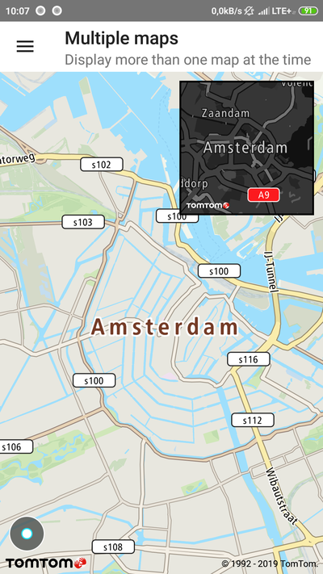

Maps SDK supports displaying multiple instances of a map at the same time. You can put as many map
objects as you want on the same Activity without any issues.

In this tutorial we are going to add a mini map to a fragment which will be displayed over an
activity that already contains a `MapFragment`.

We can define a fragment layout which contains a mini map as:

```xml
<FrameLayout xmlns:android="http://schemas.android.com/apk/res/android"
    xmlns:New="http://schemas.android.com/apk/res-auto"
    android:layout_width="match_parent"
    android:layout_height="match_parent">

    <fragment
        android:id="@+id/mini_map_fragment"
        android:name="com.New.online.sdk.map.MapFragment"
        android:layout_width="@dimen/mini_map_size"
        android:layout_height="@dimen/mini_map_size"
        android:layout_gravity="top|end"
        android:layout_margin="@dimen/mini_map_margin"
        android:background="@color/solid_black"
        android:padding="@dimen/mini_map_border"
        New:customMapBackgroundColor="@color/solid_black"
        New:mapsApiKey="@string/maps_api_key" />
</FrameLayout>
```

Initialization of mini map:

```java
miniMapFragment = childFragmentManager.findFragmentById(R.id.mini_map_fragment) as MapFragment
// Make sure that mini map is drawn on top of the main map
// If not set, the mini map may be invisible on old devices
// with low Android version.
miniMapFragment.setZOrderMediaOverlay(true)
```

**Sample use case:** You want to show a mini map with the night style and a different zoom level
than the main map.

Before any operation can be done on the map, we need to obtain a reference to a `NewMap`:

```java
miniMapFragment.getAsyncMap { miniNewMap -> "your code" }
```

To configure map behaviour use:

```java
miniNewMap.uiSettings.compassView.hide()
miniNewMap.uiSettings.currentLocationView.hide()
miniNewMap.uiSettings.setStyleUrl(NIGHT_STYLE_URL_PATH)
miniNewMap.uiSettings.logoView.applyInvertedLogo()
miniNewMap.uiSettings.copyrightsView.applyInvertedColor()

miniNewMap.updateGesturesConfiguration(
    GesturesConfiguration.Builder()
        .zoomEnabled(false)
        .panningEnabled(false)
        .rotationEnabled(false)
        .tiltEnabled(false)
        .build()
)
```

At this point mini map will have all of the gestures disabled. Moving the camera to a new location
requires information from the main map.

We can obtain a new camera position for our mini map
using `NewMapCallback.OnCameraMoveFinishedListener` which will be registered in the main map.

Define `NewMapCallback.OnCameraMoveFinishedListener` as:

```java
private val onCameraMoveFinished = object : NewMapCallback.OnCameraMoveFinishedListener {
    override fun onCameraMoveFinished() {
        // This callback is not called too often, only when map centering animation or map transition using gestures is finished.
        // To have more frequent updates, one can register for the onCameraChanged listener.
        // However, this may cause performance issues as onCameraChanged is called very often.
        mainViewModel.applyOnMap(MapAction {

            val cameraPosition = uiSettings.cameraPosition
            val miniMapZoomLevel = if (cameraPosition.zoom <= MAP_ZOOM_LEVEL_FOR_SECOND_MAP) {
                cameraPosition.zoom
            } else {
                cameraPosition.zoom - MAP_ZOOM_LEVEL_FOR_SECOND_MAP
            }

            val miniMapBearing = cameraPosition.bearing
            val miniMapPosition = CameraPosition.builder()
                .focusPosition(centerOfMap)
                .zoom(miniMapZoomLevel)
                .bearing(miniMapBearing)
                .animationDuration(SECOND_MAP_ANIMATION_TIME)
                .build()

            viewModel.applyOnMiniMap(MapAction { uiSettings.cameraPosition = miniMapPosition })
        })
    }
}
```

Then register the callback in the main map:

```java
NewMap.addOnCameraMoveFinishedListener(onCameraMoveFinished)
```

To unregister the callback use:

```java
NewMap.removeOnCameraMoveFinishedListener(onCameraMoveFinished)
```

<ContentWrapper maxWidth="350px" objectFit="contain">



</ContentWrapper>