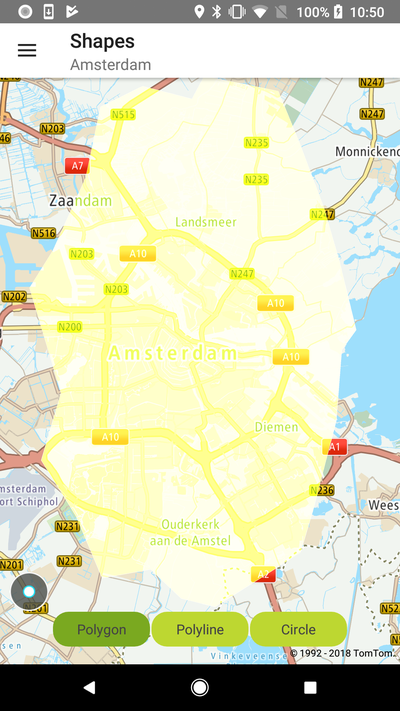
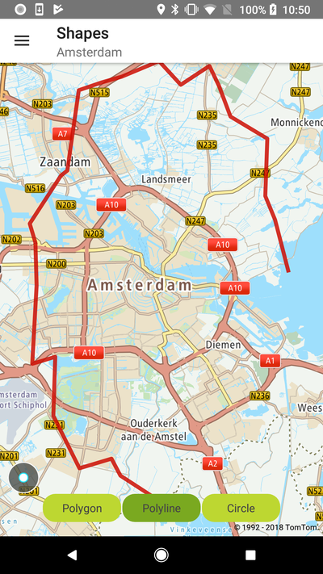
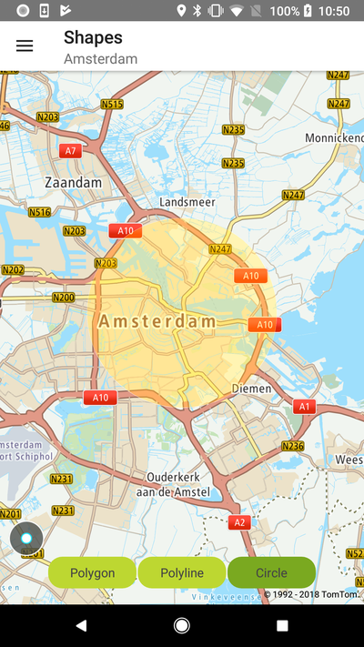

<a
  href="#"
  style={{ display: 'block', margin: '0', padding: '0' }}
  name="custom-shapes"
></a>

Allow your users to draw shapes like circles, polygons, and polylines on your map to mark different
areas on the map.

**Sample use case:** You are developing an app for a delivery company and need to illustrate ranges
of the transportation area around different cities. What you need to do is render circles around
cities with radiuses indicating zones of deliveries. The details on the example implementation of
shapes rendering follows.

The NewMap supports several shape overlays which can be easily created by using corresponding
overlay builders. These are:

- PolygonBuilder
- PolylineBuilder
- CircleBuilder

Shape overlays are immutable. That is, once they have been created their shape cannot be changed.
Visibility and color can be changed. If you want to change a shape, you must remove the existing
shape and replace it with a new one. It is the responsibility of the framework user to take care of
performance and the number of shapes in use. You should use as few shapes as possible, and hide or
dispose of the ones that are not being displayed.

To create shape overlays:

<Code>

```java
Polygon polygon = PolygonBuilder.create()
        .coordinates(coordinates)
        .color(color)
        .build()

NewMap.getOverlaySettings().addOverlay(polygon);
```

```kotlin
val polygon = PolygonBuilder.create()
    .coordinates(coordinates)
    .color(color)
    .build()

NewMap.overlaySettings.addOverlay(polygon)
```

</Code>
<Code>

```java
Polyline polyline = PolylineBuilder.create()
        .coordinates(coordinates)
        .color(color)
        .build();

NewMap.getOverlaySettings().addOverlay(polyline);
```

```kotlin
val polyline = PolylineBuilder.create()
    .coordinates(coordinates)
    .color(color)
    .build()

NewMap.overlaySettings.addOverlay(polyline)
```

</Code>
<Code>

```java
Circle circle = CircleBuilder.create()
        .fill(true)
        .radius(radiusM)
        .position(position)
        .color(color)
        .build();

NewMap.getOverlaySettings().addOverlay(circle);
```

```kotlin
val circle = CircleBuilder.create()
    .fill(true)
    .radius(CIRCLE_RADIUS_IN_METERS)
    .position(position)
    .color(color)
    .build()

NewMap.overlaySettings.addOverlay(circle)
```

</Code>

To register click events:

<Code>

```java
NewMap.addOnCircleClickListener(onCircleClickListener);
NewMap.addOnPolygonClickListener(onPolygonClickListener);
NewMap.addOnPolylineClickListener(onPolylineClickListener);
```

```kotlin
NewMap.addOnCircleClickListener { infoTextView.displayAsToast(getString(R.string.toast_circle_clicked)) }
NewMap.addOnPolygonClickListener { infoTextView.displayAsToast(getString(R.string.toast_polygon_clicked)) }
NewMap.addOnPolylineClickListener { infoTextView.displayAsToast(getString(R.string.toast_polyline_clicked)) }
```

</Code>

To unregister click events:

<Code>

```java
NewMap.removeOnCircleClickListeners();
NewMap.removeOnPolygonClickListeners();
NewMap.removeOnPolylineClickListeners();
```

```kotlin
NewMap.removeOnCircleClickListeners()
NewMap.removeOnPolygonClickListeners()
NewMap.removeOnPolylineClickListeners()
```

</Code>

<table>
  <tbody>
    <tr>
      <td>
        <ContentWrapper maxWidth="350px" objectFit="contain">
          <p>
            
          </p>
        </ContentWrapper>
        <p>Polygon overlay</p>
      </td>
      <td>
        <ContentWrapper maxWidth="350px" objectFit="contain">
          <p>
            
          </p>
        </ContentWrapper>
        <p>Polyline overlay</p>
      </td>
    </tr>
    <tr>
      <td>
        <ContentWrapper maxWidth="350px" objectFit="contain">
          <p>
            
          </p>
        </ContentWrapper>
        <p>Circle overlay</p>
      </td>
      <td></td>
    </tr>
  </tbody>
</table>