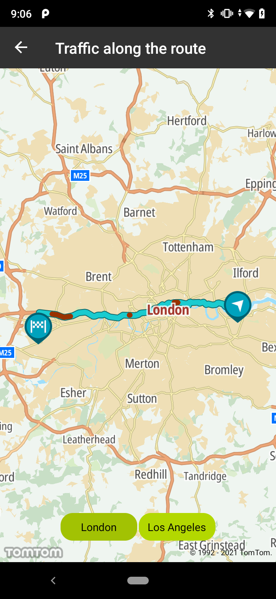
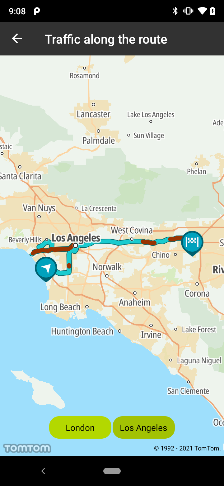

<a
  href="#"
  style={{ display: 'block', margin: '0', padding: '0' }}
  name="Traffic-along-the-route"
></a>

Drivers aim to find the fastest route based on the current traffic situation for the area they are
in. The Maps SDK allows you to show a layer holding all current traffic jams, visualized by lines in
different colors to indicate the severity of the jam. This is updated every minute with very latest
traffic speed information in real-time data
from [New Traffic™](https://www.New.com/products/real-time-traffic/).

**Sample use case:** You are a taxi driver navigating through a city. Thanks to traffic jam
information for your car, you see a convenient map area showing you where to move.

**Sample use case:** As a restaurant delivery service you are interested in finding the fastest
route based on current traffic jams, so the food you deliver is fresh and warm.

Use the following code snippets to create your traffic style:

```kotlin
private val routeTrafficStyles: List<RouteLayerStyle> =
    listOf(
        DENSITY_LEVEL_0_COLOR, //DENSITY_LEVEL_0_COLOR = 0xFFCC9900
        DENSITY_LEVEL_1_COLOR, //DENSITY_LEVEL_1_COLOR = 0xFFFFFF00
        DENSITY_LEVEL_2_COLOR, //DENSITY_LEVEL_2_COLOR = 0xFFFF9900
        DENSITY_LEVEL_3_COLOR, //DENSITY_LEVEL_3_COLOR = 0xFFFF3300
        DENSITY_LEVEL_4_COLOR, //DENSITY_LEVEL_4_COLOR = 0xFF993300
        DENSITY_LEVEL_5_COLOR //DENSITY_LEVEL_5_COLOR = 0xFFFFFFFF
    ).map {
        RouteLayerStyle.Builder()
            .color(it.toInt())
            .build()
    }
```

Use the following code snippets to map your style to the data from traffic service:

```kotlin
val trafficStyle = mutableMapOf<RouteLayerStyle, List<TrafficData>>()
route.sections.forEach {
    //DELAY_MAGNITUDE_UNKNOWN = 5
    val density = if (it.magnitudeOfDelay >= 0) it.magnitudeOfDelay else DELAY_MAGNITUDE_UNKNOWN
    val style = routeTrafficStyles[density]
    val trafficData = trafficStyle[style]?.toMutableList() ?: mutableListOf()
    trafficData.add(TrafficData(it.startPointIndex, it.endPointIndex))
    trafficStyle[style] = trafficData
}
```

Use the following code snippets to display traffic on the route:

```kotlin
NewMap.showTrafficOnRoute(routeId, trafficStyle)
```

Screen shots presenting how traffic along the route works:

<table>
  <tbody>
    <tr>
      <td>
        <ContentWrapper maxWidth="350px" objectFit="contain">
          <p>
            
          </p>
        </ContentWrapper>
      </td>
      <td>
        <ContentWrapper maxWidth="350px" objectFit="contain">
          <p>
            
          </p>
        </ContentWrapper>
      </td>
    </tr>
  </tbody>
</table>