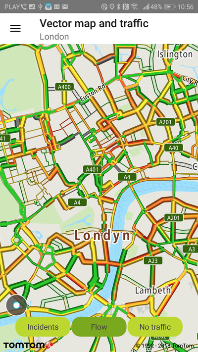
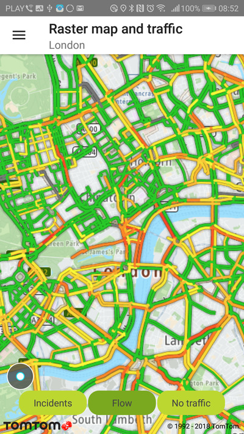
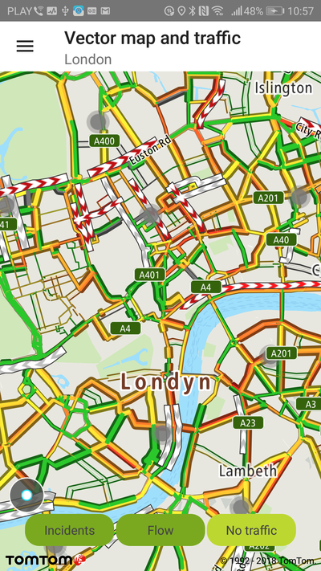
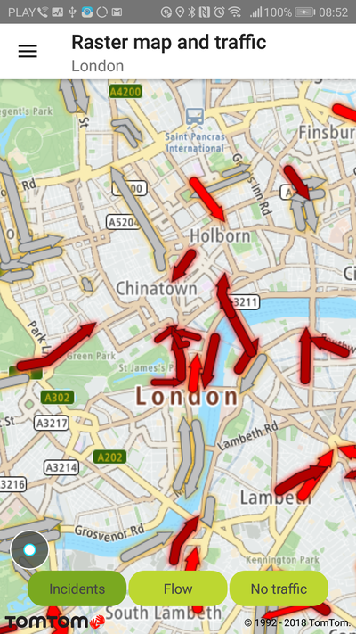
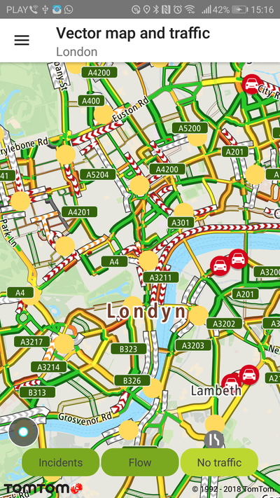
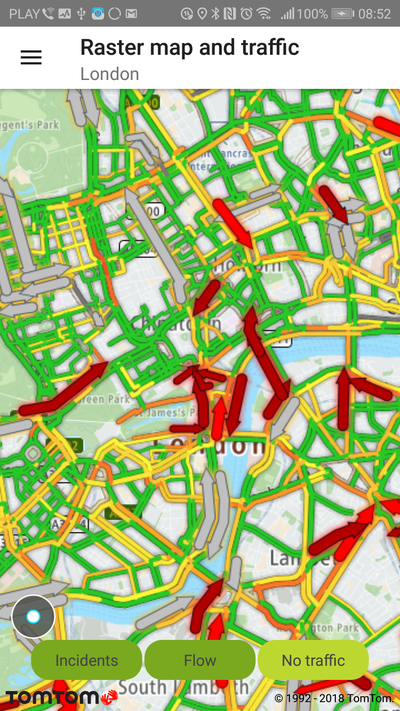
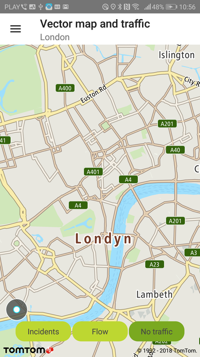
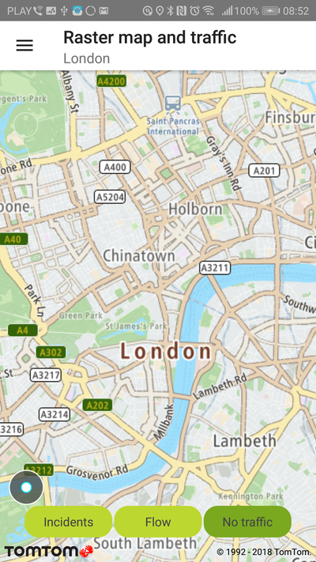

Give your users the ability to see real time traffic in your mobile apps.

With Traffic Flow tiles your users will have information about congestion, the speed of traffic on
different road segments, and the difference between that speed and the free-flow speed on the same
road segments. You can find more information and details about Traffic Flow tile parameters
on [Vector Traffic Flow tiles](/traffic-api/documentation/traffic-flow/vector-flow-tiles)
or [Raster Traffic Flow tiles](/traffic-api/documentation/traffic-flow/raster-flow-tiles).

<a
  href="#"
  style={{ display: 'block', margin: '0', padding: '0' }}
  name="_traffic_flow_tiles"
></a>

# Traffic Flow tiles

Traffic Flow tiles are available in two formats: vector (`.pbf`) and raster (`.png`). Vector tiles
provide a possibility for visual customization and a better visual experience by means of a style
sheet. Also, the vector tiles contain certain traffic information (e.g., road type, traffic level,
etc.). Check Traffic Flow tags in
the [Vector Flow Tiles](/traffic-api/documentation/traffic-flow/vector-flow-tiles)
documentation for details.

**IMPORTANT:** In May 2020, the methods used to switch between vector and raster tiles were
deprecated and will be removed after one year. From that point, to display raster tiles it will be
required to reload the style to one which contains raster layers. Before the deprecation period is
over, a map is still going to be initialized with the style that contains raster and vector tiles.
However, if your style is obtained from the Style Merger you need to set `MapStyleSource`
to `STYLE_MERGER` in `MapProperties`
described [here](/maps-android-sdk/documentation/map-display/documentation/map-initialization). This approach
will only load vector tiles.

Vector Traffic Flow tiles are used by default for traffic flow in the Maps SDK.

You can switch to Raster Traffic Flow tiles
by [reloading the style](/maps-android-sdk/documentation/map-display/map-examples/custom-styles) and then
filtering layers using the following code:

<Code>

```java
List<Layer> layers = NewMap.getStyleSettings().findLayersById("New-flow-raster-layer")
FuncUtils.forEach(layers, layer -> layer.setVisibility(visibility));
```

```kotlin
val layers = NewMap.styleSettings.findLayersById("New-flow-raster-layer")
layers.forEach { layer ->
    layer.visibility = visibility
}
```

</Code>

You can display Vector Traffic Flow tiles by using the following method:

<Code>

```java
NewMap.getTrafficSettings().turnOnTrafficFlowTiles();
```

```kotlin
NewMap.trafficSettings.turnOnTrafficFlowTiles()
```

</Code>

When the Maps SDK is launched with a style containing raster sources for Traffic Flow, and
appropriately set according to the style definition, you can then switch to Raster Traffic Flow
tiles by calling:

<Code>

```java
NewMap.getTrafficSettings().turnOnRasterTrafficFlowTiles();
```

```kotlin
NewMap.trafficSettings.turnOnRasterTrafficFlowTiles()
```

</Code>

You can display Vector Traffic Flow tiles by using the following method:

<Code>

```java
NewMap.getTrafficSettings().turnOnVectorTrafficFlowTiles();
```

```kotlin
NewMap.trafficSettings.turnOnRasterTrafficFlowTiles()
```

</Code>

<a
  href="#"
  style={{ display: 'block', margin: '0', padding: '0' }}
  name="_vector_traffic_flow_tiles_listener"
></a>

# Vector Traffic Flow tiles listener

Additionally, you can get details about the specific traffic flow of the road fragment (e.g.,
current speed, travel times, etc.) from
the [Flow Segment Data](/traffic-api/documentation/traffic-flow/flow-segment-data)
service which is integrated in the Maps SDK. This service is designed to work alongside the Traffic
Flow tiles to support clickable flow data visualizations. This is handled for you in the Maps SDK.
Set the following listener:

<Code>

```java
NewMap.getTrafficSettings().setOnTrafficFlowClickListener(new DefaultOnTrafficFlowClickListener(NewMap));
```

```kotlin
NewMap.trafficSettings.setOnTrafficFlowClickListener(DefaultOnTrafficFlowClickListener(this))
```

</Code>

Then you need to implement the following interface which informs you if any Traffic Flow segment was
clicked:

```java
/**
 * A callback executed when traffic flow on the map is clicked.
 */
public interface OnTrafficFlowClickListener {
    /**
     * A callback executed when traffic flow on the map is clicked.
     *
     * @param mapPoint A point on the screen resolved as a location.
     * @param trafficFlows  A list of traffic points displayed under the clicked place on the map.
     */
    boolean onTrafficFlowClick(MapPoint mapPoint, List<TrafficFlow> trafficFlows);
}
```

which informs the user what place on the map is clicked and what traffic flows are clicked.

By the default implementation, when you click on the specific Traffic Flow segment, a balloon with
details is shown:

```java
NewMap.getTrafficSettings().showTrafficFlowBalloon(pointOnScreen, new TrafficFlowMapBalloon(flows));
```

The default listener dismisses a traffic balloon when information about traffic is not available:

```java
NewMap.getTrafficSettings().dismissTrafficBalloon();
```

To set a custom view for the traffic balloon, the `TrafficFlowBalloonViewAdapter` should be
implemented and set by the `TrafficSettings#setTrafficFlowBalloonViewAdapter` method. A default
implementation is set as follows:

<Code>

```java
NewMap.getTrafficSettings().setTrafficFlowBalloonViewAdapter(new TrafficFlowBalloonViewAdapter.Default());
```

```kotlin
NewMap.trafficSettings.setTrafficFlowBalloonViewAdapter(TrafficFlowBalloonViewAdapter.Default())
```

</Code>

<a
  href="#"
  style={{ display: 'block', margin: '0', padding: '0' }}
  name="_vector_traffic_incidents_tiles_listener"
></a>

# Vector Traffic Incidents Tiles listener

You can get details about the specific traffic incidents flow and traffic incidents POIs (e.g.,
current speed, travel times, etc.) from
the [Vector Flow Tiles](/traffic-api/documentation/traffic-flow/raster-flow-tiles)
service which is integrated in the Maps SDK. This service is designed to work alongside the traffic
tiles to support clickable incident data visualizations. This is handled for you in the Maps SDK.
Set the following listener:

<Code>

```java
NewMap.getTrafficSettings().setOnTrafficIncidentsClickListener(new DefaultOnTrafficIncidentClickListener(NewMap));
```

```kotlin
NewMap.trafficSettings.setOnTrafficIncidentsClickListener(DefaultOnTrafficIncidentClickListener(this))
```

</Code>

Next you need to implement the following interface which informs you if any traffic incident (POI,
cluster, flow) was clicked:

```java
/**
 * A callback executed when traffic flow on the map is clicked.
 */
public interface OnTrafficFlowClickListener {
    /**
     * A callback executed when traffic flow on the map is clicked.
     *
     * @param mapPoint A point on the screen resolved as a location.
     * @param trafficFlows  A list of traffic points displayed under the clicked place on the map.
     */
    boolean onTrafficFlowClick(MapPoint mapPoint, List<TrafficFlow> trafficFlows);
}
```

and informs the user what place on the map is clicked and what traffic flows are clicked.

By the default implementation, when you click on the specific traffic incident, a balloon with
details is shown for incident flows:

```java
NewMap.getTrafficSettings().showTrafficIncidentBalloon(mapPoint, TrafficIncidentsMapBalloon.ofFlows(incidentsFlows));
```

and for incident POIs

```java
NewMap.getTrafficSettings().showTrafficIncidentBalloon(mapPoint, TrafficIncidentsMapBalloon.ofPois(incidentsPois));
```

For the default implementation of incident, click listener and zoom the map when a traffic cluster
is clicked:

```java
NewMap.getUiSettings().setCameraPosition(
        CameraPosition.builder()
                .focusPosition(mapPoint.getPosition())
                .zoom(countNewZoom(incidentsCluster))
                .build()
);
```

To set a custom view for the traffic incident balloon, the `TrafficIncidentsBalloonViewAdapter`
should be implemented and set by the `TrafficSettings#setTrafficIncidentsBalloonViewAdapter` method.
A default implementation is set as follows:

<Code>

```java
NewMap.getTrafficSettings().setTrafficIncidentsBalloonViewAdapter(new TrafficIncidentsBalloonViewAdapter.Default());
```

```kotlin
NewMap.trafficSettings.setTrafficIncidentsBalloonViewAdapter(TrafficIncidentsBalloonViewAdapter.Default())
```

</Code>

<a
  href="#"
  style={{ display: 'block', margin: '0', padding: '0' }}
  name="_traffic_type_and_styles"
></a>

# Traffic type and styles

<Blockquote type="warning">

Methods in this section related to adjusting Traffic Flow styles can only be used when the Maps SDK
is not launched with merged style mode.

</Blockquote>

Traffic tile styles are represented in the SDK as Java data classes. Traffic flow tile style types
are represented in the SDK as data classes.

The available vector traffic flow styles listed below can be set by the following method:

<Code>

```java
NewMap.getTrafficSettings().turnOnVectorTrafficFlowTiles(new TrafficFlowType.RelativeTrafficFlowStyle()); //default
NewMap.getTrafficSettings().turnOnVectorTrafficFlowTiles(new TrafficFlowType.AbsoluteTrafficFlowStyle());
NewMap.getTrafficSettings().turnOnVectorTrafficFlowTiles(new TrafficFlowType.RelativeDelayTrafficFlowStyle());
```

```kotlin
NewMap.trafficSettings.turnOnVectorTrafficFlowTiles(TrafficFlowType.RelativeTrafficFlowStyle()) //default
NewMap.trafficSettings.turnOnVectorTrafficFlowTiles(TrafficFlowType.AbsoluteTrafficFlowStyle())
NewMap.trafficSettings.turnOnVectorTrafficFlowTiles(TrafficFlowType.RelativeDelayTrafficFlowStyle())
```

</Code>

The available raster traffic flow styles listed below can be set by the following method:

<Code>

```java
NewMap.getTrafficSettings().turnOnRasterTrafficFlowTiles(new TrafficFlowType.RelativeTrafficFlowStyle()); //default
NewMap.getTrafficSettings().turnOnRasterTrafficFlowTiles(new TrafficFlowType.AbsoluteTrafficFlowStyle());
NewMap.getTrafficSettings().turnOnRasterTrafficFlowTiles(new TrafficFlowType.RelativeDelayTrafficFlowStyle());
```

```kotlin
//default
NewMap.trafficSettings.turnOnRasterTrafficFlowTiles(TrafficFlowType.RelativeTrafficFlowStyle())
NewMap.trafficSettings.turnOnRasterTrafficFlowTiles(TrafficFlowType.AbsoluteTrafficFlowStyle())
NewMap.trafficSettings.turnOnRasterTrafficFlowTiles(TrafficFlowType.RelativeDelayTrafficFlowStyle())
NewMap.trafficSettings.turnOnRasterTrafficFlowTiles(TrafficFlowType.ReducedSensitivityTrafficFlowStyle())
```

</Code>

**Sample use case:** You want to visualize traffic information in your app so your users can adjust
their commute based on traffic information.

Use the following code snippets in your app to enable and visualize the vector traffic flow layer on
the map:

<Code>

```java
NewMap.getTrafficSettings().turnOnTrafficFlowTiles();
```

```kotlin
NewMap.trafficSettings.turnOnTrafficFlowTiles()
```

</Code>

You can turn off traffic flow by using the following method:

<Code>

```java
NewMap.getTrafficSettings().turnOffTraffic();
NewMap.getTrafficSettings().turnOffTrafficFlowTiles();
```

```kotlin
NewMap.trafficSettings.turnOffTraffic()
```

</Code>

Information about set style:

<Code>

```java
TrafficFlowType.VectorTrafficFlowType style = NewMap.getTrafficSettings().getTrafficVectorFlowStyle();
```

```kotlin
val style = NewMap.trafficSettings.trafficVectorFlowStyle
```

</Code>

<a
  href="#"
  style={{ display: 'block', margin: '0', padding: '0' }}
  name="_traffic_incidents"
></a>

# Traffic incidents

**IMPORTANT:** In May 2020, the methods used to switch between vector and raster tiles were
deprecated and will be removed after one year. From that point, to display raster tiles it will be
required to reload the style to one which contains raster layers. Before the deprecation period is
over, a map is still going to be initialized with the style that contains raster and vector tiles.
However, if your style is obtained from the Style Merger you need to set `MapStyleSource`
to `STYLE_MERGER` in `MapProperties`
described [here](/maps-android-sdk/documentation/map-display/documentation/map-initialization).

In Merged Styles mode you can switch to Raster Traffic Incidents
by [reloading the style](/maps-android-sdk/documentation/map-display/documentation/custom-style) and then
filtering layers using the following code:

- Raster incident tiles:

<Code>

```java
List<Layer> layers = NewMap.getStyleSettings().findLayersById("New-incidents-layer");
FuncUtils.forEach(layers, layer -> layer.setVisibility(visibility));
```

```kotlin
val layers = NewMap.styleSettings.findLayersById("New-incidents-layer")
layers.forEach { layer ->
    layer.visibility = visibility
}
```

</Code>

- Vector incident tiles and POIs:

<Code>

```java
NewMap.getTrafficSettings().turnOnTrafficIncidents();
```

```kotlin
NewMap.trafficSettings.turnOnTrafficIncidents()
```

</Code>

You can turn off traffic incidents by using the following method:

- Vector incidents

<Code>

```java
NewMap.getTrafficSettings().turnOffTrafficIncidents();
```

```kotlin
NewMap.trafficSettings.turnOffTrafficIncidents()
```

</Code>

- Raster incidents, where Visibility is equal to `Visibility.None`

<Code>

```java
List<Layer> layers = NewMap.getStyleSettings().findLayersById("New-incidents-layer");
FuncUtils.forEach(layers, layer -> layer.setVisibility(visibility));
```

```kotlin
val layers = NewMap.styleSettings.findLayersById("New-incidents-layer")
layers.forEach { layer ->
    layer.visibility = visibility
}
```

</Code>

When the Maps SDK is launched with a style containing raster sources for Traffic Incident, and
appropriately set according to the style definition, then you can switch to Raster Traffic Incident
tiles by calling:

To enable Traffic Incident tiles:

- Vector incident tiles and POIs:

<Code>

```java
NewMap.getTrafficSettings().turnOnVectorTrafficIncidents();
```

```kotlin
NewMap.trafficSettings.turnOnVectorTrafficIncidents()
```

</Code>

- Raster incident tiles:

<Code>

```java
NewMap.getTrafficSettings().turnOnRasterTrafficIncidents();
```

```kotlin
NewMap.trafficSettings.turnOnRasterTrafficIncidents()
```

</Code>

You can turn off traffic incidents by using the following method:

<Code>

```java
NewMap.getTrafficSettings().turnOffTrafficIncidents();
```

```kotlin
NewMap.trafficSettings.turnOffTrafficIncidents()
```

</Code>

<table>
  <tbody>
    <tr>
      <td>
        <ContentWrapper maxWidth="350px" objectFit="contain">
          <p>
            
          </p>
        </ContentWrapper>
        <p>Traffic vector flow layer shown on a vector map.</p>
      </td>
      <td>
        <ContentWrapper maxWidth="350px" objectFit="contain">
          <p>
            
          </p>
        </ContentWrapper>
        <p>Traffic raster flow shown on a raster map.</p>
      </td>
    </tr>
    <tr>
      <td>
        <ContentWrapper maxWidth="350px" objectFit="contain">
          <p>
            
          </p>
        </ContentWrapper>
        <p>Traffic vector incidents layer with the S1 file style.</p>
      </td>
      <td>
        <ContentWrapper maxWidth="350px" objectFit="contain">
          <p>
            
          </p>
        </ContentWrapper>
        <p>Traffic raster incidents layer in the sample app.</p>
      </td>
    </tr>
    <tr>
      <td>
        <ContentWrapper maxWidth="350px" objectFit="contain">
          <p>
            
          </p>
        </ContentWrapper>
        <p>Traffic vector incidents and raster flow layer on a raster map.</p>
      </td>
      <td>
        <ContentWrapper maxWidth="350px" objectFit="contain">
          <p>
            
          </p>
        </ContentWrapper>
        <p>Traffic raster incidents and raster flow layer on a raster map.</p>
      </td>
    </tr>
    <tr>
      <td>
        <ContentWrapper maxWidth="350px" objectFit="contain">
          <p>
            
          </p>
        </ContentWrapper>
        <p>No vector traffic in the sample app.</p>
      </td>
      <td>
        <ContentWrapper maxWidth="350px" objectFit="contain">
          <p>
            
          </p>
        </ContentWrapper>
        <p>No raster traffic in the sample app.</p>
      </td>
    </tr>
  </tbody>
</table>