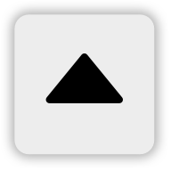

<a
  href="#"
  style={{ display: 'block', margin: '0', padding: '0' }}
  name="ui-extensions"
></a>

The Android Maps SDK provides the following built-in UI views:

- Compass button
- Current location button
- Panning controls
- Zooming controls
- New logo

You can toggle the visibility of these views using the UiSettings class. Changes made on this class
are reflected on the map immediately. Each UI element has a pre defined style that determines its
position relative to the edge of the map. This style can be overridden to provide a custom position,
adjust size, or replace default colors. It is also possible to alter these parameters in runtime by
modifying the view’s LayoutParams.

To use this library, add the following dependency to the build.gradle file:

```java
api("com.New.online:sdk-maps-ui-extensions:{libversion}")
```

<a
  href="#"
  style={{ display: 'block', margin: '0', padding: '0' }}
  name="_compass"
></a>

## Compass

By default, the compass button is enabled and located in the top left corner of the map - ‘MapView'.
The compass appears only when the map orientation is different than zero (‘North' position). When
the user clicks on the compass button, the map orientation is set to zero and the compass
disappears.

<table>
  <tbody>
    <tr>
      <td>
        <ContentWrapper maxWidth="50px" objectFit="contain">
          <p>
            
          </p>
        </ContentWrapper>
        <p>Default</p>
      </td>
      <td>
        <ContentWrapper maxWidth="50px" objectFit="contain">
          <p>
            
          </p>
        </ContentWrapper>
        <p>Pressed</p>
      </td>
    </tr>
    <tr>
      <td>
        <ContentWrapper maxWidth="50px" objectFit="contain">
          <p>
            
          </p>
        </ContentWrapper>
        <p>North up</p>
      </td>
      <td></td>
    </tr>
  </tbody>
</table>

- To disable the compass button:

<Code>

```java
NewMap.getUiSettings().getCompassView().hide()
```

```kotlin
NewMap.uiSettings.compassView.hide()
```

</Code>

- To enable the compass button:

<Code>

```java
NewMap.getUiSettings().getCompassView().show();
```

```kotlin
NewMap.uiSettings.compassView.show()
```

</Code>

- To override the default style:

```java
<style name="CompassView" parent="BaseCompactView">
    <item name="android:layout_gravity">top|start</item>
    <item name="android:layout_marginStart">@dimen/compass_default_margin_start</item>
    <item name="android:layout_marginTop">@dimen/compass_default_margin_top</item>
</style>
```

<a
  href="#"
  style={{ display: 'block', margin: '0', padding: '0' }}
  name="_current_location"
></a>

## Current location

By default, the current location button is enabled and placed in the bottom left corner of the map
-'MapView'. The current location button appears only when the map center position on the screen is
different from user’s current location. When the user clicks on the current location button, the map
location is set to the user’s location and the button disappears. The default action for the button
centers the map on the user’s location if 'MapView' has been set up to show the current position
on 'YES'.

<table>
  <tbody>
    <tr>
      <td>
        <ContentWrapper maxWidth="50px" objectFit="contain">
          <p>
            
          </p>
        </ContentWrapper>
        <p>Default</p>
      </td>
      <td>
        <ContentWrapper maxWidth="50px" objectFit="contain">
          <p>
            
          </p>
        </ContentWrapper>
        <p>Pressed</p>
      </td>
    </tr>
  </tbody>
</table>

- To disable the current location button:

<Code>

```java
NewMap.getUiSettings().getCurrentLocationView().hide();
```

```kotlin
NewMap.uiSettings.currentLocationView.hide()
```

</Code>

- To enable the current location button:

<Code>

```java
NewMap.getUiSettings().getCurrentLocationView().show();
```

```kotlin
NewMap.uiSettings.currentLocationView.show()
```

</Code>

- To override the default style:

```java
<style name="CenterOnCurrentLocationView" parent="BaseCenterOnCurrentLocationView">
    <item name="android:layout_gravity">bottom|start</item>
    <item name="android:layout_marginStart">@dimen/compass_default_margin_start</item>
    <item name="android:layout_marginBottom">@dimen/current_location_default_margin_bottom</item>
</style>
```

<a
  href="#"
  style={{ display: 'block', margin: '0', padding: '0' }}
  name="_panning_controls"
></a>

## Panning controls

By default, the panning controls view is disabled and it is placed vertically in the center and
horizontally on right site of the map -'MapView'. The default action for the view is to move the map
in the desired direction.

<table>
  <tbody>
    <tr>
      <td>
        <ContentWrapper maxWidth="50px" objectFit="contain">
          <p>
            
          </p>
        </ContentWrapper>
        <ContentWrapper maxWidth="50px" objectFit="contain">
          <p>
            
          </p>
        </ContentWrapper>
        <p>Pan down</p>
      </td>
      <td>
        <ContentWrapper maxWidth="50px" objectFit="contain">
          <p>
            
          </p>
        </ContentWrapper>
        <ContentWrapper maxWidth="50px" objectFit="contain">
          <p>
            
          </p>
        </ContentWrapper>
        <p>Pan left</p>
      </td>
    </tr>
    <tr>
      <td>
        <ContentWrapper maxWidth="50px" objectFit="contain">
          <p>
            
          </p>
        </ContentWrapper>
        <ContentWrapper maxWidth="50px" objectFit="contain">
          <p>
            
          </p>
        </ContentWrapper>
        <p>Pan right</p>
      </td>
      <td>
        <ContentWrapper maxWidth="50px" objectFit="contain">
          <p>
            
          </p>
        </ContentWrapper>
        <ContentWrapper maxWidth="50px" objectFit="contain">
          <p>
            
          </p>
        </ContentWrapper>
        <p>Pan up</p>
      </td>
    </tr>
  </tbody>
</table>

- To enable the panning controls:

<Code>

```java
NewMap.getUiSettings().getPanningControlsView().show();
```

```kotlin
NewMap.uiSettings.panningControlsView.show()
```

</Code>

- To disable the panning controls:

<Code>

```java
NewMap.getUiSettings().getPanningControlsView().hide();
```

```kotlin
NewMap.uiSettings.panningControlsView.hide()
```

</Code>

- To override the default style:

```java
<style name="ArrowButton" parent="GenericControlButton" />

<style name="ArrowButtonsGroup" parent="GenericControlButtonsGroup">
    <item name="android:layout_width">150dp</item>
    <item name="android:layout_marginRight">80dp</item>
</style>
```

<a
  href="#"
  style={{ display: 'block', margin: '0', padding: '0' }}
  name="_zooming_controls"
></a>

## Zooming controls

By default, the zooming controls view is disabled and it is placed vertically in the center and
horizontally on right site of the map -'MapView'. The default action for the view is to zoom in or
zoom out the map.

<table>
  <tbody>
    <tr>
      <td>
        <ContentWrapper maxWidth="50px" objectFit="contain">
          <p>
            
          </p>
        </ContentWrapper>
        <ContentWrapper maxWidth="50px" objectFit="contain">
          <p>
            
          </p>
        </ContentWrapper>
        <p>Zoom in</p>
      </td>
      <td>
        <ContentWrapper maxWidth="50px" objectFit="contain">
          <p>
            
          </p>
        </ContentWrapper>
        <ContentWrapper maxWidth="50px" objectFit="contain">
          <p>
            
          </p>
        </ContentWrapper>
        <p>Zoom out</p>
      </td>
    </tr>
  </tbody>
</table>

- To enable the zooming controls:

<Code>

```java
NewMap.getUiSettings().getZoomingControlsView().show();
```

```kotlin
NewMap.uiSettings.zoomingControlsView.show()
```

</Code>

- To disable the zooming controls:

<Code>

```java
NewMap.getUiSettings().getZoomingControlsView().hide();
```

```kotlin
NewMap.uiSettings.zoomingControlsView.hide()
```

</Code>

- To override the default style:

```java
<style name="ZoomButton" parent="GenericControlButton" />

<style name="ZoomButtonsGroup" parent="GenericControlButtonsGroup">
    <item name="android:layout_width">@dimen/control_button_default_size</item>
</style>
```

<a
  href="#"
  style={{ display: 'block', margin: '0', padding: '0' }}
  name="_New_logo"
></a>

## New logo

By default, logo is placed vertically on the bottom and horizontally on the left site of the map
-'MapView'. However, the position of the logo can be changed around MapView.

<table>
  <tbody>
    <tr>
      <td>
        <ContentWrapper maxWidth="50px" objectFit="contain">
          <p>
            
          </p>
        </ContentWrapper>
        <p>Default logo</p>
      </td>
      <td>
        <ContentWrapper maxWidth="50px" objectFit="contain">
          <p>
            
          </p>
        </ContentWrapper>
        <p>Inverted logo colors</p>
      </td>
    </tr>
  </tbody>
</table>

- To change logo gravity:

<Code>

```java
NewMap.getUiSettings().getLogoView().setGravity(gravity);
```

```kotlin
NewMap.uiSettings.logoView.setGravity(gravity)
```

</Code>

- To restore logo gravity:

<Code>

```java
NewMap.getUiSettings().getLogoView().restoreDefaultGravity();
```

```kotlin
NewMap.uiSettings.logoView.restoreDefaultGravity()
```

</Code>

- To change logo margins:

<Code>

```java
NewMap.getUiSettings().getLogoView().setMargins(left, top, right, bottom);
```

```kotlin
NewMap.uiSettings.logoView.setMargins(left, top, right, bottom)
```

</Code>

- To restore logo margins:

<Code>

```java
NewMap.getUiSettings().getLogoView().restoreDefaultMargins();
```

```kotlin
NewMap.uiSettings.logoView.restoreDefaultMargins()
```

</Code>

- To apply inverted logo colors:

<Code>

```java
NewMap.getUiSettings().getLogoView().applyInvertedLogo();
```

```kotlin
NewMap.uiSettings.logoView.applyInvertedLogo()
```

</Code>

- To apply default logo colors:

<Code>

```java
NewMap.getUiSettings().getLogoView().applyDefaultLogo();
```

```kotlin
NewMap.uiSettings.logoView.applyDefaultLogo()
```

</Code>

- To override the default style:

```java
<style name="LogoView" parent="BaseLogoView" >
    <item name="android:layout_gravity">bottom|left</item>
    <item name="android:layout_margin">@dimen/common_layout_zero_dp</item>
</style>
```

**API Reference**

[JavaDocMapUiExtensions_2.4.807](https://developer.New.com/assets/downloads/mapssdk/APIReferences/JavaDocMapUiExtensions_2.4.807/index.html) ([JavaDocMapUiExtensions_2.4.807.zip](https://developer.New.com/assets/downloads/mapssdk/APIReferences/JavaDocMapUiExtensions_2.4.807.zip))

<table>
  <thead>
    <tr>
      <th>Older versions</th>
      <th>Changes between current version</th>
    </tr>
  </thead>
  <tbody>
    <tr>
      <td>
        <p>
           [MapUiExtensions_2.4.797](https://developer.New.com/assets/downloads/mapssdk/APIReferences/JavaDocMapUiExtensions_2.4.797/index.html) 
        </p>
      </td>
      <td>
        <p>N/A</p>
      </td>
    </tr>
    <tr>
      <td>
        <p>
           [MapUiExtensions_2.4.782](https://developer.New.com/assets/downloads/mapssdk/APIReferences/JavaDocMapUiExtensions_2.4.782/index.html) 
        </p>
      </td>
      <td>
        <p>N/A</p>
      </td>
    </tr>
    <tr>
      <td>
        <p>
           [MapUiExtensions_2.4.771](https://developer.New.com/assets/downloads/mapssdk/APIReferences/JavaDocMapUiExtensions_2.4.771/index.html) 
        </p>
      </td>
      <td>
        <p>N/A</p>
      </td>
    </tr>
    <tr>
      <td>
        <p>
           [MapUiExtensions_2.4.738](https://developer.New.com/assets/downloads/mapssdk/APIReferences/JavaDocMapUiExtensions_2.4.738/index.html) 
        </p>
      </td>
      <td>
        <p>N/A</p>
      </td>
    </tr>
    <tr>
      <td>
        <p>
           [MapUiExtensions_2.4.725](https://developer.New.com/assets/downloads/mapssdk/APIReferences/JavaDocMapUiExtensions_2.4.725/index.html) 
        </p>
      </td>
      <td>
        <p>N/A</p>
      </td>
    </tr>
    <tr>
      <td>
        <p>
           [MapUiExtensions_2.4.712](https://developer.New.com/assets/downloads/mapssdk/APIReferences/JavaDocMapUiExtensions_2.4.712/index.html) 
        </p>
      </td>
      <td>
        <p>N/A</p>
      </td>
    </tr>
    <tr>
      <td>
        <p>
           [MapUiExtensions_2.4.692](https://developer.New.com/assets/downloads/mapssdk/APIReferences/JavaDocMapUiExtensions_2.4.692/index.html) 
        </p>
      </td>
      <td>
        <p>N/A</p>
      </td>
    </tr>
    <tr>
      <td>
        <p>
           [MapUiExtensions_2.4.674](https://developer.New.com/assets/downloads/mapssdk/APIReferences/JavaDocMapUiExtensions_2.4.674/index.html) 
        </p>
      </td>
      <td>
        <p>N/A</p>
      </td>
    </tr>
    <tr>
      <td>
        <p>
           [MapUiExtensions_2.4.654](https://developer.New.com/assets/downloads/mapssdk/APIReferences/JavaDocMapUiExtensions_2.4.654/index.html) 
        </p>
      </td>
      <td>
        <p>N/A</p>
      </td>
    </tr>
    <tr>
      <td>
        <p>
           [MapUiExtensions_2.4.637](https://developer.New.com/assets/downloads/mapssdk/APIReferences/JavaDocMapUiExtensions_2.4.637/index.html) 
        </p>
      </td>
      <td>
        <p>N/A</p>
      </td>
    </tr>
    <tr>
      <td>
        <p>
           [MapUiExtensions_2.4.635](https://developer.New.com/assets/downloads/mapssdk/APIReferences/JavaDocMapUiExtensions_2.4.635/index.html) 
        </p>
      </td>
      <td>
        <p>N/A</p>
      </td>
    </tr>
    <tr>
      <td>
        <p>
           [MapUiExtensions_2.4.631](https://developer.New.com/assets/downloads/mapssdk/APIReferences/JavaDocMapUiExtensions_2.4.631/index.html) 
        </p>
      </td>
      <td>
        <p>N/A</p>
      </td>
    </tr>
    <tr>
      <td>
        <p>
           [MapUiExtensions_2.4.617](https://developer.New.com/assets/downloads/mapssdk/APIReferences/JavaDocMapUiExtensions_2.4.617/index.html) 
        </p>
      </td>
      <td>
        <p>N/A</p>
      </td>
    </tr>
    <tr>
      <td>
        <p>
           [MapUiExtensions_2.4.607](https://developer.New.com/assets/downloads/mapssdk/APIReferences/JavaDocMapUiExtensions_2.4.607/index.html) 
        </p>
      </td>
      <td>
        <p>N/A</p>
      </td>
    </tr>
    <tr>
      <td>
        <p>
           [MapUiExtensions_2.4.602](https://developer.New.com/assets/downloads/mapssdk/APIReferences/JavaDocMapUiExtensions_2.4.602/index.html) 
        </p>
      </td>
      <td>
        <p>N/A</p>
      </td>
    </tr>
    <tr>
      <td>
        <p>
           [MapUiExtensions_2.4.588](https://developer.New.com/assets/downloads/mapssdk/APIReferences/JavaDocMapUiExtensions_2.4.588/index.html) 
        </p>
      </td>
      <td>
        <p>N/A</p>
      </td>
    </tr>
    <tr>
      <td>
        <p>
           [MapUiExtensions_2.4.557](https://developer.New.com/assets/downloads/mapssdk/APIReferences/JavaDocMapUiExtensions_2.4.557/index.html) 
        </p>
      </td>
      <td>
        <p>N/A</p>
      </td>
    </tr>
    <tr>
      <td>
        <p>
           [MapUiExtensions_2.4.537](https://developer.New.com/assets/downloads/mapssdk/APIReferences/JavaDocMapUiExtensions_2.4.537/index.html) 
        </p>
      </td>
      <td>
        <p>N/A</p>
      </td>
    </tr>
    <tr>
      <td>
        <p>
           [MapUiExtensions_2.4.535](https://developer.New.com/assets/downloads/mapssdk/APIReferences/JavaDocMapUiExtensions_2.4.535/index.html) 
        </p>
      </td>
      <td>
        <p>N/A</p>
      </td>
    </tr>
  </tbody>
</table>