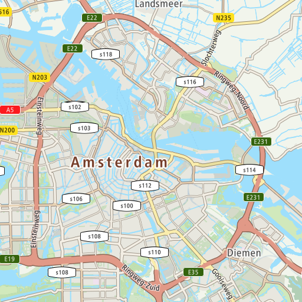
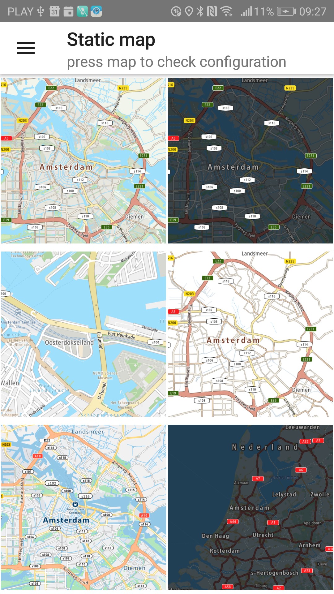

<a
  href="#"
  style={{ display: 'block', margin: '0', padding: '0' }}
  name="static-image"
></a>

Allow your user to render a user-defined rectangular image containing a map section.

For more details, please
visit [Static Map Image documentation](/map-display-api/documentation/raster/static-image)

**Sample use case 1:** Your app is designed to use simple map. You do not want to show the entire
map, just some part of it to show and mark something simple. You don’t have to download the whole
sdk-maps library which is much heavier compared to this library.

To use this library, add the following dependency to the build.gradle file:

```java
api("com.New.online:sdk-maps-static-image:{libversion}")
```

Example of displaying a static map:

<Code>

```java
StaticImage.builder(getMapApiKey())
        .center(Locations.AMSTERDAM_LOCATION) //use center or boundingBox
        .layerBasic() // basic layer is default
        .styleMain() // main style is default
        .mapSize(512, 512) // default size in px
        .png() //png is default
        .build()
        .downloadInto(staticMap1)
```

```kotlin
StaticImage.builder(mapsApiKey)
        .center(Locations.AMSTERDAM)
        .zoom(zoomLevel)
        .layer(layer)
        .style(style)
        .mapSize(DEFAULT_DIMENSION_SIZE, DEFAULT_DIMENSION_SIZE)
        .png()
        .build()
        .downloadInto(targetImageView)
```

</Code>

<table>
  <tbody>
    <tr>
      <td>
        <ContentWrapper maxWidth="512px" objectFit="contain">
          <p>
            
          </p>
        </ContentWrapper>
        <p>Sample image retrieved from the static map service.</p>
      </td>
      <td></td>
    </tr>
    <tr>
      <td>
        <ContentWrapper maxWidth="512px" objectFit="contain">
          <p>
            
          </p>
        </ContentWrapper>
        <p>Examples of static map images.</p>
      </td>
      <td></td>
    </tr>
  </tbody>
</table>

**API Reference**

[JavaDocStaticImage_2.4.807](https://developer.New.com/assets/downloads/mapssdk/APIReferences/JavaDocStaticImage_2.4.807/index.html) ([JavaDocStaticImage_2.4.807.zip](https://developer.New.com/assets/downloads/mapssdk/APIReferences/JavaDocStaticImage_2.4.807.zip))

<table>
  <thead>
    <tr>
      <th>Older versions</th>
      <th>Changes between current version</th>
    </tr>
  </thead>
  <tbody>
    <tr>
      <td>
        <p>
           [StaticImage_2.4.797](https://developer.New.com/assets/downloads/mapssdk/APIReferences/JavaDocStaticImage_2.4.797/index.html) 
        </p>
      </td>
      <td>
        <p>N/A</p>
      </td>
    </tr>
    <tr>
      <td>
        <p>
           [StaticImage_2.4.782](https://developer.New.com/assets/downloads/mapssdk/APIReferences/JavaDocStaticImage_2.4.782/index.html) 
        </p>
      </td>
      <td>
        <p>N/A</p>
      </td>
    </tr>
    <tr>
      <td>
        <p>
           [StaticImage_2.4.771](https://developer.New.com/assets/downloads/mapssdk/APIReferences/JavaDocStaticImage_2.4.771/index.html) 
        </p>
      </td>
      <td>
        <p>N/A</p>
      </td>
    </tr>
    <tr>
      <td>
        <p>
           [StaticImage_2.4.738](https://developer.New.com/assets/downloads/mapssdk/APIReferences/JavaDocStaticImage_2.4.738/index.html) 
        </p>
      </td>
      <td>
        <p>N/A</p>
      </td>
    </tr>
    <tr>
      <td>
        <p>
           [StaticImage_2.4.725](https://developer.New.com/assets/downloads/mapssdk/APIReferences/JavaDocStaticImage_2.4.725/index.html) 
        </p>
      </td>
      <td>
        <p>N/A</p>
      </td>
    </tr>
    <tr>
      <td>
        <p>
           [StaticImage_2.4.712](https://developer.New.com/assets/downloads/mapssdk/APIReferences/JavaDocStaticImage_2.4.712/index.html) 
        </p>
      </td>
      <td>
        <p>N/A</p>
      </td>
    </tr>
    <tr>
      <td>
        <p>
           [StaticImage_2.4.692](https://developer.New.com/assets/downloads/mapssdk/APIReferences/JavaDocStaticImage_2.4.692/index.html) 
        </p>
      </td>
      <td>
        <p>N/A</p>
      </td>
    </tr>
    <tr>
      <td>
        <p>
           [StaticImage_2.4.674](https://developer.New.com/assets/downloads/mapssdk/APIReferences/JavaDocStaticImage_2.4.674/index.html) 
        </p>
      </td>
      <td>
        <p>N/A</p>
      </td>
    </tr>
    <tr>
      <td>
        <p>
           [StaticImage_2.4.654](https://developer.New.com/assets/downloads/mapssdk/APIReferences/JavaDocStaticImage_2.4.654/index.html) 
        </p>
      </td>
      <td>
        <p>N/A</p>
      </td>
    </tr>
    <tr>
      <td>
        <p>
           [StaticImage_2.4.637](https://developer.New.com/assets/downloads/mapssdk/APIReferences/JavaDocStaticImage_2.4.637/index.html) 
        </p>
      </td>
      <td>
        <p>N/A</p>
      </td>
    </tr>
    <tr>
      <td>
        <p>
           [StaticImage_2.4.635](https://developer.New.com/assets/downloads/mapssdk/APIReferences/JavaDocStaticImage_2.4.635/index.html) 
        </p>
      </td>
      <td>
        <p>N/A</p>
      </td>
    </tr>
    <tr>
      <td>
        <p>
           [StaticImage_2.4.631](https://developer.New.com/assets/downloads/mapssdk/APIReferences/JavaDocStaticImage_2.4.631/index.html) 
        </p>
      </td>
      <td>
        <p>N/A</p>
      </td>
    </tr>
    <tr>
      <td>
        <p>
           [StaticImage_2.4.617](https://developer.New.com/assets/downloads/mapssdk/APIReferences/JavaDocStaticImage_2.4.617/index.html) 
        </p>
      </td>
      <td>
        <p>N/A</p>
      </td>
    </tr>
    <tr>
      <td>
        <p>
           [StaticImage_2.4.607](https://developer.New.com/assets/downloads/mapssdk/APIReferences/JavaDocStaticImage_2.4.607/index.html) 
        </p>
      </td>
      <td>
        <p>N/A</p>
      </td>
    </tr>
    <tr>
      <td>
        <p>
           [StaticImage_2.4.602](https://developer.New.com/assets/downloads/mapssdk/APIReferences/JavaDocStaticImage_2.4.602/index.html) 
        </p>
      </td>
      <td>
        <p>N/A</p>
      </td>
    </tr>
    <tr>
      <td>
        <p>
           [StaticImage_2.4.588](https://developer.New.com/assets/downloads/mapssdk/APIReferences/JavaDocStaticImage_2.4.588/index.html) 
        </p>
      </td>
      <td>
        <p>N/A</p>
      </td>
    </tr>
    <tr>
      <td>
        <p>
           [StaticImage_2.4.557](https://developer.New.com/assets/downloads/mapssdk/APIReferences/JavaDocStaticImage_2.4.557/index.html) 
        </p>
      </td>
      <td>
        <p>N/A</p>
      </td>
    </tr>
    <tr>
      <td>
        <p>
           [StaticImage_2.4.537](https://developer.New.com/assets/downloads/mapssdk/APIReferences/JavaDocStaticImage_2.4.537/index.html) 
        </p>
      </td>
      <td>
        <p>N/A</p>
      </td>
    </tr>
    <tr>
      <td>
        <p>
           [StaticImage_2.4.535](https://developer.New.com/assets/downloads/mapssdk/APIReferences/JavaDocStaticImage_2.4.535/index.html) 
        </p>
      </td>
      <td>
        <p>N/A</p>
      </td>
    </tr>
  </tbody>
</table>