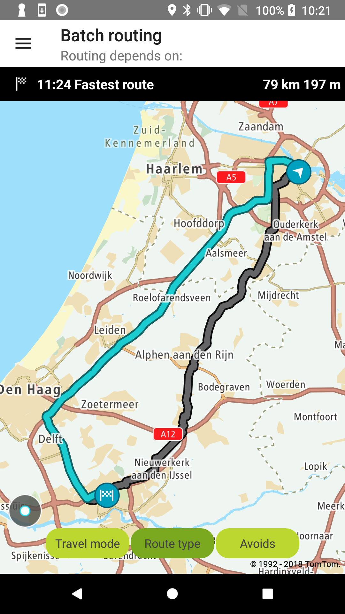

<a
  href="#"
  style={{ display: 'block', margin: '0', padding: '0' }}
  name="barch-routing"
></a>

Allow your users to send multiple synchronous routing requests with Batch Routing components. You
can mix different types of routing requests to easily compare them.

Batch Routing components as described use
the [Batch Routing API](/routing-api/documentation/batch-routing/synchronous-batch)
so you can find all details about it in the service documentation.

**Sample use case:** You are preparing for a trip and you would like to choose the most optimal
route for your travel. You would like to compare the ETA and distances for routes depending on
travel modes, route types, or avoids.

Also, you can adjust the batch request with other parameters as described in
the [Batch Routing API](/routing-api/documentation/batch-routing/synchronous-batch)
or the JavaDocs of this SDK under the API reference section.

The following example shows multiple routes requested in the batch. Each example sends three
requests in one batch. All examples allow a user to compare routes visually on the map, their ETAs,
and distances by clicking a chosen route.

- Travel mode example shows three routes: the route by car, the route by truck, and the route as a
  pedestrian.
- Route type example shows three routes: the fastest route, the shortest route, and the most eco
  route.
- Avoids example shows three routes: the avoid-motorways route, the avoid-ferries route, and the
  avoid-toll roads.

Use the following code sample to implement a similar use case.

To obtain a batch routes plan create a `BatchRoutesSpecification`:

<Code>

```java
return new BatchRoutesSpecification.Builder()
        .routeSpecifications(routeSpecifications)
        .build()
```

```kotlin
val batchRoutesSpecification = BatchRoutesSpecification.Builder()
    .routeSpecifications(
        listOf(
            createRouteTravelModesSpecification(TravelMode.CAR, AmsterdamToRotterdamRouteConfig()),
            createRouteTravelModesSpecification(TravelMode.TRUCK, AmsterdamToRotterdamRouteConfig()),
            createRouteTravelModesSpecification(TravelMode.PEDESTRIAN, AmsterdamToRotterdamRouteConfig())
        )
    ).build()
```

</Code>

and pass it to the Routing API:

<Code>

```java
routingApi.planRoutes(specification, batchRoutesCallback);
```

```kotlin
routingApi.planRoutes(batchRoutesSpecification, batchRoutesCallback)
```

</Code>

The result can be observed with a listener or through a synchronous call:

```java
/**
 * Callback which informs about a received [BatchRoutesPlan] or respective error.
 */
@PublicPreview(byTheEndOf = "2021.06")
@Keep
interface BatchRoutesCallback {
    /**
     * Called when a [BatchRoutesPlan] has been successfully obtained.
     *
     * @param routePlan The planned routes.
     */
    @PublicPreview(byTheEndOf = "2021.06")
    fun onSuccess(routePlan: BatchRoutesPlan)

    /**
     * Called when an error occurs during the process of obtaining the [BatchRoutesPlan].
     *
     * @param error Error which occurred while obtaining the [BatchRoutesPlan].
     */
    @PublicPreview(byTheEndOf = "2021.06")
    fun onError(error: RoutingException)
}
```

<table>
  <tbody>
    <tr>
      <td>
        <ContentWrapper maxWidth="350px" objectFit="contain">
          <p>
            
          </p>
        </ContentWrapper>
        <p>Travel modes: car, truck, pedestrian</p>
      </td>
      <td>
        <ContentWrapper maxWidth="350px" objectFit="contain">
          <p>
            
          </p>
        </ContentWrapper>
        <p>Route type: fastest, shortest, eco</p>
      </td>
    </tr>
    <tr>
      <td>
        <ContentWrapper maxWidth="350px" objectFit="contain">
          <p>
            
          </p>
        </ContentWrapper>
        <p>Avoids: motorways, ferries, toll roads</p>
      </td>
      <td></td>
    </tr>
  </tbody>
</table>

You can select a route and get information about ETA and distances.

**Sample use case:** You are preparing the trip for the weekend and you want to check how far you
can get by electric car, electric car with time budget, and non-electric car.

To achieve this you first have to create a specification and pass a list
of `ReachableRangeSpecifications`:

```java
new BatchRoutesSpecification.Builder()
        .reachableRangeSpecifications(batchRoutesSpecifications)
        .build();
```

Secondly, pass the created specification to the Routing API:

```java
getRoutePlannerAPI().planRoutes(batchRoutesSpecification, batchRoutesCallback);
```

This example shows how Reachable Range calculations for multiple vehicle types and time budgets can
be retrieved with a single request to the Batch Routing service. For each vehicle type, you can see
how its type and time budget will affect ranges returned as a result. These ranges are then
visualised as polylines on the map. You can obtain the description of each reachable range by
clicking the polylines.

<table>
  <tbody>
    <tr>
      <td>
        <ContentWrapper maxWidth="350px" objectFit="contain">
          <p>
            
          </p>
        </ContentWrapper>
        <p>
          Three possible reachable ranges from Amsterdam by electric car,
          combustion, and electric car with a time budget for 2 hours
        </p>
      </td>
      <td></td>
    </tr>
  </tbody>
</table>