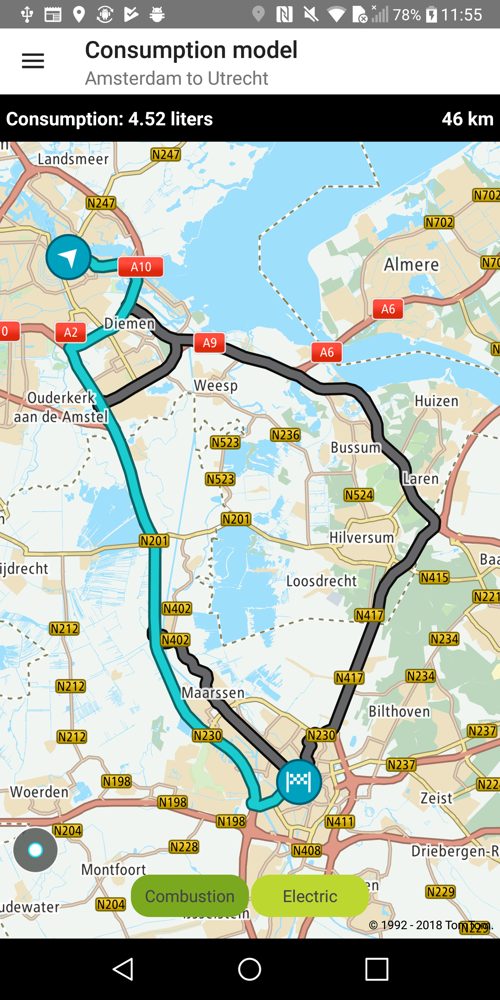
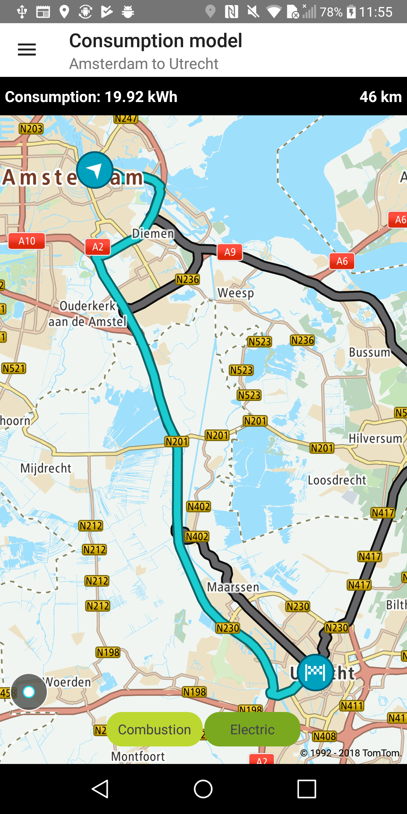

Allow your user to utilise the vehicle-specific consumption model when requesting a new route. The
consumption model can be calculated based on a number of Routing API parameters for two vehicle
types: combustion or electric, and the output will contain the additional field
fuelConsumptionInLiters or batteryConsumptionInkWh. For more details, please refer
to: [this documentation](https://developer.New.com/maps-sdk-web/functional-examples#consumption-models).

**Sample use case:** You are planning a journey and you want to select the most optimal route in
terms of fuel / energy consumption.

To request a route and calculate the consumption model for a combustion vehicle:

<Code>

```java
RouteDescriptor routeDescriptor = new RouteDescriptor.Builder()
        .considerTraffic(false)
        .build()

RouteCalculationDescriptor routeCalculationDescriptor = new RouteCalculationDescriptor.Builder()
        .routeDescription(routeDescriptor)
        .maxAlternatives(2)
        .build();

//vehicle specific consumption model <speed, consumption in liters>
Map<Double, Double> speedToConsumptionMap = new HashMap<>();
speedToConsumptionMap.put(10.0, 6.5);
speedToConsumptionMap.put(30.0, 7.0);
speedToConsumptionMap.put(50.0, 8.0);
speedToConsumptionMap.put(70.0, 8.4);
speedToConsumptionMap.put(90.0, 7.7);
speedToConsumptionMap.put(120.0, 7.5);
speedToConsumptionMap.put(150.0, 9.0);

CombustionVehicleConsumption combustionVehicleConsumption = new CombustionVehicleConsumption(
        CURRENT_FUEL_IN_LITERS,
        AUXILIARY_POWER_IN_LITERS_PER_HOUR,
        FUEL_ENERGY_DENSITY_IN_MJOULES_PER_LITER,
        speedToConsumptionMap
);

CombustionVehicleDescriptor combustionVehicleDescriptor = new CombustionVehicleDescriptor.Builder()
        .vehicleConsumption(combustionVehicleConsumption)
        .vehicleDimensions(new VehicleDimensions.Builder()
                .vehicleWeightInKg(1600)
                .build()
        )
        .vehicleEfficiency(new VehicleEfficiency.Builder()
                .accelerationEfficiency(0.33)
                .decelerationEfficiency(0.33)
                .downhillEfficiency(0.33)
                .uphillEfficiency(0.33)
                .build()
        )
        .build();

RouteSpecification routeSpecification = new RouteSpecification.Builder(routeConfig.getOrigin(), routeConfig.getDestination())
        .routeCalculationDescriptor(routeCalculationDescriptor)
        .combustionVehicleDescriptor(combustionVehicleDescriptor)
        .build();
```

```kotlin
val vehicleEfficiency = VehicleEfficiency.Builder()
    .accelerationEfficiency(EFFICIENCY) //e.g. KineticEnergyGained/ChemicalEnergyConsumed
    .decelerationEfficiency(EFFICIENCY) //e.g. ChemicalEnergySaved/KineticEnergyLost
    .downhillEfficiency(EFFICIENCY) //e.g. ChemicalEnergySaved/PotentialEnergyLost
    .uphillEfficiency(EFFICIENCY) //e.g. PotentialEnergyGained/ChemicalEnergyConsumed
    .build()

val vehicleDimensions = VehicleDimensions.Builder()
    .vehicleWeightInKg(VEHICLE_WEIGHT)
    .build()

//vehicle specific consumption model <speed, consumption in liters>
val combustionVehicleConsumption = CombustionVehicleConsumption(
    CURRENT_FUEL,
    AUXILIARY_POWER_COMBUSTION,
    FUEL_ENERGY_DENSITY,
    mapOf(
        Pair(10.0, 6.5),
        Pair(30.0, 7.0),
        Pair(50.0, 8.0),
        Pair(70.0, 8.4),
        Pair(90.0, 7.7),
        Pair(120.0, 7.5),
        Pair(150.0, 9.0)
    )
)

val combustionVehicleDescriptor = CombustionVehicleDescriptor.Builder()
    .vehicleConsumption(combustionVehicleConsumption)
    .vehicleEfficiency(vehicleEfficiency)
    .vehicleDimensions(vehicleDimensions)
    .build()

val routeDescriptor = RouteDescriptor.Builder()
    .considerTraffic(false)
    .build()

val routeCalculationDescriptor = RouteCalculationDescriptor.Builder()
    .routeDescription(routeDescriptor)
    .maxAlternatives(MAX_ALTERNATIVES)
    .build()

val routeSpecification = RouteSpecification.Builder(origin, destination)
    .combustionVehicleDescriptor(combustionVehicleDescriptor)
    .routeCalculationDescriptor(routeCalculationDescriptor)
    .build()
```

</Code>

To request a route and calculate the consumption model for an electric vehicle:

<Code>

```java
RouteDescriptor routeDescriptor = new RouteDescriptor.Builder()
        .considerTraffic(false)
        .build();

RouteCalculationDescriptor routeCalculationDescriptor = new RouteCalculationDescriptor.Builder()
        .routeDescription(routeDescriptor)
        .maxAlternatives(2)
        .build();

//vehicle specific consumption model <speed, consumption in kWh>
Map<Double, Double> speedToConsumptionMap = new HashMap<>();
speedToConsumptionMap.put(10.0, 5.0);
speedToConsumptionMap.put(30.0, 10.0);
speedToConsumptionMap.put(50.0, 15.0);
speedToConsumptionMap.put(70.0, 20.0);
speedToConsumptionMap.put(90.0, 25.0);
speedToConsumptionMap.put(120.0, 30.0);

ElectricVehicleConsumption electricVehicleConsumption = new ElectricVehicleConsumption(
        MAX_CHARGE_IN_KWH,
        CURRENT_CHARGE_IN_KWH,
        AUXILIARY_POWER_IN_KW,
        speedToConsumptionMap);

ElectricVehicleDescriptor electricVehicleDescriptor = new ElectricVehicleDescriptor.Builder(electricVehicleConsumption)
        .vehicleDimensions(new VehicleDimensions.Builder()
                .vehicleWeightInKg(1600)
                .build()
        )
        .vehicleEfficiency(new VehicleEfficiency.Builder()
                .accelerationEfficiency(0.33)
                .decelerationEfficiency(0.33)
                .downhillEfficiency(0.33)
                .uphillEfficiency(0.33)
                .build()
        )
        .build();

RouteSpecification routeSpecification = new RouteSpecification.Builder(routeConfig.getOrigin(), routeConfig.getDestination())
        .routeCalculationDescriptor(routeCalculationDescriptor)
        .electricVehicleDescriptor(electricVehicleDescriptor)
        .build();
```

```kotlin
val vehicleEfficiency = VehicleEfficiency.Builder()
    .accelerationEfficiency(EFFICIENCY) //e.g. KineticEnergyGained/ChemicalEnergyConsumed
    .decelerationEfficiency(EFFICIENCY) //e.g. ChemicalEnergySaved/KineticEnergyLost
    .downhillEfficiency(EFFICIENCY) //e.g. ChemicalEnergySaved/PotentialEnergyLost
    .uphillEfficiency(EFFICIENCY) //e.g. PotentialEnergyGained/ChemicalEnergyConsumed
    .build()

val vehicleDimensions = VehicleDimensions.Builder()
    .vehicleWeightInKg(VEHICLE_WEIGHT)
    .build()

//vehicle specific consumption model <speed, consumption in liters>
val electricVehicleConsumption = ElectricVehicleConsumption(
    MAX_ELECTRIC_CHARGE,
    CURRENT_ELECTRIC_CHARGE,
    AUXILIARY_POWER_ELECTRIC,
    mapOf(
        Pair(10.0, 5.0),
        Pair(30.0, 10.0),
        Pair(50.0, 15.0),
        Pair(70.0, 20.0),
        Pair(90.0, 25.0),
        Pair(120.0, 30.0)
    )
)

val electricVehicleDescriptor = ElectricVehicleDescriptor.Builder(electricVehicleConsumption)
    .vehicleEfficiency(vehicleEfficiency)
    .vehicleDimensions(vehicleDimensions)
    .build()

val routeDescriptor = RouteDescriptor.Builder()
    .considerTraffic(false)
    .build()

val routeCalculationDescriptor = RouteCalculationDescriptor.Builder()
    .routeDescription(routeDescriptor)
    .maxAlternatives(MAX_ALTERNATIVES)
    .build()

val routeSpecification = RouteSpecification.Builder(origin, destination)
    .electricVehicleDescriptor(electricVehicleDescriptor)
    .routeCalculationDescriptor(routeCalculationDescriptor)
    .build()
```

</Code>

<table>
  <tbody>
    <tr>
      <td>
        <ContentWrapper maxWidth="350px" objectFit="contain">
          <p>
            
          </p>
        </ContentWrapper>
        <p>Combustion</p>
      </td>
      <td>
        <ContentWrapper maxWidth="350px" objectFit="contain">
          <p>
            
          </p>
        </ContentWrapper>
        <p>Electric</p>
      </td>
    </tr>
  </tbody>
</table>