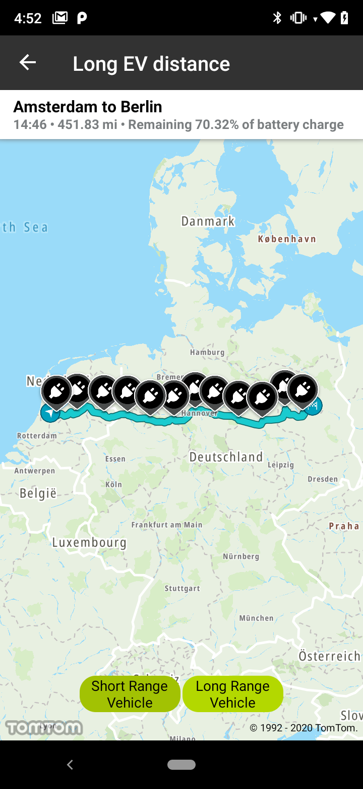
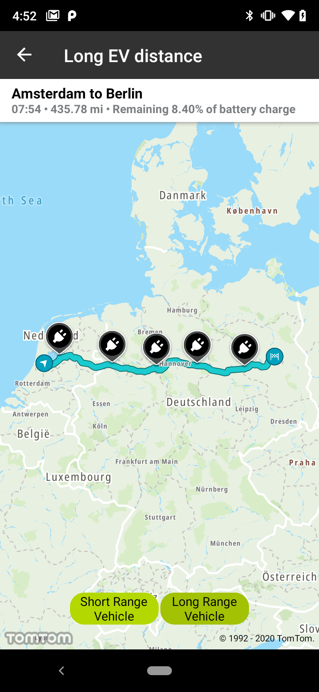

<a
  href="#"
  style={{ display: 'block', margin: '0', padding: '0' }}
  name="ev-routing"
></a>

Plan a route between a given origin and destination that automatically includes charging stops along
the way with the Long Distance EV Routing API available in the Maps SDK. Long Distance EV Routing
automatically adds charging stops to your route based on a number of parameters specific for your
electric car and driving behavior. Have a look at
the [Long Distance EV Routing](/routing-api/documentation/extended-routing/long-distance-ev-routing)
detailed documentation.

Long Distance EV Routing can be used in variety of use cases that will help users of your app to
plan routes for their electric cars to avoid car charging anxiety and enjoy peaceful driving. We
prepared a few examples of such use cases.

**Sample use case**: You would like to plan a long route for your electric car that will take into
consideration charging stops. Thanks to that, you will know in advance when you need to stop to
charge your car. Also, you will be able to estimate how much energy will be consumed during the
trip. Using New Long Distance EV Routing you will also be provided with an energy-efficient route
with accurate battery consumption calculations, that also considers the route profile and expected
traffic.

**Sample use case**: You would like to see how much battery you have left when arriving at a stop so
that you can find out what the options are if you need an alternative charger.

In order to plan an EV route, you need to set the vehicle parameters in your app such as vehicle
weight, vehicle length, vehicle height, and others. For your convenience we have created predefined
examples of vehicle objects representing a prototypical EV with different ranges defining how far
they will actually go on a single charge. This will help you to easily try out Long Distance EV
Routing functionality without specifying all the detailed parameters defining the particular vehicle
model.

Use the following code snippets to try this in your app:

Example showing a possible vehicle definition for a short range vehicle

<Code>

```java
ElectricVehicleDescriptor evDescriptor = new ElectricVehicleDescriptor.Builder(
        new ElectricVehicleConsumption(
                40.0,
                20.0,
                auxiliaryPowerInKw,
                speedConsumptionInKwhPer100Km
        )
).build()

ChargingDescriptor chargingDescriptor = new ChargingDescriptor(
        minChargeAtDestinationInKwh,
        minChargeAtChargingStopsInKwh,
        Collections.singletonList(
                new ChargingMode(
                        Collections.singletonList(
                                new ChargingConnection(
                                        FacilityType.CHARGE_380_TO_480V_3_PHASE_AT_32A,
                                        PlugType.IEC_62196_TYPE_2_OUTLET
                                )
                        ),
                        Arrays.asList(
                                new ChargingCurveSupportPoint(6.0, 360),
                                new ChargingCurveSupportPoint(40.0, 4680)
                        )
                )
        )
);
EvRouteSpecification evRouteSpecification = new EvRouteSpecification.Builder(
        Locations.AMSTERDAM_LOCATION,
        Locations.EINDHOVEN_LOCATION,
        evDescriptor,
        chargingDescriptor
).build();
```

```kotlin
// SPEED_CONSUMPTION_IN_KWH_PER_100_KM = mapOf(77.0 to 32.0, 18.01 to 10.87)
// AUXILIARY_POWER_IN_KW = 1.0
val evDescriptor = ElectricVehicleDescriptor.Builder(
    ElectricVehicleConsumption(
        50.0,
        20.0,
        AUXILIARY_POWER_IN_KW,
        SPEED_CONSUMPTION_IN_KWH_PER_100_KM
    )
).build()

val chargingDescriptor = ChargingDescriptor(
    minChargeAtDestinationInkWh = 2.0,
    minChargeAtChargingStopsInkWh = 4.0,
    chargingModes = listOf(
        ChargingMode(
            listOf(
                ChargingConnection(
                    FacilityType.CHARGE_200_TO_240V_1_PHASE_AT_16A,
                    PlugType.IEC_62196_TYPE_2_OUTLET
                ),
                ChargingConnection(
                    FacilityType.CHARGE_200_TO_240V_3_PHASE_AT_32A,
                    PlugType.IEC_62196_TYPE_2_OUTLET
                ),
                ChargingConnection(
                    FacilityType.CHARGE_380_TO_480V_3_PHASE_AT_32A,
                    PlugType.IEC_62196_TYPE_2_OUTLET
                )
            ),
            listOf(
                ChargingCurveSupportPoint(6.0, 360),
                ChargingCurveSupportPoint(50.0, 4680)
            )
        )
    )
)
val evRouteSpecification =
    EvRouteSpecification.Builder(Locations.AMSTERDAM, Locations.BERLIN, evDescriptor, chargingDescriptor)
        .routeDescriptor(
            RouteDescriptor.Builder()
                .routeType(RouteType.FASTEST)
                .travelMode(TravelMode.CAR)
                .build()
        )
        .build()
return routingApi.planRoute(evRouteSpecification, evRouteCallback)
```

</Code>

Example showing a possible vehicle definition for a long range vehicle

<Code>

```java
ElectricVehicleDescriptor evDescriptor = new ElectricVehicleDescriptor.Builder(
        new ElectricVehicleConsumption(
                80.0,
                40.0,
                auxiliaryPowerInKw,
                speedConsumptionInKwhPer100Km
        )
).build();

ChargingDescriptor chargingDescriptor = new ChargingDescriptor(
        minChargeAtDestinationInKwh,
        minChargeAtChargingStopsInKwh,
        Collections.singletonList(
                new ChargingMode(
                        Collections.singletonList(
                                new ChargingConnection(
                                        FacilityType.CHARGE_380_TO_480V_3_PHASE_AT_32A,
                                        PlugType.IEC_62196_TYPE_2_OUTLET
                                )
                        ),
                        Arrays.asList(
                                new ChargingCurveSupportPoint(6.0, 360),
                                new ChargingCurveSupportPoint(80.0, 6680)
                        )
                )
        )
);
EvRouteSpecification evRouteSpecification = new EvRouteSpecification.Builder(
        Locations.AMSTERDAM_LOCATION,
        Locations.EINDHOVEN_LOCATION,
        evDescriptor,
        chargingDescriptor
).build();
```

```kotlin
// SPEED_CONSUMPTION_IN_KWH_PER_100_KM = mapOf(77.0 to 32.0, 18.01 to 10.87)
// AUXILIARY_POWER_IN_KW = 1.0
val evDescriptor = ElectricVehicleDescriptor.Builder(
    ElectricVehicleConsumption(
        100.0,
        40.0,
        AUXILIARY_POWER_IN_KW,
        SPEED_CONSUMPTION_IN_KWH_PER_100_KM
    )
).build()

val chargingDescriptor = ChargingDescriptor(
    minChargeAtDestinationInkWh = 4.0,
    minChargeAtChargingStopsInkWh = 8.0,
    chargingModes = listOf(
        ChargingMode(
            listOf(
                ChargingConnection(
                    FacilityType.CHARGE_200_TO_240V_1_PHASE_AT_16A,
                    PlugType.IEC_62196_TYPE_2_OUTLET
                ),
                ChargingConnection(
                    FacilityType.CHARGE_200_TO_240V_3_PHASE_AT_32A,
                    PlugType.IEC_62196_TYPE_2_OUTLET
                ),
                ChargingConnection(
                    FacilityType.CHARGE_380_TO_480V_3_PHASE_AT_32A,
                    PlugType.IEC_62196_TYPE_2_OUTLET
                )
            ),
            listOf(
                ChargingCurveSupportPoint(6.0, 360),
                ChargingCurveSupportPoint(100.0, 6680)
            )
        )
    )
)
val evRouteSpecification =
    EvRouteSpecification.Builder(Locations.AMSTERDAM, Locations.BERLIN, evDescriptor, chargingDescriptor)
        .routeDescriptor(
            RouteDescriptor.Builder()
                .routeType(RouteType.FASTEST)
                .travelMode(TravelMode.CAR)
                .build()
        )
        .build()
return routingApi.planRoute(evRouteSpecification, evRouteCallback)
```

</Code>

<table>
  <tbody>
    <tr>
      <td>
        <ContentWrapper maxWidth="350px" objectFit="contain">
          <p>
            
          </p>
        </ContentWrapper>
        <p>EV route with short range vehicle</p>
      </td>
      <td>
        <ContentWrapper maxWidth="350px" objectFit="contain">
          <p>
            
          </p>
        </ContentWrapper>
        <p>EV route with long range vehicle</p>
      </td>
    </tr>
  </tbody>
</table>