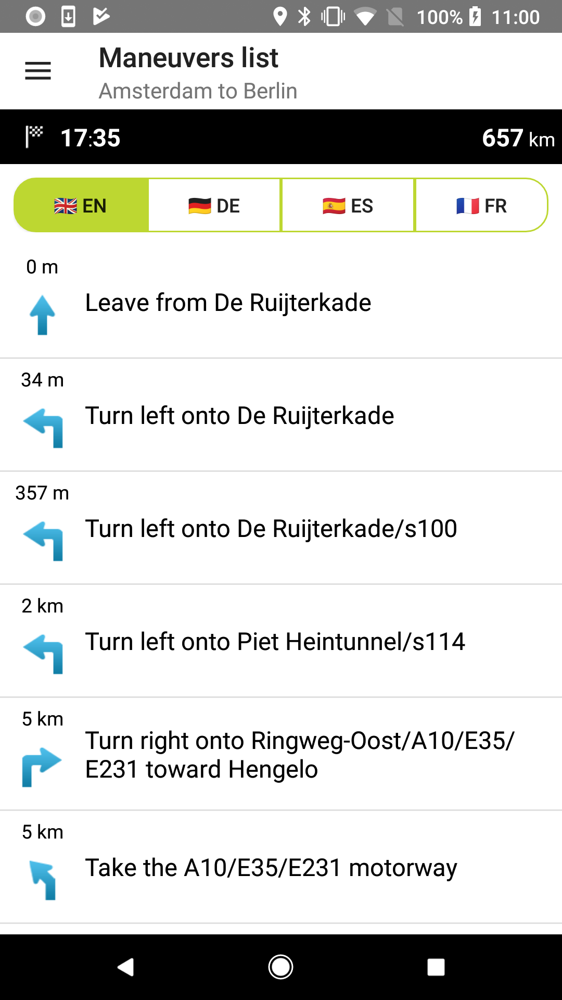
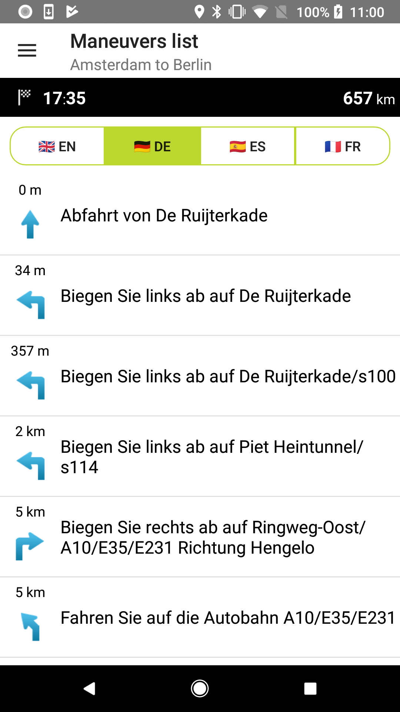
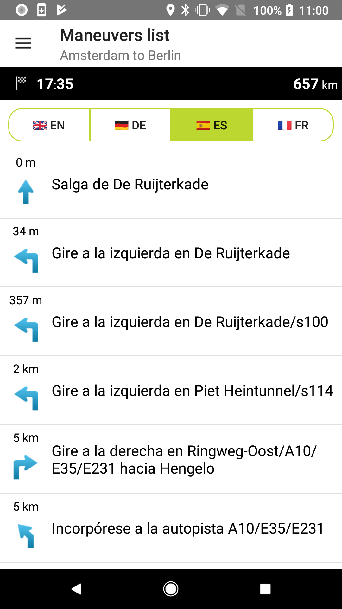

<a
  href="#"
  style={{ display: 'block', margin: '0', padding: '0' }}
  name="Route-Maneuver-List"
></a>

Serve your users with a list of maneuvers (driving instructions) with turn by turn information for
every maneuver. You can get the maneuvers in different languages to make your app international.

**Sample use case:** You are planning a journey and you want to have the list of maneuvers so you
can always look them up en route.

In the example below, you can see an implementation of a maneuver list that is available in English,
German, Spanish, and French. You can select the language while building the 'FullRoute' object.

```java
List<Instruction> instructions = routeResult.getGuidance().getInstructions()
```

<table>
  <tbody>
    <tr>
      <td>
        <ContentWrapper maxWidth="350px" objectFit="contain">
          <p>
            
          </p>
        </ContentWrapper>
        <p>English</p>
      </td>
      <td>
        <ContentWrapper maxWidth="350px" objectFit="contain">
          <p>
            
          </p>
        </ContentWrapper>
        <p>German</p>
      </td>
    </tr>
    <tr>
      <td>
        <ContentWrapper maxWidth="350px" objectFit="contain">
          <p>
            
          </p>
        </ContentWrapper>
        <p>Spanish</p>
      </td>
      <td></td>
    </tr>
  </tbody>
</table>