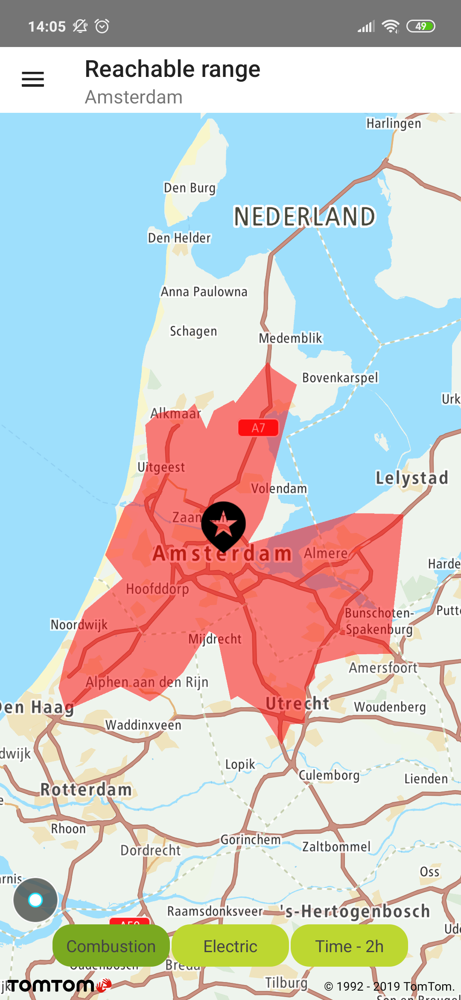
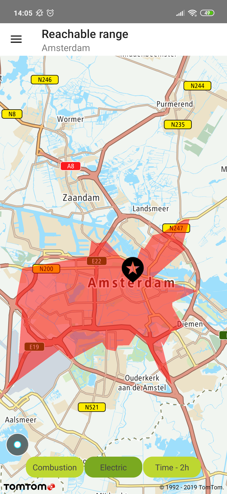
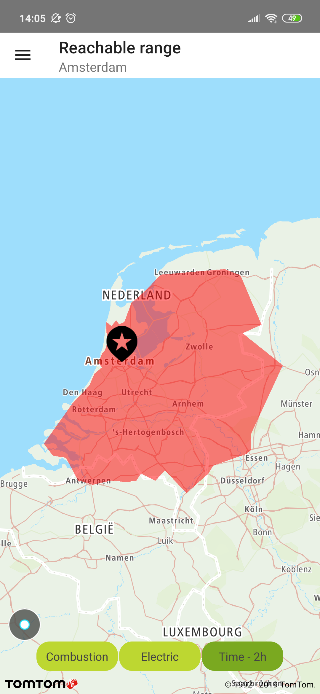

The Reachable Range component calculates a set of locations that can be reached from the origin
point. It optimizes routes with a given route-type (e.g., fastest, eco, etc.) but limits the range
for the given budget and consumption parameters. It uses
the [Calculate Reachable Range API](/routing-api/documentation/routing/calculate-reachable-range)
so you can find all details in the service documentation.

**Sample use case:** You are preparing for a trip and you would like to check how far you can drive
on your battery or tank, or within a specific time limit so you can plan your journey.

The following example shows a number of points that are reachable based on one of a specified model
for: \* Combustion engine \* Electric engine \* Time-2h limit on an electric car (time budget model
is available for both electric and combustion engines)

Use the following code sample to implement a similar use case.

To request a reachable range, create a `ReachableRangeSpecification`:

Creating `ReachableRangeSpecification` for a combustion vehicle can be done in the following manner:

<Code>

```java
return new ReachableRangeSpecification.Builder(Locations.AMSTERDAM_CENTER_LOCATION)
        .reachableRangeBudgetDescriptor(reachableRangeBudgetDescriptor)
        .combustionVehicleDescriptor(combustionVehicleDescriptor)
        .build()
```

```kotlin
return ReachableRangeSpecification.Builder(Locations.AMSTERDAM_CENTER)
    .reachableRangeBudgetDescriptor(reachableRangeBudgetDescriptor)
    .combustionVehicleDescriptor(createCombustionVehicleDescriptor())
    .build()
```

</Code>

Creating `ReachableRangeSpecification` for the electric vehicle can be done in the following manner:

<Code>

```java
return new ReachableRangeSpecification.Builder(Locations.AMSTERDAM_CENTER_LOCATION)
        .reachableRangeBudgetDescriptor(reachableRangeBudgetDescriptor)
        .electricVehicleDescriptor(electricVehicleDescriptor)
        .build();
```

```kotlin
return ReachableRangeSpecification.Builder(Locations.AMSTERDAM_CENTER)
    .reachableRangeBudgetDescriptor(reachableRangeBudgetDescriptor)
    .electricVehicleDescriptor(createElectricVehicleDescriptor())
    .build()
```

</Code>

and pass it to the Routing API:

<Code>

```java
routingApi.planReachableRange(
        reachableRangeSpecificationFactory.createReachableRangeSpecificationForCombustion(),
        reachableAreaCallback);
```

```kotlin
routingApi.planReachableRange(reachableRangeSpecification, reachableAreaCallback)
```

</Code>

Setup of the common parameters of the `ReachableRangeSpecification` for a combustion engine:

<Code>

```java
ReachableRangeBudgetDescriptor reachableRangeBudgetDescriptor =
        new ReachableRangeBudgetDescriptor.Builder()
                .fuelBudgetInLiters(5.0)
                .build();

Map<Double, Double> consumptionMap = new HashMap<>();
consumptionMap.put(50.0, 6.3);

CombustionVehicleConsumption combustionVehicleConsumption = new CombustionVehicleConsumption(
        43.0, 1.7, 34.2, consumptionMap
);

CombustionVehicleDescriptor combustionVehicleDescriptor = new CombustionVehicleDescriptor.Builder()
        .vehicleConsumption(combustionVehicleConsumption)
        .vehicleDimensions(new VehicleDimensions.Builder()
                .vehicleWeightInKg(1600)
                .build())
        .vehicleEfficiency(new VehicleEfficiency.Builder()
                .uphillEfficiency(0.33)
                .downhillEfficiency(0.33)
                .decelerationEfficiency(0.33)
                .accelerationEfficiency(0.33)
                .build())
        .build();
```

```kotlin
val consumption = mapOf(Pair(SPEED, CONSUMPTION_AT_SPEED))
val combustionVehicleConsumption = CombustionVehicleConsumption(
    VEHICLE_CURRENT_FUEL, VEHICLE_AUXILIARY_POWER, FUEL_ENERGY_DENSITY, consumption
)

return CombustionVehicleDescriptor.Builder()
    .vehicleConsumption(combustionVehicleConsumption)
    .vehicleEfficiency(createVehicleEfficiency())
    .vehicleDimensions(createVehicleDimensions())
    .build()
```

</Code>

Setup of the common parameters of the `ReachableRangeSpecification` for an electric vehicle:

<Code>

```java
ReachableRangeBudgetDescriptor reachableRangeBudgetDescriptor =
        new ReachableRangeBudgetDescriptor.Builder()
                .energyBudgetInKWh(5.0)
                .build();
Map<Double, Double> consumptionMap = new HashMap<>();
consumptionMap.put(50.0, 6.3);

ElectricVehicleConsumption electricVehicleConsumption =
        new ElectricVehicleConsumption(85.0, 43.0, 1.7, consumptionMap);

ElectricVehicleDescriptor electricVehicleDescriptor = new ElectricVehicleDescriptor.Builder(electricVehicleConsumption)
        .vehicleDimensions(new VehicleDimensions.Builder()
                .vehicleWeightInKg(1600)
                .build())
        .vehicleEfficiency(new VehicleEfficiency.Builder()
                .uphillEfficiency(0.33)
                .downhillEfficiency(0.33)
                .decelerationEfficiency(0.33)
                .accelerationEfficiency(0.33)
                .build())
        .build();
```

```kotlin
val consumption = mapOf(Pair(SPEED, CONSUMPTION_AT_SPEED))
val electricVehicleConsumption = ElectricVehicleConsumption(
    VEHICLE_MAX_CHARGE, VEHICLE_CURRENT_CHARGE, VEHICLE_AUXILIARY_POWER, consumption
)

return ElectricVehicleDescriptor.Builder(electricVehicleConsumption)
    .vehicleEfficiency(createVehicleEfficiency())
    .vehicleDimensions(createVehicleDimensions())
    .build()
```

</Code>

The result can be observed with ReachableAreaCallback:

<Code>

```java
protected ReachableAreaCallback reachableAreaCallback = new ReachableAreaCallback() {
    @Override
    public void onSuccess(@NonNull ReachableRangeArea reachableArea) {
        doActionOnReachableRangeResponse(reachableArea);
    }

    @Override
    public void onError(@NonNull RoutingException error) {
        doActionOnReachableRangeError();
    }
};
```

```kotlin
private val reachableAreaCallback = object : ReachableAreaCallback {
    override fun onSuccess(reachableArea: ReachableRangeArea) {
        reachableRangeArea.value = Resource.success(reachableArea)
    }

    override fun onError(error: RoutingException) {
        reachableRangeArea.value = Resource.error(null, Error(error.message))
    }
}
```

</Code>

<table>
  <tbody>
    <tr>
      <td>
        <ContentWrapper maxWidth="350px" objectFit="contain">
          <p>
            
          </p>
        </ContentWrapper>
        <p>Fuel budget: 5 liters</p>
      </td>
      <td>
        <ContentWrapper maxWidth="350px" objectFit="contain">
          <p>
            
          </p>
        </ContentWrapper>
        <p>Energy budget: 5 kWh</p>
      </td>
    </tr>
    <tr>
      <td>
        <ContentWrapper maxWidth="350px" objectFit="contain">
          <p>
            
          </p>
        </ContentWrapper>
        <p>Time budget: 2h</p>
      </td>
      <td></td>
    </tr>
  </tbody>
</table>

You can use the output of the returned set of locations for other interacting use cases e.g.,
searching for places on the route to one (many) reachable point(s) with Search along the route or
within the polygon boundaries with the Geometry search features of the Maps SDK.