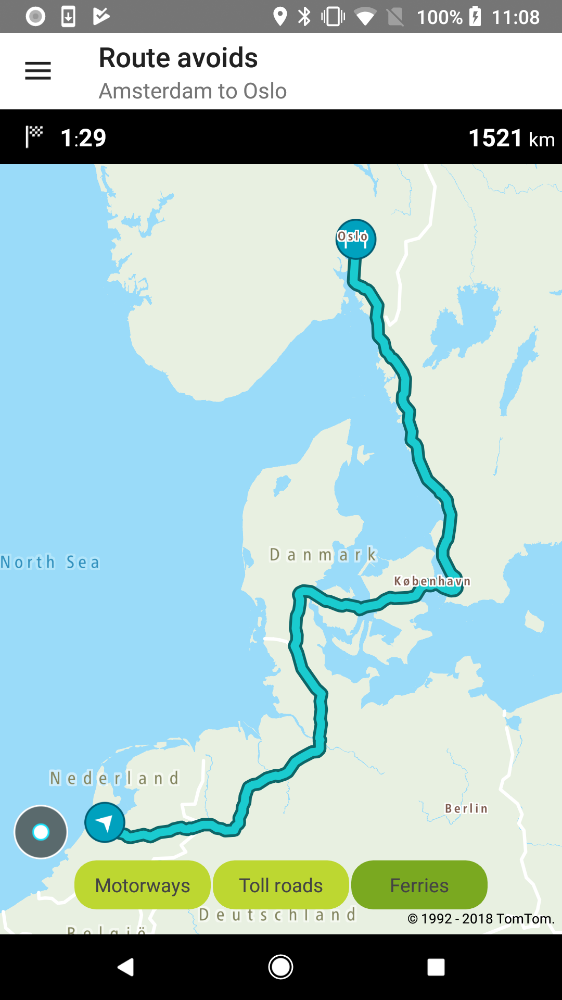
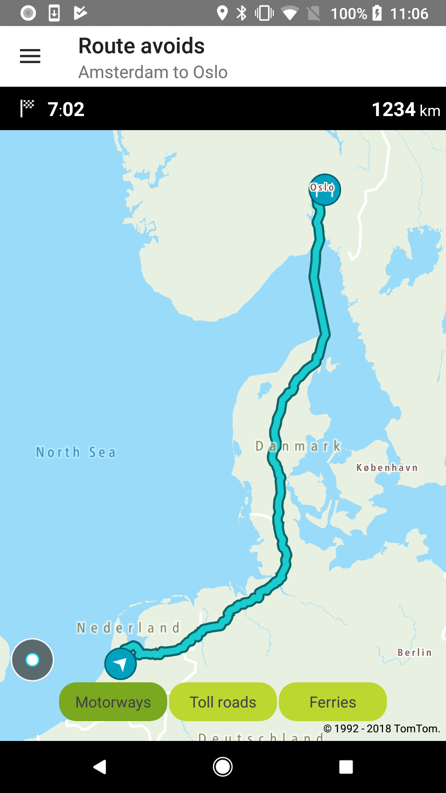
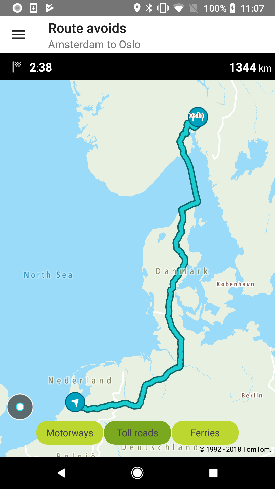
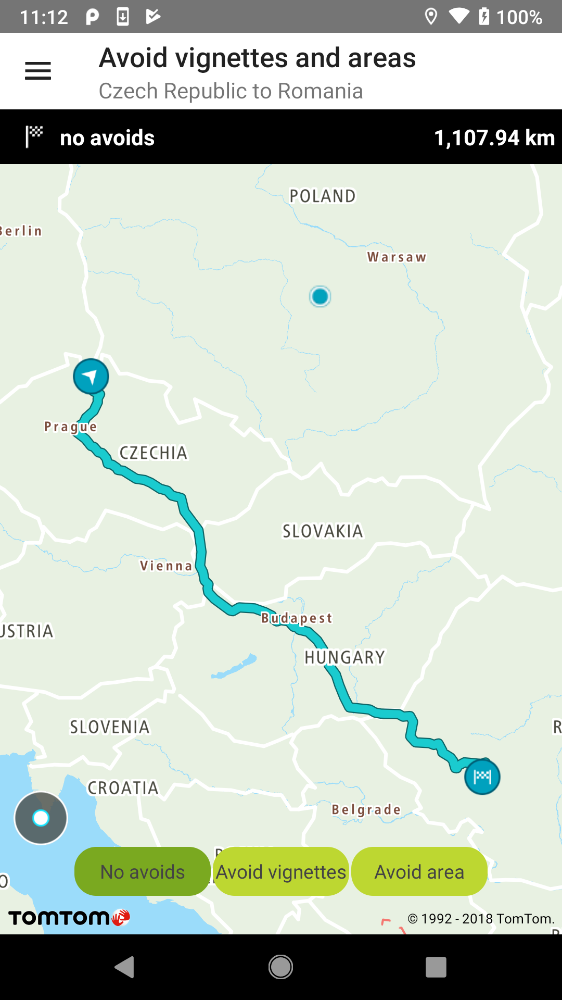
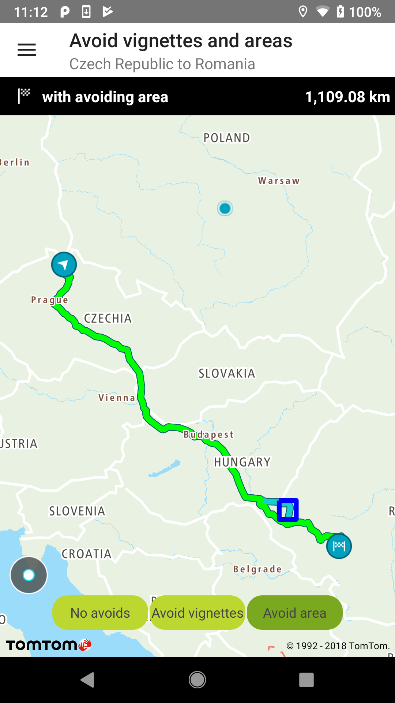
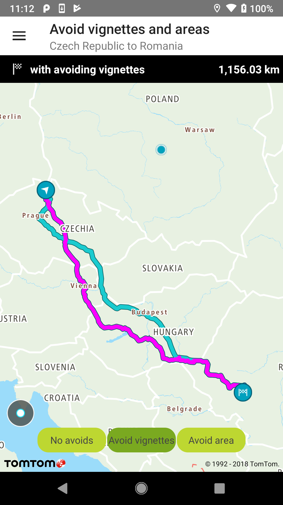

<a
  href="#"
  style={{ display: 'block', margin: '0', padding: '0' }}
  name="Route-avoids"
></a>

Allow your users to plan a route that avoids toll roads, motorways, ferries, unpaved roads, carpool
lanes, roads that they have already taken, vignettes, or even whole areas.

**Sample use case:** You plan a trip between the New offices in Amsterdam and Oslo. You would
like to check how much time you gain by taking a ferry and how much more time it will take to drive
if you don’t use motorways so you can choose the best route.

Available routes to avoid:

```java
routeAvoid = Avoid.TOLL_ROADS
routeAvoid = Avoid.MOTORWAYS
routeAvoid = Avoid.FERRIES
routeAvoid = Avoid.UNPAVED_ROADS
routeAvoid = Avoid.CAR_POOLS
routeAvoid = Avoid.ALREADY_USED_ROADS
```

To request a route for a specified route avoid:

<Code>

```java
RouteDescriptor routeDescriptor = new RouteDescriptor.Builder()
        .avoidType(avoidTypes)
        .considerTraffic(false)
        .build()

RouteCalculationDescriptor routeCalculationDescriptor = new RouteCalculationDescriptor.Builder()
        .routeDescription(routeDescriptor)
        .maxAlternatives(0)
        .reportType(ReportType.NONE)
        .instructionType(InstructionsType.NONE)
        .build();

RouteSpecification routeSpecification = new RouteSpecification.Builder(
        routeConfig.getOrigin(),
        routeConfig.getDestination()
)
        .routeCalculationDescriptor(routeCalculationDescriptor)
        .build();
```

```kotlin
val routeDescriptor = RouteDescriptor.Builder()
    .avoidType(listOf(avoidType))
    .considerTraffic(false)
    .build()

val routeCalculationDescriptor = RouteCalculationDescriptor.Builder()
    .routeDescription(routeDescriptor)
    .maxAlternatives(MAX_ALTERNATIVES)
    .reportType(ReportType.NONE)
    .instructionType(InstructionsType.NONE)
    .build()

val routeSpecification = RouteSpecification.Builder(origin, destination)
    .routeCalculationDescriptor(routeCalculationDescriptor)
    .build()
```

</Code>

<table>
  <tbody>
    <tr>
      <td>
        <ContentWrapper maxWidth="350px" objectFit="contain">
          <p>
            
          </p>
        </ContentWrapper>
        <p>Route avoid ferries</p>
      </td>
      <td>
        <ContentWrapper maxWidth="350px" objectFit="contain">
          <p>
            
          </p>
        </ContentWrapper>
        <p>Route avoid motorways</p>
      </td>
    </tr>
    <tr>
      <td>
        <ContentWrapper maxWidth="350px" objectFit="contain">
          <p>
            
          </p>
        </ContentWrapper>
        <p>Route avoid toll roads</p>
      </td>
      <td></td>
    </tr>
  </tbody>
</table>

**Sample use case:** You plan a trip from A to B and you know that on your way there are vignettes.
Additionally, there is an area which has very high traffic. You want to avoid both vignettes and the
specified area.

To avoid vignettes:

<Code>

```java
List<String> avoidVignettesList = new ArrayList<>();
avoidVignettesList.add("HUN");
avoidVignettesList.add("CZE");
avoidVignettesList.add("SVK");

RouteSpecification routeSpecification = RouteSpecificationFactory.createRouteForAvoidsVignettesAndAreas(avoidVignettesList, routeConfig);
```

```kotlin
    val listOfVignettes = listOf("HUN", "CZE", "SVK")
val routeCalculationDescriptor = RouteCalculationDescriptor.Builder()
    .routeDescription(createRouteDescriptor())
    .maxAlternatives(MAX_ALTERNATIVES)
    .reportType(ReportType.NONE)
    .instructionType(InstructionsType.NONE)
    .avoidVignettes(avoidVignettesList)
    .build()

val routeSpecification = RouteSpecification.Builder(routeConfig.origin, routeConfig.destination)
    .routeCalculationDescriptor(routeCalculationDescriptor)
    .build()
```

</Code>

To avoid an area:

<Code>

```java
BoundingBox boundingBox = new BoundingBox(ARAD_TOP_LEFT_NEIGHBORHOOD, ARAD_BOTTOM_RIGHT_NEIGHBORHOOD);

List<BoundingBox> avoidAreas = new ArrayList<>();
avoidAreas.add(boundingBox);

RouteSpecification routeSpecification = RouteSpecificationFactory.createRouteForAvoidsArea(avoidAreas, routeConfig);
```

```kotlin
    val boundingBox = BoundingBox(Locations.ARAD_TOP_LEFT_NEIGHBORHOOD, Locations.ARAD_BOTTOM_RIGHT_NEIGHBORHOOD)
val routeCalculationDescriptor = RouteCalculationDescriptor.Builder()
    .routeDescription(createRouteDescriptor())
    .maxAlternatives(MAX_ALTERNATIVES)
    .reportType(ReportType.NONE)
    .instructionType(InstructionsType.NONE)
    .avoidAreas(listOf(avoidArea))
    .build()

val routeSpecification = RouteSpecification.Builder(routeConfig.origin, routeConfig.destination)
    .routeCalculationDescriptor(routeCalculationDescriptor)
    .build()
```

</Code>

<table>
  <tbody>
    <tr>
      <td>
        <ContentWrapper maxWidth="350px" objectFit="contain">
          <p>
            
          </p>
        </ContentWrapper>
        <p>Route without avoiding anything</p>
      </td>
      <td>
        <ContentWrapper maxWidth="350px" objectFit="contain">
          <p>
            
          </p>
        </ContentWrapper>
        <p>Route avoiding a specified area</p>
      </td>
    </tr>
    <tr>
      <td>
        <ContentWrapper maxWidth="350px" objectFit="contain">
          <p>
            
          </p>
        </ContentWrapper>
        <p>Route avoiding vignettes</p>
      </td>
      <td></td>
    </tr>
  </tbody>
</table>