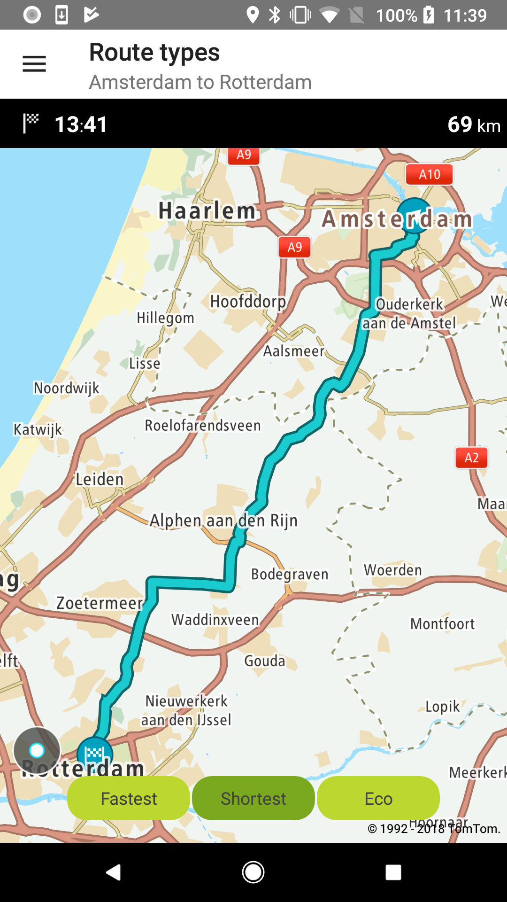

<a
  href="#"
  style={{ display: 'block', margin: '0', padding: '0' }}
  name="Route-types"
></a>

Allow your users to plan a route that will be the fastest, shortest, most thrilling, or environment
friendly.

**Sample use case:** You plan a trip from Amsterdam to Rotterdam and want to compare ETAs for
different types of routes to choose the best fit your preferences.

Available route types:

```java
routeType = RouteType.FASTEST
routeType = RouteType.SHORTEST
routeType = RouteType.ECO
routeType = RouteType.THRILLING
```

To request a route for a specified travel type:

<Code>

```java
RouteDescriptor routeDescriptor = new RouteDescriptor.Builder()
        .routeType(routeType)
        .considerTraffic(false)
        .build()

RouteCalculationDescriptor routeCalculationDescriptor = new RouteCalculationDescriptor.Builder()
        .routeDescription(routeDescriptor)
        .maxAlternatives(0)
        .reportType(ReportType.EFFECTIVE_SETTINGS)
        .instructionType(InstructionsType.TEXT)
        .build();

RouteSpecification routeSpecification = new RouteSpecification.Builder(
        routeConfig.getOrigin(),
        routeConfig.getDestination()
)
        .routeCalculationDescriptor(routeCalculationDescriptor)
        .build();
```

```kotlin
val routeDescriptor = RouteDescriptor.Builder()
    .routeType(routeType)
    .considerTraffic(false)
    .build()

val routeCalculationDescriptor = RouteCalculationDescriptor.Builder()
    .routeDescription(routeDescriptor)
    .reportType(ReportType.EFFECTIVE_SETTINGS)
    .instructionType(InstructionsType.TEXT)
    .build()

val routeSpecification = RouteSpecification.Builder(origin, destination)
    .routeCalculationDescriptor(routeCalculationDescriptor)
    .build()
```

</Code>

<table>
  <tbody>
    <tr>
      <td>
        <ContentWrapper maxWidth="350px" objectFit="contain">
          <p>
            
          </p>
        </ContentWrapper>
        <p>Route type eco</p>
      </td>
      <td>
        <ContentWrapper maxWidth="350px" objectFit="contain">
          <p>
            
          </p>
        </ContentWrapper>
        <p>Route type fastest</p>
      </td>
    </tr>
    <tr>
      <td>
        <ContentWrapper maxWidth="350px" objectFit="contain">
          <p>
            
          </p>
        </ContentWrapper>
        <p>Route type shortest</p>
      </td>
      <td></td>
    </tr>
  </tbody>
</table>