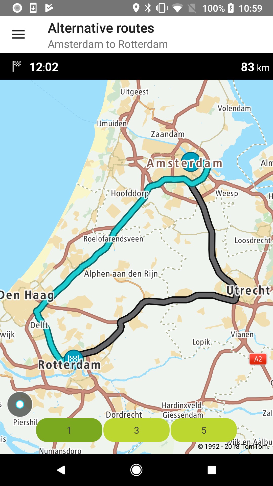
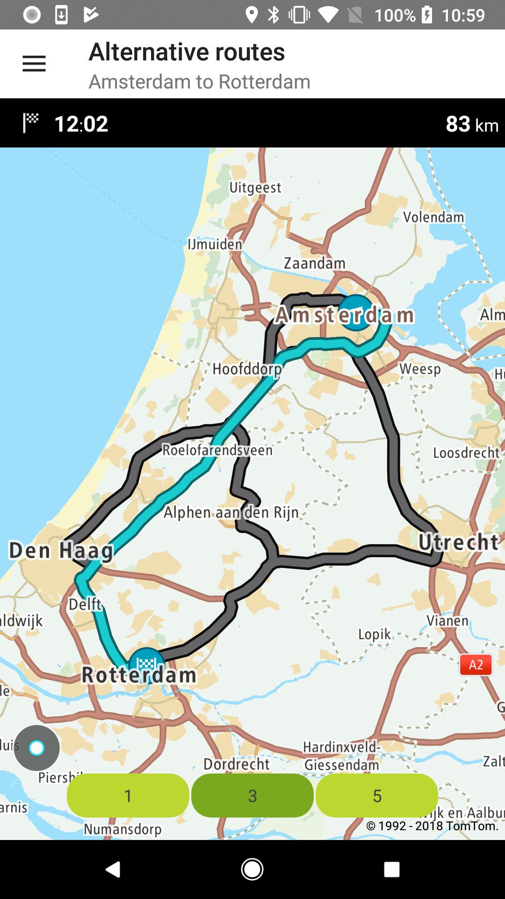
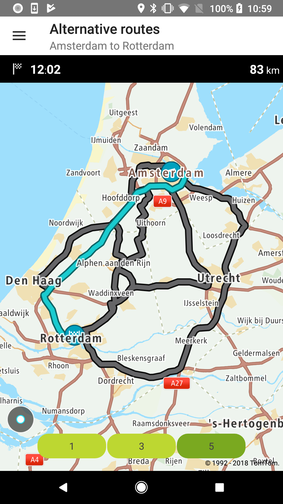

<a
  href="#"
  style={{ display: 'block', margin: '0', padding: '0' }}
  name="Route-Alternatives"
></a>

Allow your users to check different routing alternatives so they can choose the one they prefer.

**Sample use case:** You are preparing a road trip and you would like to see different route options
so you can choose one that is both optimal for your trip and suits your road trip preferences.

In the following example you can see an implementation of alternative routes using a clickable route
object. Click on the route to get its ETA and the distance between its origin and destination.

To request a route with alternatives:

<Code>

```java
RouteDescriptor routeDescriptor = new RouteDescriptor.Builder()
        .considerTraffic(false)
        .build()

RouteCalculationDescriptor routeCalculationDescriptor = new RouteCalculationDescriptor.Builder()
        .routeDescription(routeDescriptor)
        .maxAlternatives(maxAlternatives)
        .reportType(ReportType.EFFECTIVE_SETTINGS)
        .instructionType(InstructionsType.TEXT)
        .build();

RouteSpecification routeSpecification = new RouteSpecification.Builder(
        routeConfig.getOrigin(),
        routeConfig.getDestination()
)
        .routeCalculationDescriptor(routeCalculationDescriptor)
        .build();
```

```kotlin
val routeDescriptor = RouteDescriptor.Builder()
    .considerTraffic(false)
    .build()

val routeCalculationDescriptor = RouteCalculationDescriptor.Builder()
    .routeDescription(routeDescriptor)
    .maxAlternatives(maxAlternatives)
    .build()

val routeSpecification = RouteSpecification.Builder(origin, destination)
    .routeCalculationDescriptor(routeCalculationDescriptor)
    .build()
```

</Code>

<table>
  <tbody>
    <tr>
      <td>
        <ContentWrapper maxWidth="350px" objectFit="contain">
          <p>
            
          </p>
        </ContentWrapper>
        <p>One alternative route</p>
      </td>
      <td>
        <ContentWrapper maxWidth="350px" objectFit="contain">
          <p>
            
          </p>
        </ContentWrapper>
        <p>Three alternative routes</p>
      </td>
    </tr>
    <tr>
      <td>
        <ContentWrapper maxWidth="350px" objectFit="contain">
          <p>
            
          </p>
        </ContentWrapper>
        <p>Five alternative routes</p>
      </td>
      <td></td>
    </tr>
  </tbody>
</table>