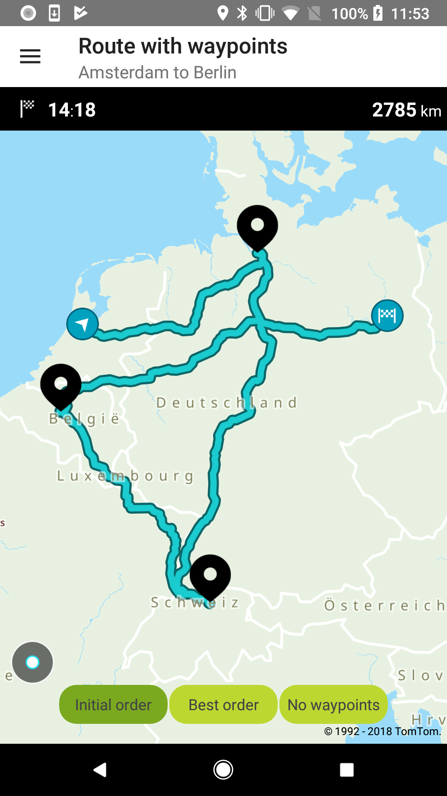
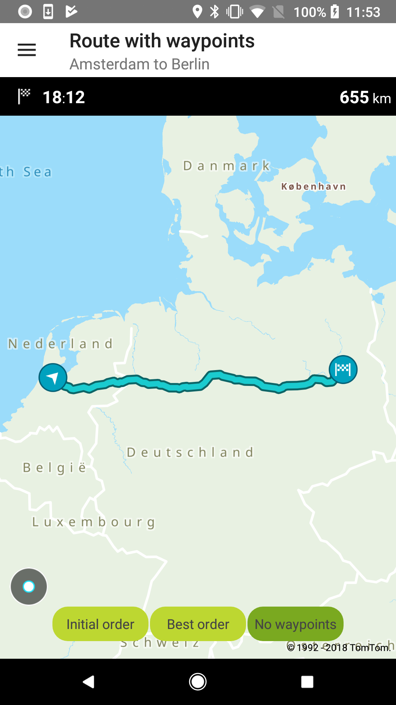

<a
  href="#"
  style={{ display: 'block', margin: '0', padding: '0' }}
  name="Route-With-Waypoints"
></a>

Allow your users to plan a route with up to 50 waypoints.

**Sample use case:** You plan a trip from the New office in Amsterdam to their office in Berlin.
There are a few places that you would like to visit during the drive. You would like to use your app
to plan your route so it includes the places you would like to visit on the way, and check the total
distance and ETA as well as see the entire route on the map.

To request a route with waypoints:

<Code>

```java
RouteDescriptor routeDescriptor = new RouteDescriptor.Builder()
        .considerTraffic(false)
        .build()

RouteCalculationDescriptor routeCalculationDescriptor = new RouteCalculationDescriptor.Builder()
        .routeDescription(routeDescriptor)
        .waypoints(wayPoints)
        .build();

RouteSpecification routeSpecification = new RouteSpecification.Builder(routeConfig.getOrigin(), routeConfig.getDestination())
        .routeCalculationDescriptor(routeCalculationDescriptor)
        .build();
```

```kotlin
waypoints = listOf(WAYPOINT_HAMBURG, WAYPOINT_ZURICH, WAYPOINT_BRUSSELS)
val routeDescriptor = RouteDescriptor.Builder()
    .considerTraffic(false)
    .build()

val routeCalculationDescriptor = RouteCalculationDescriptor.Builder()
    .routeDescription(routeDescriptor)
    .waypoints(waypoints)
    .build()

val routeSpecification = RouteSpecification.Builder(origin, destination)
    .routeCalculationDescriptor(routeCalculationDescriptor)
    .build()
```

</Code>

<table>
  <tbody>
    <tr>
      <td>
        <ContentWrapper maxWidth="350px" objectFit="contain">
          <p>
            
          </p>
        </ContentWrapper>
        <p>Initial_order</p>
      </td>
      <td>
        <ContentWrapper maxWidth="350px" objectFit="contain">
          <p>
            
          </p>
        </ContentWrapper>
        <p>No waypoints</p>
      </td>
    </tr>
  </tbody>
</table>