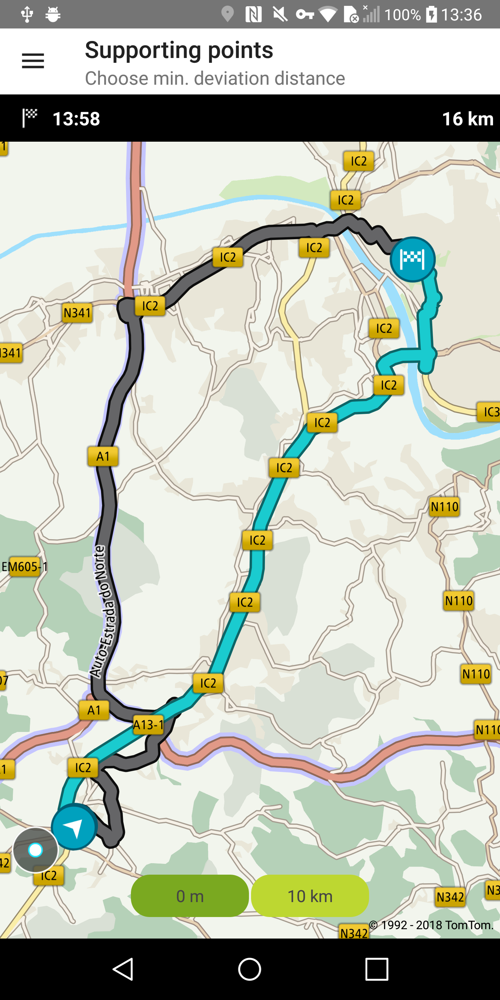
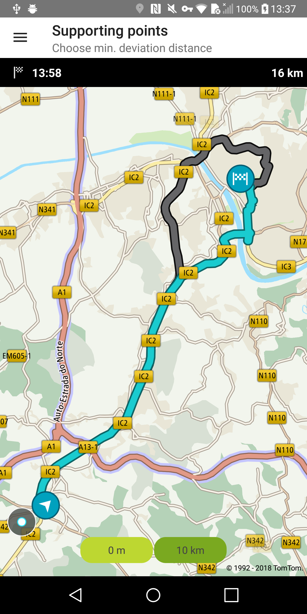

Allow your user to reconstruct his/her route using supporting points. Supporting points can be
combined with minDeviationDistance or minDeviationTime constraints. When these constraints are used,
the alternative routes will follow the reference route from the origin point for the given time or
distance. In other words, alternative routes just diverge from the reference route after the given
constraints. When using supporting points, intermediate locations (waypoints) are not supported.

**Sample use case:** You have route coordinates saved on your device. You want to reconstruct the
route based on the coordinates (supporting points) and calculate zero or more alternative routes to
this reference route.

To request a route with supporting points support:

<Code>

```java
RouteDescriptor routeDescriptor = new RouteDescriptor.Builder()
        .considerTraffic(false)
        .build()

RouteCalculationDescriptor routeCalculationDescriptor = new RouteCalculationDescriptor.Builder()
        .routeDescription(routeDescriptor)
        .maxAlternatives(1)
        .minDeviationTime(0)
        .supportingPoints(SUPPORTING_POINTS)
        .minDeviationDistance(minDeviationDistance)
        .build();

RouteSpecification routeSpecification = new RouteSpecification.Builder(EXAMPLE_ORIGIN, EXAMPLE_DESTINATION)
        .routeCalculationDescriptor(routeCalculationDescriptor)
        .build();
```

```kotlin
val routeDescriptor = RouteDescriptor.Builder()
    .considerTraffic(false)
    .build()

val routeCalculationDescriptor = RouteCalculationDescriptor.Builder()
    .routeDescription(routeDescriptor)
    .maxAlternatives(MAX_ALTERNATIVES)
    .minDeviationTime(MIN_DEVIATION_TIME)
    .supportingPoints(SUPPORTING_POINTS)
    .minDeviationDistance(minDeviationDistance)
    .build()

val routeSpecification = RouteSpecification.Builder(origin, destination)
    .routeCalculationDescriptor(routeCalculationDescriptor)
    .build()
```

</Code>

<table>
  <tbody>
    <tr>
      <td>
        <ContentWrapper maxWidth="350px" objectFit="contain">
          <p>
            
          </p>
        </ContentWrapper>
        <p>Min. deviation distance: 0 m</p>
      </td>
      <td>
        <ContentWrapper maxWidth="350px" objectFit="contain">
          <p>
            
          </p>
        </ContentWrapper>
        <p>Min. deviation distance: 10 km</p>
      </td>
    </tr>
  </tbody>
</table>