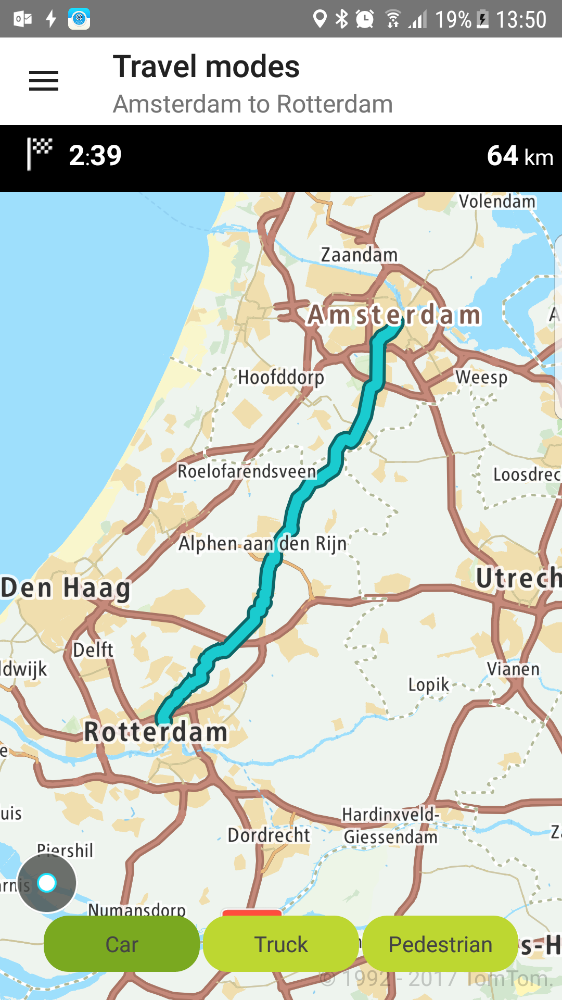
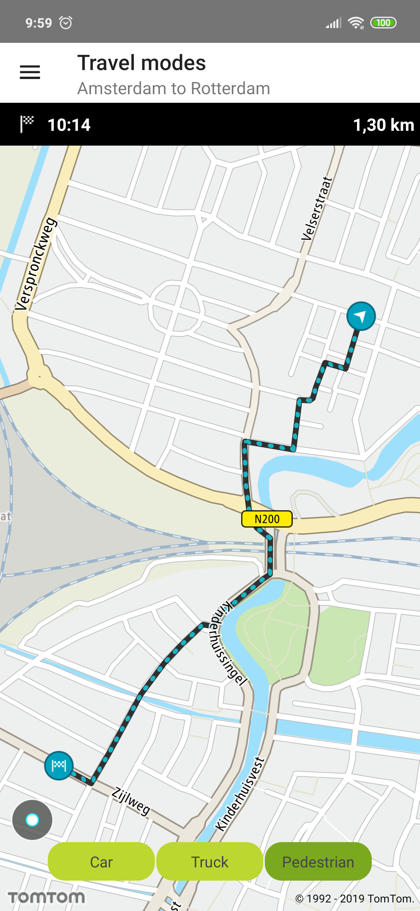
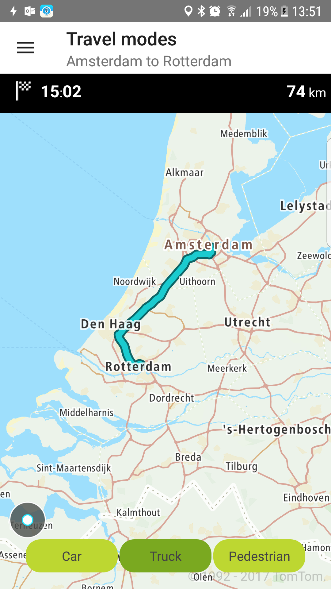

<a
  href="#"
  style={{ display: 'block', margin: '0', padding: '0' }}
  name="simple-route-planner-travel-modes"
></a>

Allow your users to plan a route for different travel modes.

**Sample use case:** You want to check what travel mode (car or truck) gives you the best ETA for a
trip from Amsterdam to Rotterdam.

Available travel modes:

```java
travelMode = TravelMode.CAR
travelMode = TravelMode.TRUCK
travelMode = TravelMode.TAXI
travelMode = TravelMode.BUS
travelMode = TravelMode.VAN
travelMode = TravelMode.MOTORCYCLE
travelMode = TravelMode.BICYCLE
travelMode = TravelMode.PEDESTRIAN
travelMode = TravelMode.OTHER
```

To request a specified travel mode:

<Code>

```java
RouteDescriptor routeDescriptor = new RouteDescriptor.Builder()
        .travelMode(travelMode)
        .considerTraffic(false)
        .build()

RouteCalculationDescriptor routeCalculationDescriptor = new RouteCalculationDescriptor.Builder()
        .routeDescription(routeDescriptor)
        .maxAlternatives(0)
        .reportType(ReportType.NONE)
        .instructionType(InstructionsType.NONE)
        .build();

RouteSpecification routeSpecification = new RouteSpecification.Builder(
        routeConfig.getOrigin(),
        routeConfig.getDestination()
)
        .routeCalculationDescriptor(routeCalculationDescriptor)
        .build();
```

```kotlin
val routeDescriptor = RouteDescriptor.Builder()
    .travelMode(travelMode)
    .considerTraffic(false)
    .build()

val routeCalculationDescriptor = RouteCalculationDescriptor.Builder()
    .routeDescription(routeDescriptor)
    .build()

return RouteSpecification.Builder(origin, destination)
    .routeCalculationDescriptor(routeCalculationDescriptor)
    .build()
```

</Code>

<table>
  <tbody>
    <tr>
      <td>
        <ContentWrapper maxWidth="350px" objectFit="contain">
          <p>
            
          </p>
        </ContentWrapper>
        <p>Travel mode car</p>
      </td>
      <td>
        <ContentWrapper maxWidth="350px" objectFit="contain">
          <p>
            
          </p>
        </ContentWrapper>
        <p>Travel mode pedestrian</p>
      </td>
    </tr>
    <tr>
      <td>
        <ContentWrapper maxWidth="350px" objectFit="contain">
          <p>
            
          </p>
        </ContentWrapper>
        <p>Travel mode truck</p>
      </td>
      <td></td>
    </tr>
  </tbody>
</table>