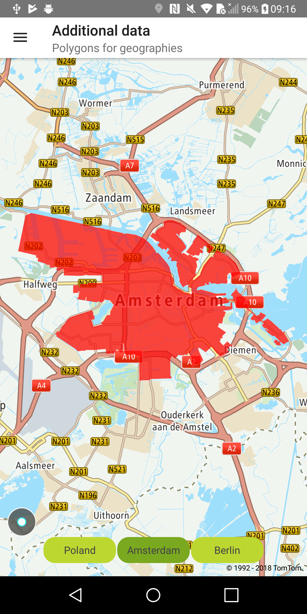
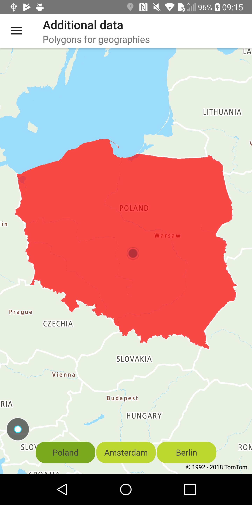

Allow your users to request extra data like polygons representing administrative borders, for a set
of entities previously retrieved from an Search API. For more information, refer to
the [Additional Data service](/search-api/documentation/additional-data-service/additional-data)
documentation.

**Sample use case:** You want to apply colors to geographic-boundary areas such as countries,
cities, or districts.

Use the following code to try this in your app:

<Code>

```java
FuzzySearchQuery fuzzySearchQuery = FuzzySearchQueryBuilder.create(term).build()

searchRequester.performAdpSearch(fuzzySearchQuery, responseConsumer);
```

```kotlin
val searchQuery = FuzzySearchQueryBuilder.create(term).build()
val requester = AdpSearchRequester(getApplication(), geometriesZoom)

requester.fuzzyWithAdp(searchQuery, adpResult)
```

</Code>

Sample views utilizing entities retrieved from the Additional Data service:

<table>
  <tbody>
    <tr>
      <td>
        <ContentWrapper maxWidth="350px" objectFit="contain">
          <p>
            
          </p>
        </ContentWrapper>
        <p>Boundaries for Amsterdam</p>
      </td>
      <td>
        <ContentWrapper maxWidth="350px" objectFit="contain">
          <p>
            
          </p>
        </ContentWrapper>
        <p>Boundaries for Poland</p>
      </td>
    </tr>
  </tbody>
</table>