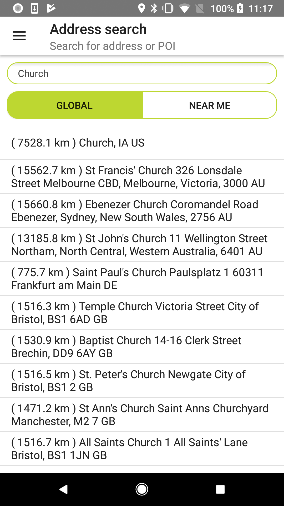
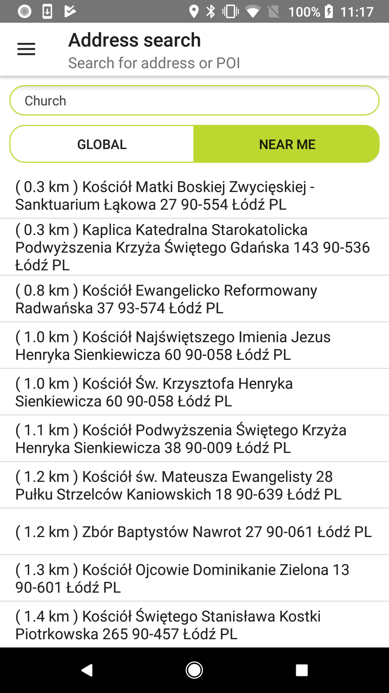

<a
  href="#"
  style={{ display: 'block', margin: '0', padding: '0' }}
  name="address-search"
></a>

Allow your users to easily search for addresses and POIs in a single step. Implement global search
or near-me search in your mobile app so that it returns the best search results for your needs.
Global search uses the search functionality’s default settings. It doesn’t use the user’s position
or other search parameters.

**Sample use case:** You use an app to search for a place. This search should not be limited in any
way. Use the following code snippet in your app to list general search results or display them on
the map.

<Code>

```java
return new FuzzySearchSpecification.Builder(text).build()
```

```kotlin
FuzzySearchSpecification.Builder(text).build()
```

</Code>

Add the following code snippet to your app to get search results that are geo-biased for a given
location in a range specified by a radius.

<Code>

```java
FuzzyLocationDescriptor fuzzyLocationDescriptor = new FuzzyLocationDescriptor.Builder()
        .positionBias(new LatLngBias(position, STANDARD_RADIUS))
        .build();
return new FuzzySearchSpecification.Builder(text)
        .locationDescriptor(fuzzyLocationDescriptor)
        .build();
```

```kotlin
val locationDescriptor = FuzzyLocationDescriptor.Builder()
    .positionBias(preciseness)
    .build()
return FuzzySearchSpecification.Builder(term)
    .locationDescriptor(locationDescriptor)
    .build()
```

</Code>

<table>
  <tbody>
    <tr>
      <td>
        <ContentWrapper maxWidth="350px" objectFit="contain">
          <p>
            
          </p>
        </ContentWrapper>
        <p>Global address search functional example from Sample App</p>
      </td>
      <td>
        <ContentWrapper maxWidth="350px" objectFit="contain">
          <p>
            
          </p>
        </ContentWrapper>
        <p>Near me address search functional example from Sample App</p>
      </td>
    </tr>
  </tbody>
</table>