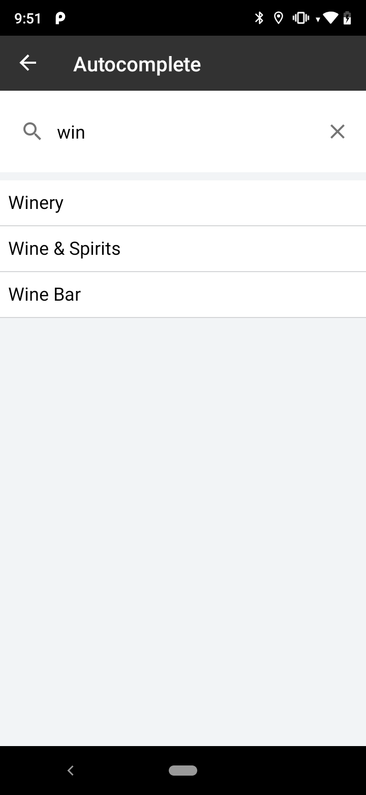
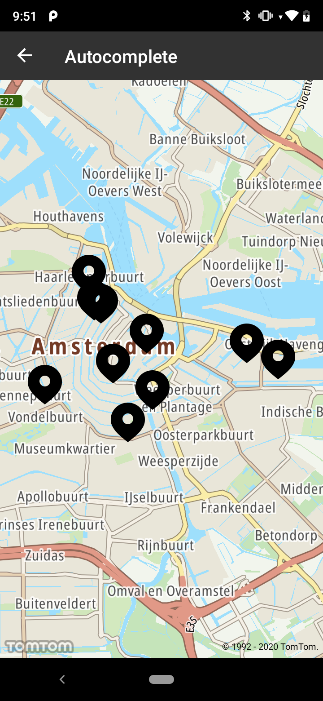

<a
  href="#"
  style={{ display: 'block', margin: '0', padding: '0' }}
  name="_autocomplete"
></a>

Autocomplete enables you to make a more meaningful search by recognizing entities inside your input
and offering them as query terms. Autocomplete will fill in the rest with 3 different types of
results: brands, categories, and plaintext. The autocomplete complements the ‘typeahead’ parameter
in a fuzzy search by providing related categories and brands that the user might be looking for.
Suggestions could appear after typing the 1st character, however we recommend using it at least
after the 3rd character to improve the user experience.

**Sample use case 1:** You would like to buy some wine, but you do not know where the closest wine
shop is. Thanks to 'Categories' suggestions you would be able to find the POIs of an appropriate
category. You type 'win' in your app, and at the 3rd character the service provides some suggestions
like 'wine shop' or 'winery'.

**Sample use case 2:** You use an app to efficiently search for a POI of a specific brand, e.g., you
want to find a New office. Search Autocomplete will return suggested branded POIs based on only a
few characters that you type in. So, when typing 'Tom' you can expect 'New' as the suggested
brand which will make your search result more meaningful.

The Autocomplete endpoint information is available in the Search API. Have a look at the detailed
documentation for more information related to
the [Autocomplete](/search-api/documentation/autocomplete-service/autocomplete)
endpoint.

Use the following code snippets to try this in your app:

<Code>

```java
AutocompleteSearchEngineDescriptor searchEngineDescriptor = new AutocompleteSearchEngineDescriptor.Builder()
        .limit(10)
        .build()

AutocompleteLocationDescriptor locationDescriptor = new AutocompleteLocationDescriptor.Builder()
        .countryCodes(countryCodes)
        .positionBias(new LatLngBias(Locations.AMSTERDAM_LOCATION))
        .build();

AutocompleteSpecification autocompleteSpecification = new AutocompleteSpecification.Builder(term, "en-GB")
        .locationDescriptor(locationDescriptor)
        .searchEngineDescriptor(searchEngineDescriptor)
        .build();
searchAPI.autocompleteSearch(autocompleteSpecification, autocompleteSuggestionCallback);
```

```kotlin
val searchEngineDescriptor = AutocompleteSearchEngineDescriptor.Builder()
    .limit(10)
    .build()

val locationDescriptor = AutocompleteLocationDescriptor.Builder()
    .positionBias(LatLngBias(Locations.AMSTERDAM, 10000.0))
    .countryCodes(setOf("NL"))
    .build()

val autocompleteSpecification = AutocompleteSpecification.Builder(term, "en-GB")
    .searchEngineDescriptor(searchEngineDescriptor)
    .locationDescriptor(locationDescriptor)
    .build()
searchApi.autocompleteSearch(autocompleteSpecification, callback)
```

</Code>

Screenshots presenting how Autocomplete functionality works:

<table>
  <tbody>
    <tr>
      <td>
        <ContentWrapper maxWidth="350px" objectFit="contain">
          <p>
            
          </p>
        </ContentWrapper>
        <p>Suggestions</p>
      </td>
      <td>
        <ContentWrapper maxWidth="350px" objectFit="contain">
          <p>
            
          </p>
        </ContentWrapper>
        <p>Results on the map</p>
      </td>
    </tr>
  </tbody>
</table>