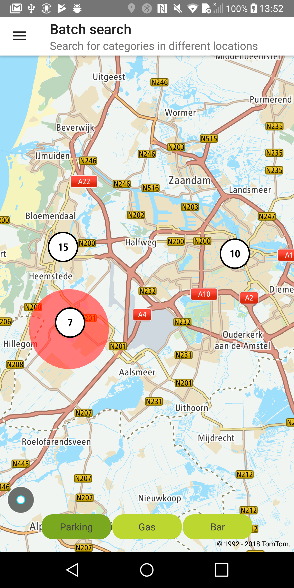

Allow your users to process synchronous batch search calls with
the [Batch Search](/search-api/documentation/batch-search-service/synchronous-batch)
service integrated. When the service receives a request, it will respond as soon as the batch items
are calculated and there will be no possibility to retrieve the results later on.

<a
  href="#"
  style={{ display: 'block', margin: '0', padding: '0' }}
  name="_supported_types_of_requests"
></a>

## Supported types of requests

Different types of requests can be mixed in one batch request. The information about the limit of
queries, request processing time, and other details are described in
the [Batch Search](/search-api/documentation/batch-search-service/synchronous-batch)
service documentation. An error in one of the batch requests causes the whole batch to fail.

**Sample use case:** You want to simultaneously search for different categories within different
locations.

Use the following code to try this in your app:

<Code>

```java
//Using batch, it is possible to execute different search types:
//fuzzy, geometry or reverse geocoding. The order of responses
//is the same as the order in which the queries are added.
BatchSearchQueryBuilder batchQuery = new BatchSearchQueryBuilder()
batchQuery.withFuzzySearchQuery(createAmsterdamQuery(category));
batchQuery.withFuzzySearchQuery(createHaarlemQuery(category));
batchQuery.withGeometrySearchQuery(createHoofddropQuery(category));

final SearchApi searchApi = OnlineSearchApi.create(context, BuildConfig.SEARCH_API_KEY);
searchApi.batchSearch(batchQuery.build(), batchSearchResultListener);
```

```kotlin
//Using batch, it is possible to execute different search types:
//fuzzy, geometry or reverse geocoding. The order of responses
//is the same as the order in which the queries are added.
val batchQuery = BatchSearchQueryBuilder()
        .withFuzzySearchQuery(createAmsterdamQuery(category))
        .withFuzzySearchQuery(createHaarlemQuery(category))
        .withGeometrySearchQuery(createHoofddropQuery(category))
        .build()

    searchApi.batchSearch(batchSearchQuery)
```

</Code>

Sample views utilizing data retrieved using the Batch Search service:

<table>
  <tbody>
    <tr>
      <td>
        <ContentWrapper maxWidth="350px" objectFit="contain">
          <p>
            
          </p>
        </ContentWrapper>
        <p>Search results for different locations</p>
      </td>
    </tr>
  </tbody>
</table>