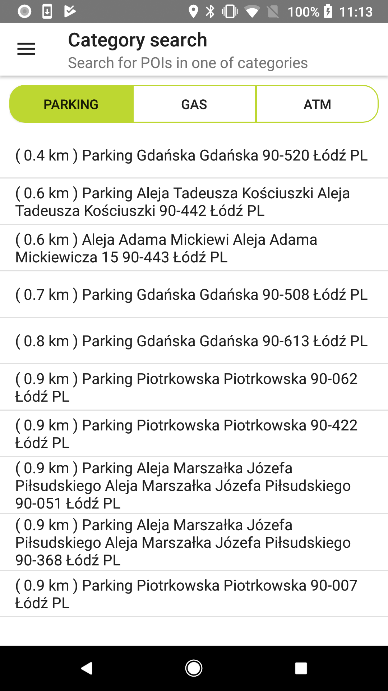
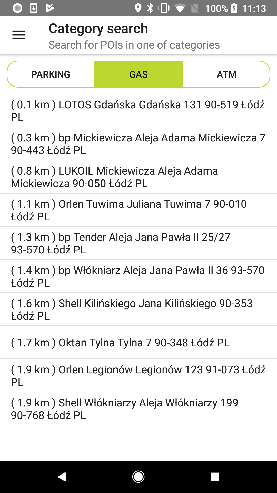
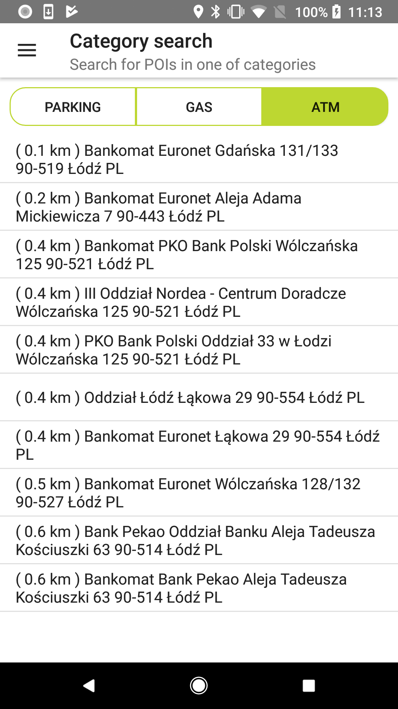

Help your users search for specific types of places with Category Search.

**Sample use case:** You are preparing for a long drive and would like to find nearby gas stations.
Use the following code snippet to try this in your app.

<Code>

```java
FuzzySearchEngineDescriptor fuzzySearchEngineDescriptor = new FuzzySearchEngineDescriptor.Builder()
        .typeAhead(true)
        .category(true)
        .build()
FuzzyLocationDescriptor fuzzyLocationDescriptor = new FuzzyLocationDescriptor.Builder()
        .positionBias(new LatLngBias(position, STANDARD_RADIUS))
        .build();
return new FuzzySearchSpecification.Builder(text)
        .searchEngineDescriptor(fuzzySearchEngineDescriptor)
        .locationDescriptor(fuzzyLocationDescriptor)
        .build();
```

```kotlin
val locationDescriptor = FuzzyLocationDescriptor.Builder()
    .positionBias(preciseness)
    .build()

val searchEngineDescriptor = FuzzySearchEngineDescriptor.Builder()
    .category(true)
    .build()

val categorySearchSpecification = FuzzySearchSpecification.Builder(term)
    .searchEngineDescriptor(searchEngineDescriptor)
    .locationDescriptor(locationDescriptor)
    .build()
```

</Code>

The following is an example application view utilizing Category Search.

<table>
  <tbody>
    <tr>
      <td>
        <ContentWrapper maxWidth="350px" objectFit="contain">
          <p>
            
          </p>
        </ContentWrapper>
        <p>Address search with category: Parking</p>
      </td>
      <td>
        <ContentWrapper maxWidth="350px" objectFit="contain">
          <p>
            
          </p>
        </ContentWrapper>
        <p>Address search with category: Gas</p>
      </td>
    </tr>
    <tr>
      <td>
        <ContentWrapper maxWidth="350px" objectFit="contain">
          <p>
            
          </p>
        </ContentWrapper>
        <p>Address search with category: ATM</p>
      </td>
      <td></td>
    </tr>
  </tbody>
</table>