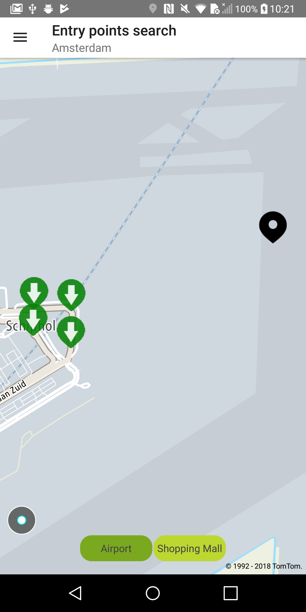
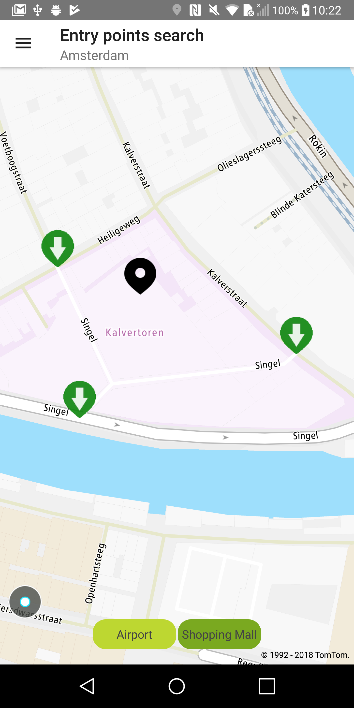

Allow your users to display entry points using Fuzzy Search results.

**Sample use case:** A taxi driver wants to pick up a passenger from the specific entry point at the
airport.

Use the following code to try this in your app:

<Code>

```java
for (EntryPoint entryPoint : fuzzySearchDetails.getEntryPoints()) {
    SimpleMarkerBalloon markerBalloon = new SimpleMarkerBalloon(
            String.format(markerBalloonText, entryPoint.getType().toString().toLowerCase()))

    addMarkerWithIcon(entryPoint, markerBalloon, icon);
}
```

```kotlin
fuzzySearchDetails.entryPoints.forEach { entryPoint ->
    val markerBalloon = SimpleMarkerBalloon(
        String.format(markerBalloonText, entryPoint.type.toString().toLowerCase())
    )
    addMarkerWithIcon(entryPoint, markerBalloon, icon)
}
```

</Code>
<Code>

```java
private void addMarkerWithIcon(EntryPoint entryPoint, SimpleMarkerBalloon balloon, Icon icon) {
    NewMap.addMarker(new MarkerBuilder(entryPoint.getPosition())
            .markerBalloon(balloon)
            .icon(icon));
}
```

```kotlin
private fun addMarkerWithIcon(entryPoint: EntryPoint, balloon: SimpleMarkerBalloon, icon: Icon) {
    NewMap.addMarker(
        MarkerBuilder(entryPoint.position)
            .markerBalloon(balloon)
            .icon(icon)
    )
}
```

</Code>

Sample views utilizing entry points:

<table>
  <tbody>
    <tr>
      <td>
        <ContentWrapper maxWidth="350px" objectFit="contain">
          <p>
            
          </p>
        </ContentWrapper>
        <p>Entry points for the Amsterdam airport</p>
      </td>
      <td>
        <ContentWrapper maxWidth="350px" objectFit="contain">
          <p>
            
          </p>
        </ContentWrapper>
        <p>Entry points for the Kalvertoren mall</p>
      </td>
    </tr>
  </tbody>
</table>