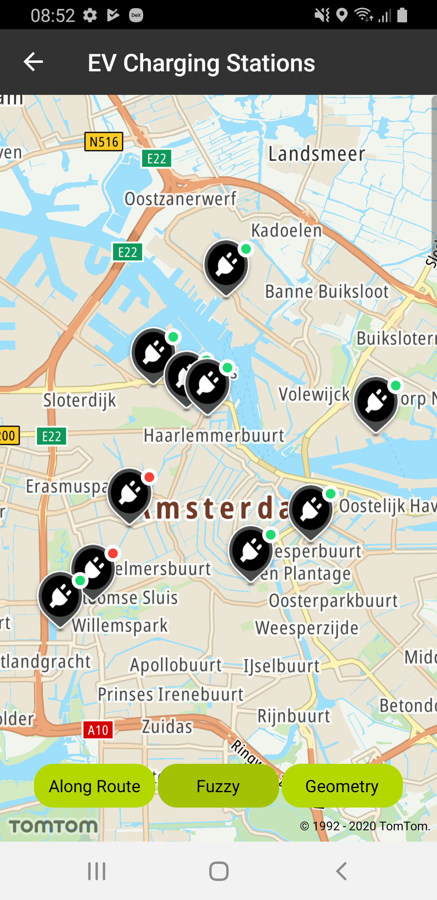
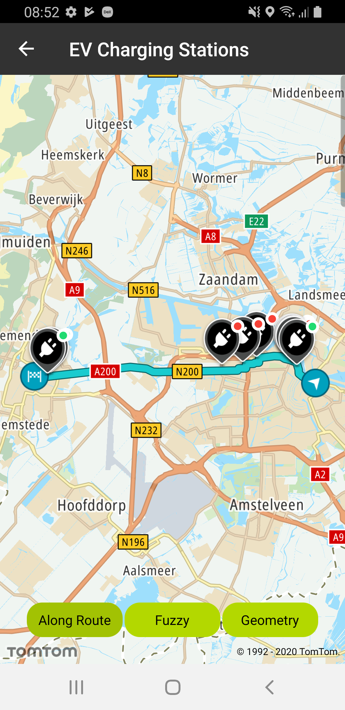
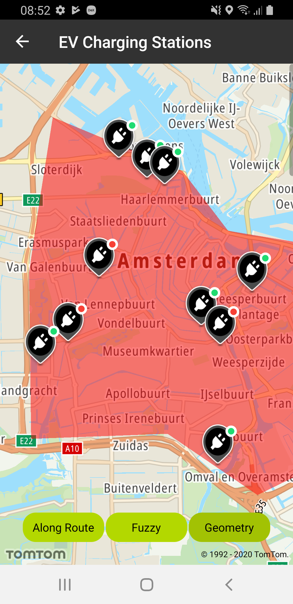

You can use any of the POI searches including Fuzzy Search, Geometry Search, or Along Route Search (
see the [SEARCH API](/search-api/documentation/product-information/introduction) reference) to
find a charging point for your electric car.

The EV charging stations IDs are returned from a search query. You can use this ID for checking the
real-time availability of EV connector types at the charging station using the Extended Search API –
EV Charging Stations Availability endpoint. You can view charging station availability when you want
to stop during the drive, or due to an event like the low level of the battery. The EV Charging
Stations Availability endpoint provides information about the real-time availability of charging
points based on criteria such as charging power, probability of being available, etc. The Response
of EV Charging Stations Availability Request is grouped by the connector type. You can also specify
the connector type in your POI searches including Fuzzy Search, Geometry Search, or Along Route
Search by defining \[connectorSet\] to narrow the results. By doing so, the Response will only
return EV charging stations for the specified connector type. Have a look at the detailed
documentation
about [EV charging stations availability](/extended-search-api/documentation/extended-search-api/ev-charging-stations-availability).

To use EV Charging Stations Availability, first you need to make an API call to a Search endpoint (
Fuzzy Search, Geometry Search, or Along Route Search) to retrieve UUIDs of one or n-number of
charging stations, then a call to the Extended Search endpoint to retrieve the availability of these
n charging stations. You use multiple API calls in this case: If you want make a Request to retrieve
n charging station details, separate n Requests have to be made.

**Sample use case:** As an EV driver you want to see the EV POIs around a certain location (e.g.,:
when approaching a destination), so you know what charging stations are available around this place.

**Sample use case:** You want to see upcoming EV POIs along a planned route, such that you always
have a quick preview of charging possibilities that are in range, matching your vehicle and
preferred energy vendor.

**Sample use case:** You would like to know whether the EV POI that is included on the route has any
available charging spots (e.g., they are all occupied or otherwise unavailable) and would like to
find an alternative EV POI.

**Sample use case:** You are planning to visit the area of Amsterdam. You need to find EV charging
stations in the city center in Amsterdam.

Use the code snippets below to try this in your app:

**First you need to make a Request to an appropriate search endpoint:**

- Along Route Search

```java
searchApi.alongRouteSearch(searchQuery) // Single<AlongRouteSearchResponse>
    .flatMap { mapFromAlongRouteResultsToChargingStationsDetails(it.results) }
```

- Fuzzy Search

```java
searchApi.search(searchQuery) // Single<FuzzySearchResponse>
    .flatMap { mapFromFuzzyResultsToChargingStationsDetails(it.results) }
```

- Geometry Search

```java
searchApi.geometrySearch(searchQuery) // Single<GeometrySearchResponse>
    .flatMap { mapFromGeometryResultsToChargingStationsDetails(it.results) }
```

**After that you need to do mapping from the returned EV charging station ID’s to the actual data
about them:**

```java
return Observable.fromIterable(evSearchResults)
    .map { it.additionalDataSources.chargingAvailabilityDataSource.get().id }
    .map { searchApi.chargingStationsSearch(ChargingStationsSpecification(UUID.fromString(it))) }
    .zipWith(evSearchResults) { stations, result ->
        ChargingStationDetails(
            result.poiName,
            result.freeformAddress,
            result.position,
            stations.value().connectors
        )
    }
    .toList()
```

Screenshots presenting how the EV charging stations availability functionality works:

<table>
  <tbody>
    <tr>
      <td>
        <ContentWrapper maxWidth="350px" objectFit="contain">
          <p>
            
          </p>
        </ContentWrapper>
        <p>
          Fuzzy search with term:  **electric vehicle station** ,
          combined with Ev charging stations availability
        </p>
      </td>
      <td>
        <ContentWrapper maxWidth="350px" objectFit="contain">
          <p>
            
          </p>
        </ContentWrapper>
        <p>
          Along route search with term: 
           **electric vehicle station** , combined with Ev charging
          stations availability
        </p>
      </td>
    </tr>
    <tr>
      <td>
        <ContentWrapper maxWidth="350px" objectFit="contain">
          <p>
            
          </p>
        </ContentWrapper>
        <p>
          Geometry search with term:  **electric vehicle station** ,
          combined with Ev charging stations availability
        </p>
      </td>
      <td></td>
    </tr>
  </tbody>
</table>